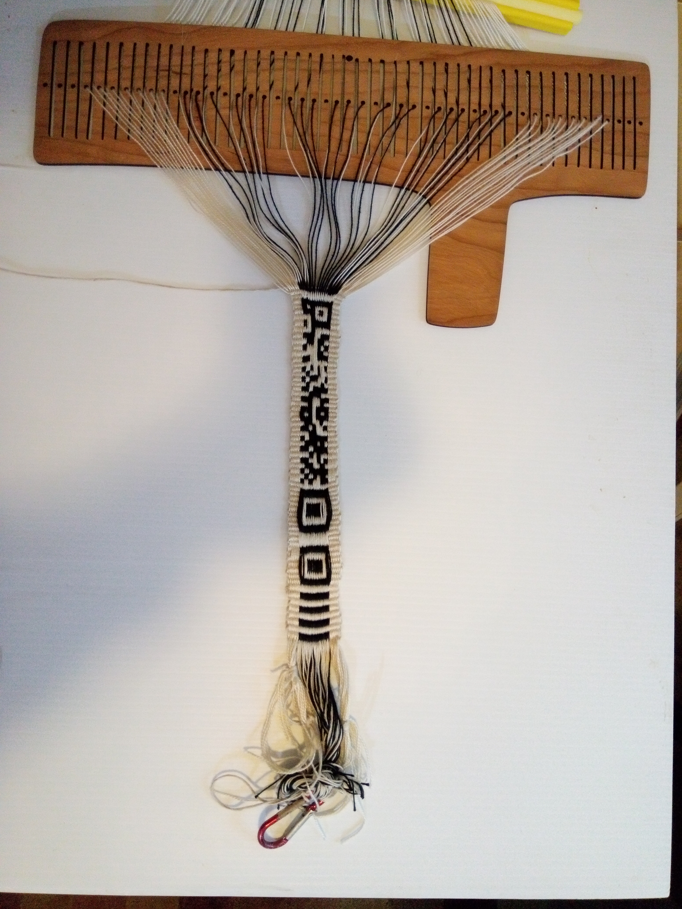
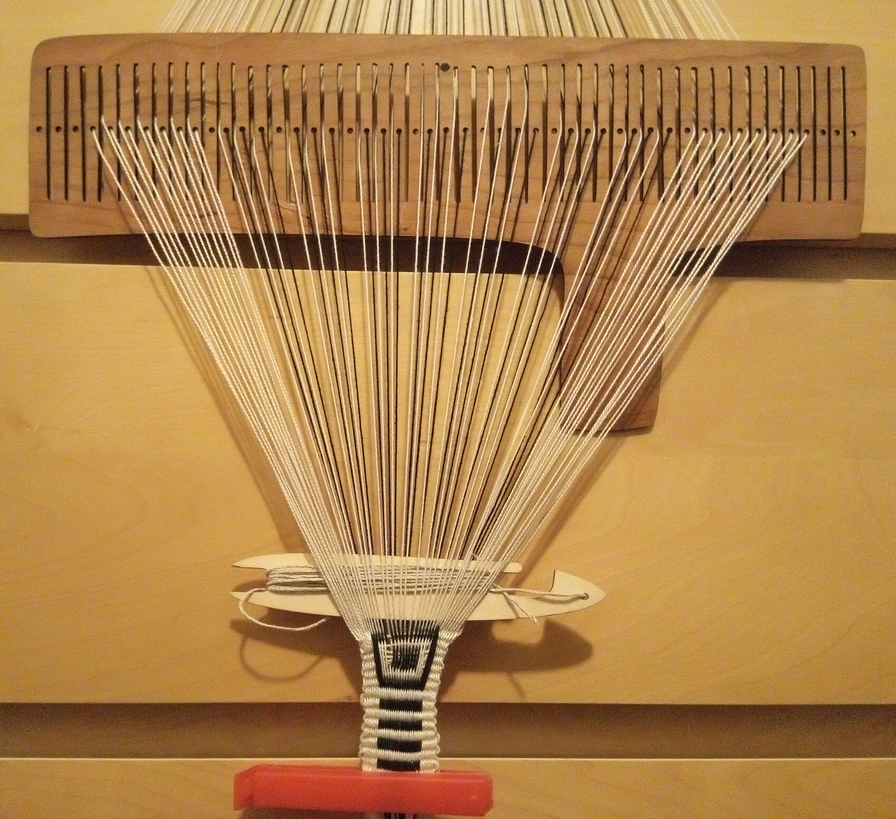
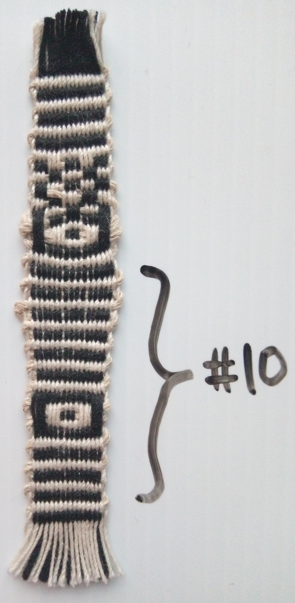
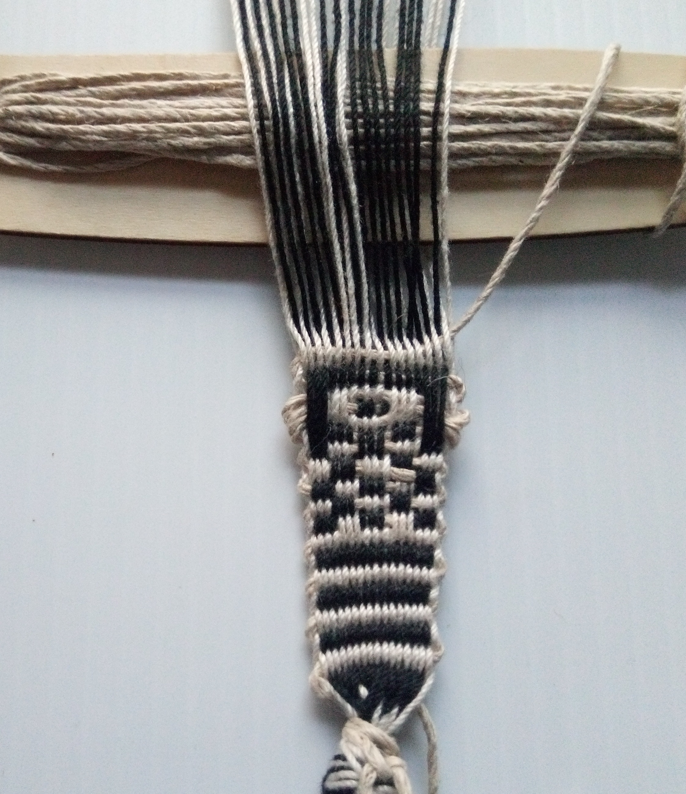
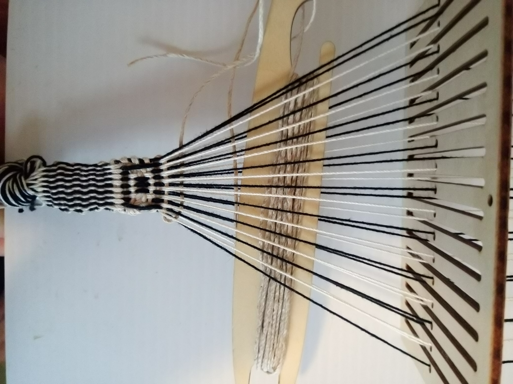
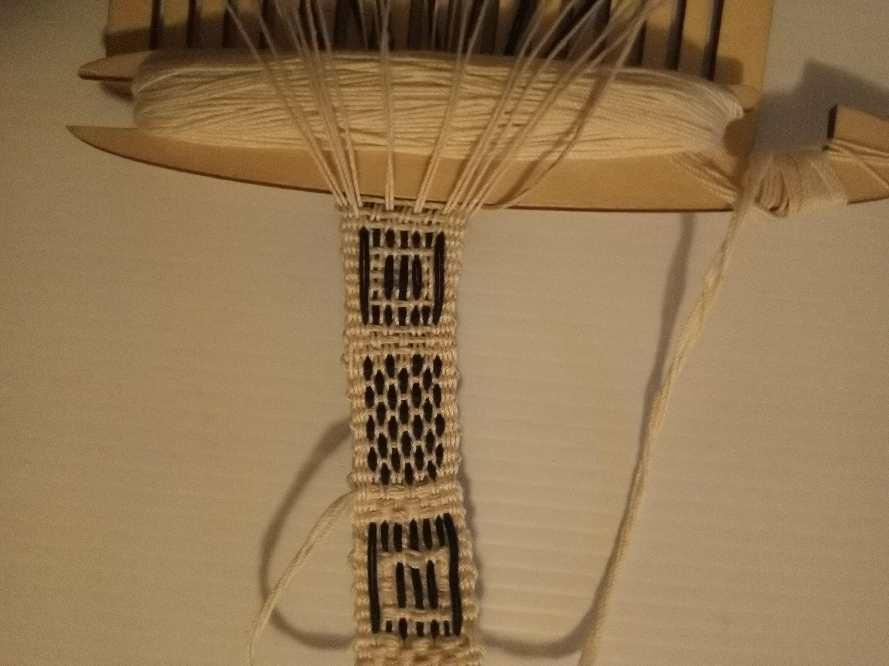
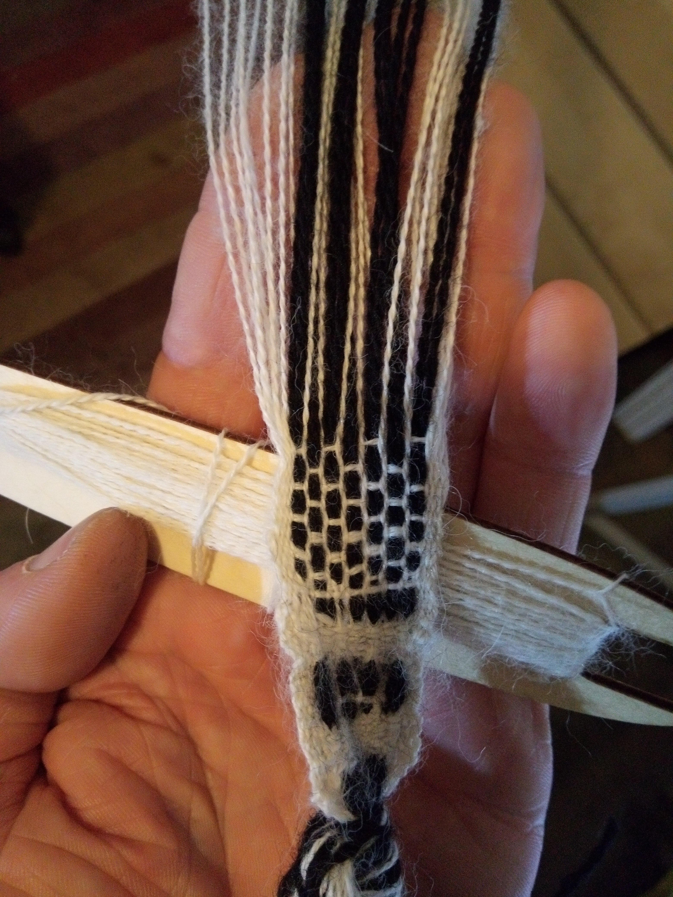

#+title: Bandgrind Experiments | Padonma Network
#+subtitle: Handmade QR codes woven on bands
#+author: John Tigue
# Https://sandyuraz.com/articles/orgmode-css/
# #+html_head: <link rel="stylesheet" href="https://sandyuraz.com/styles/org.css">
#+OPTIONS: toc:nil
#+OPTIONS: ^:nil
#+OPTIONS: num:nil
#+OPTIONS: html-postamble:nil
#+HTML_HEAD: <link rel="stylesheet" type="text/css" href="cached/org.css"/>
#+HTML_HEAD_EXTRA: 

#+attr_html: :width 100% :style NOT_transform: rotate(-0.25turn);
[[file:images/rmqr_encoding_tigue.png]]

#+attr_html: :width 100% :align center
#+caption: An rMQR band, handwoven on the following rigid heddle, a.k.a. bandgrind
[[file:images/bandgrinding/rmqr_01_image_01.tigue.jpg]]

#+attr_html: :height 80%
#+caption: The bandgrind upon which the above band was woven
[[https://www.etsy.com/listing/1484652916/97-thread-scandinavian-band-or-tape][file:cached/images/weaving/heddle_91_dents.png]]

Version: 2.4.2

* Bandgrind Experiments
  :PROPERTIES:
  :CUSTOM_ID: TargetSection
  :END:

** Introduction

The [[https://padumma.com][Padonma Network]] project seeks to encode UUIDs in QR codes
handwoven into bands. This mini blog records various band weaving
experiments carried out in order to discover how best to go about
such encoding using a simple traditional rigid heddle, which the Sweeds
call a bandgrind. (To hear how a Sweed would pronounce "bandgrind"
[[https://translate.google.com/;?sl=sv&tl=en&text=bandgrind%0A&op=translate][listen to Google Translate pronounce "bandgrind."]])

The goal of these bandgrinding sessions is to do a full write and
subsequent read test of rMQR ID bands. The "write" part of the test
is the weaving of the bands. The "read" part is QR reader software
successfully scanning the woven rMQR codes.

Success is pretty much guaranteed as there are many examples on the
web of previously handwaven square QR codes, and rMQRs are simply a
variant of QR. The real question is how fast and easy can it be done
with minimal weave tooling.

There is [[https://rmqr.oudon.xyz/][an on-line rMQR generator]] which can be used to create
downloadable rMQR code PNG images which encode arbitrary
messages|data. That tool was used to create the first test rMQR being
handwoven, the following R7x43 rMQR code:

#+attr_html: :width 200% :style NOT_transform: rotate(-0.25turn);
[[file:images/rmqr_encoding_tigue.png]]

Note, the above R7x43 rMQR only encodes five text characters (~40
bits). All UUIDs are 128 bits and so require an rMQR of size R7x77. A
real UUID encoded to an R7x77 rMQR will be the second test
subject. 

The rMQR standard, [[https://cdn.standards.iteh.ai/samples/77404/e103bf2d1f0d4162b34ca493efdaf9c4/ISO-IEC-23941-2022.pdf][ISO/IEC 23941]], was ratified by ISO in May of 2022,
and by the end of 2023 there were multiple free software apps that
could read rMQRs. Although, at the dawn of 2024 neither the Android
nor iOS default camera apps could yet read rMQRs. So, this particular
innovation is still diffusing to the mainstream devices. Nonetheless,
free apps such as QRQR and [[https://www.scandit.com/products/barcode-scanning/symbologies/rectangular-micro-qr-code/][Scandit]] are capable of recognizing rMQR
codes. ([[https://hackaday.io/project/192082-rectangular-micro-qr-code-rmqr][Someone]] found QRQR to be able to scan more codes than
Scandit.)

The above QR code is part structure and part encoded data (think:
envelope versus letter). The follow illustrates only the structure part:

#+attr_html: :width 70%
[[file:images/qr_tech/rmrq_r7_43_structure_unannotated.png]]

As for why handwoven QR code bands would be useful
(and why not just print the codes?), read the
intro to the [[file:index.org][Padonma Network]].

** Testing tools
- QRQR is a free app that can read rMQR codes.
  - iOS: [[https://apps.apple.com/us/app/qrqr-qr-code-reader/id911719423][QRQR - QR Code® Reader on the App Store]]
  - Android
    - Android [[https://play.google.com/store/apps/details?id=com.arara.q&hl=en][QRQR - QR Code® Reader - Apps on Google Play]]   
      - [ ] From Denso or from this arara?

    
** Bandgrinding experiments

There are many variables that can affect the handweaving of rMQR ID
bands (the writing of data to band) and how well QR reader software
can read the bands. The purpose of this mini-blog is to record various
experiments seeking to find the cheapest, easiest, fastest way to
handweave rMQR ID bands.

For example, the following image shows three bands, that essentially
differ only in weft thread size. Obviously a dialed-in size ratio of
warp thread to weft thread would make it easier to make better rMQR ID
bands.  Three warp thread wide QR modules ("modules" ~= "pixels") work
well. But perhaps with the right combination of warp and weft thread
it could be gotten down to two warp threads wide QR modules (not shown
in the below image) which might be more quickly ground out. So,
experiments need to be done to test that.

#+attr_html: :width 80%
[[https://spinoffmagazine.com/spinning-bandweaving-3-ways-weave-gorgeous-ribbons/][file:cached/images/weaving_qr_codes/spinning_for_bandweaving__weft_sizes.jpeg]]

Another experiment might be to figure out how to bandgrind with only
one type of thread (say, cheap white cotton, which could be locally
dyed dark to get two colors). That imposes the requirement that the
size ratio of warp:weft must be 1:1. What encoding weave would work in
that context?

An extremely talented weaver might even be able to get down to 0.25mm
per module (a single stictch, one stitch per module). At that scale,
an R7x77 rMQR would be [[https://www.qrcode.com/en/codes/rmqr.html][approximately 2mm x 20mm]]. That (single stitch
per module) certainly seems to be what is currently being done in
India by some handloomers.

#+attr_html: :height 200px :align center
#+caption: "Banarasi Saree To Have QR Code Woven In"  (LatestLY, 2019)
[[https://www.latestly.com/india/news/banarasi-saree-to-have-qr-code-woven-in-it-bhu-develops-new-technique-to-identity-genuineness-of-the-handloom-products-2673359.html][file:cached/images/qr_tech/QR-code-woven-in-Banarasi-sari.jpg]]

Which sizes of rMQR are optimal in terms of trade off of width (number
of warp thread ends) versus length (number of picks, a shuttle pass
left or rigth)? A tablet weaver would probably be less bothered by
width than a rigid heddle weaver (that is, without the square cards that are
used in tablet weaving).

We need test cases to see how much human variability can be handled by
QR reader software. Consider this example of a handwoven band with
uneven beat leading to irregular lines. Would an rMQR ID band woven as
irregularly shaped as this band be scanable? Or would it be
[[https://www.youtube.com/watch?v=81_NcN7yANM&ab_channel=BestComedyCut][unscannable]]?

#+attr_html: :width 40%
[[https://www.einesaite.com/blog/einesaite/2020/10/17/the-many-little-missteps][file:cached/images/weaving/uneven_beat_belt.jpg]]

Essentially we need to handweave some rMQR ID bands and see if QR
readers will recognize the QR codes woven into the bands. Success is
pretty much guaranteed so the main question is how fast, easy, and
cheap can it be done at low scale. This "blog" includes a record of
some experiments.

** Session Next                                                                                                         :noexport:
*** Tooling: band width guide

A [[https://youtu.be/ZzhuDomPtxE?t=191][simple band width guide]] might help make rMQRs that are easier for 
a smart camera to read:

#+attr_html: :height 300px :align center
#+caption: A band width guide
[[https://www.youtube.com/watch?v=ZzhuDomPtxE&t=191s][file:cached/images/weaving/band_width_guide.png]]

One made of just paper [[https://jumaka.com/2019/01/bandweaving/][Bandweaving – Jumaka]]
  https://jumaka.com/wp-content/uploads/2019/01/IMG_4584-576x1024.jpg
  
*** New tool type: rMQR heddles

When weaving mRQR codes into double-faced bands, each QR module square
can be represented via 4 (2x2) or 9 (3x3) stitches. Whether 4 or 9,
for any give weaving/encoding all the stitches of a module will be
white or black together, all making up a dark or light QR module -- a
One or a Zero. That fact could be used to design task specific
heddles, optimized for cranking out rMQR bands. Dents could be spaced
horrizontally on the heddle in groups of 4 or 6 for, respectively 2x2
or 3x3 sized renderings.
    
One could even imagine lazer cutting a heddle designed to weave
nothing but rMQR codes, with the above mentioned gapping carved into
the heddle.  

The rMQR spacing could also be merged with the short slots seen
in Baltic pattern stitching heddles:

#+attr_html: :height 150px
[[https://www.handweavers.co.uk/sunna-heddle.ir][file:cached/images/weaving/sunna-heddle-17-pattern-slots.jpg]]

Such a theoretical task specific rMQR heddles is absolutely not
required to grind out a rMQR, but one might well make band grinding go
quicker. Even without a task specific heddle an experienced weaver can
probably grind out an rMQR band in 15 to 30 minutes.

For example, Heddle #2 has 91 dents. 91 is wide enough to get
luxurious with regard to a warping plan by setting up a warping
pattern having 2-dent gaps between 6-dent groups (three black ends,
three white ends), each 6-dent group being used to render a single QR
module, so BWBWBWxx repeated for each QR module. The group-by-six
pattern would probably make it easier to weave QR modules, which
always will be woven as either three black threads up or three white
threads up to fill in a QR module as a one or a zero. If doing the
above "standard heddle odd warp planning" helps, then could also make
heddles specifically designed for the task
    

** Band #6
- Novelty
  - First time full band
  - [[https://www.amazon.com/dp/B07M722SVS?ref=ppx_yo2ov_dt_b_product_details&th=1][1mm Waxed Cotton Braided Cord by Beadthoven, 100 Yards on Spool, Colored Burlywood (natural)]]

** Band #5
** Session #13
This is actually three mini-sessions that spanned two days, ending on [2023-12-26 Tue]

#+attr_html: :height 400px :align center
#+caption: Band #5 on Heddle #2, end of Session #13

** Session #12
[2023-12-27 Wed]

This was the first session to get beyond just the finder symbol (the
siz3 7 1-1-3-1-1 square that a starts all rMQR codes. This session
ground out a finder symbol and half the data code body of the rMQR.

#+attr_html: :height 400px :align center
#+caption: Band #5 on Heddle #2, end of Session #12
[[file:images/bandgrinding/bandgrind_session_12.jpg]]
   
** Session #11

Session #11 is when work started on Band #5.
Session #11 is also the first time weaving with Heddle #2.

#+attr_html: :height 400px :align center
#+caption: Band #5 on Heddle #2, end of Session #11

*** Ladder infra-structured bands
There is an interesting coincidence between the physical structure of
woven bands and the visual structure of rMQR codes which might be put
to good engineering use: they both have structure along the long
edges. This coincidence should be explored: perhap best thought of as
a **physical ladder** infra-structure underlying better encoding of
a band's rMQR code's **visual data structure.**

#+attr_html: :width 70%
#+caption: The non-cargo part of an rMQR code
[[file:images/qr_tech/rmrq_r7_43_structure_unannotated.png]]

Stronger warp threads on the edges of a rMQR ID band might make for
more readable QR codes. Such would be analogous to having strong side
rails on a ladder. To visualize such warp patternings, refer to the
following band and imagine if each green warp were thicker than the
rest:

#+attr_html: :height 350px
#+caption: Green warps could be thicker than others
[[https://www.etsy.com/listing/532605301/lithuanian-traditional-handwoven-sash][file:cached/images/weaving/band_green_edges.jpg]]

An interesting variation beyond simply using stronger-thicker thread
for the quiet zone edge warps, might be to also have stronger-thicker
threads in the warps that make up the two outer rows of QR modules
(think: wider, stronger side rail of the ladder). Having that part
(the timing patterns) rectilinear and evenly spaced would probably
increase scanability, because those two always contain the
on-off-on-off timing pattern as required by the spec and illustrated
above along the top and bottom edges.

*** Band #5 started

In Session #11, Band #5 was started. Band #5 is an R7-wide rMQR band
with each QR module rendered 3 warps wide, using size 10 warp
threads. 

By definition double faced warp weaving has warp threads that come in
pairs, of which one of the pair will always be on the opposite side of
the band as its pair partner (this fact is why double faced bands
always have the same pattern on both faces, one the inverse of the
other).

#+attr_html: :height 225px
#+caption: The two opposite faces of a band
[[https://durhamweaver64.blogspot.com/p/band-weaving-with-11-pattern-threads.html][file:cached/images/weaving/shoe_bands.jpg]]
    
As Band #5 uses a double faced warp weave, "modules rendered 3 warps
wide" requires 6 warps per QR module. Within a given QR module, all 3
warp pairs will show the same color on a face, thereby making a single
module.

Since rMQR bands are monochromatic by design, each warp pair will have
1 dark and 1 light thread, in other words 3 black and 3 white per each
QR module, a six adjacent to each other.

Six adjacent warp ends (3 blacks and 3 whites) per QR module would
require a heddle with at least 66 dents in order to weave an R7-wide
rMQR. An R7-wide rMQR code actually require 11 not 7 module of band
width: the core 7 modules wide code + 2 quiet zone margins each 2 modules wide = a band 11
modules wide. 11 modules X 6 threads/module = 66 threads.

As such, the warping plan for Band #5 is symetrical left-to-right:
- 13 white, size 5 crochet yarn (DMC pearl cotton ecru)
- 42 warps alternating black and white, all size 10
- 12 white, size 5 crochet yarn

Band #5 is the first experiment involving stronger warp threads in the
[[https://en.wikipedia.org/wiki/Selvage][selvage]] (the size 5 warps above).  The goal hear is to prevent the
edges of the band from stretching.  So the 12 all white warps on each
edge are size 5; these make up the edges of the band which make up the
required two QR module wide "quiet zone" around the data encoding part
of an rMQR. The warp threads in the middle of the band (where data is
actually recorded) are white size 10 and black size 10. The idea is
that a large weft thread (1mm) and medium/large warp threads (size 5)
creat a sort of ladder struction, and the small (size 10) central
warps encode the data more finely, potentially leading to smaller bands.

*** Heddle #2 with 91 dents, up from a max of 31

As seen in the first ten bandgrinding sessions below Heddle #1, the
first rigid heddle used in these bandgrinding experimens, has 33 dents
-- 17 holes plus 16 slots.

#+attr_html: :height 150px
#+caption: Heddle #1 has 33 dents
[[https://www.etsy.com/listing/1484652916/97-thread-scandinavian-band-or-tape][file:cached/images/weaving/heddle_first_33_dent.png]]

The current experimental goal is to get a QR reader to recognize an
R7-wide rMQR handwoven onto a band. The earliest experiments used only
one warp thread per QR module. Starting in Session #9, experiments
started using three warp threads to render each QR module. At that
point, Heddle #1 was not large enough to handle 6 threads per QR
module (3 warps on each side of the band means 6 warps per QR
module). Heddle #1 has 31 dents, and so can render at most a QR code 5
modules wide. The minimum width on rMQR code is 7 modules. 31 <
(6*7). So, Heddle #1 is a deadend for modules 3 warp ends wide.

#+attr_html: :height 300px
#+caption: Heddle #2 has 91 dents
[[https://www.etsy.com/listing/1484652916/97-thread-scandinavian-band-or-tape][file:cached/images/weaving/heddle_91_dents.png]]

So, Heddle #2 was ordered on [2023-12-11 Mon]. Heddle #1
has 33 dents and Heddle #2 has 91 dents. (Not two two previous pictures not to the same scale.) 91 will be enough to even
get wasteful of dents (and experiment with novel heddle designs).

** Session #10

Session #10 produced the bottom half of Band #4, the band started in
Session #9. 

Obviously, my inexperience with ever the most basic weaving techniques
has been hampering results but I am getting better; the problems have
been not just hardware, but software as well :)

#+attr_html: :height 300px :align center
#+caption: Band #4

- Woven [2023-12-22 Fri]
- A continuation of Band #4, started in Session #9 on Heddle #1 (33 dents)
- Plastic warps clamp **added**, making tensions individually adjustable
  - Much more even tension on warps than Session #9
  - Faster weaving, more rectilinear band
- Weft was twirled tigher and waxed (trying to maintain the laid cord's shape)
- Weft: Hemptique 1mm hemp, ecru
- Warp: Size 10 Aunt Lydia's Crochet Thread Classic 10, Ecru 100% mercerized cotton

** Session #9

Woven [2023-12-10 Sun]

Session #9 was the first time for the second warping pattern.
Previous was using the (double black, white, white, repeat) warping
pattern, in both wool (Band #1) and cotton (Bands #2 and #3), which
actually was a mistake (that warping pattern might work with other
heddles besides Heddle #1; it's a warping pattern used with double
holed and other heddle designs but seemed to fail with Heddle
#1). 

Starting with #9, the warp pattern was changed to (black, white,
repeat) both black and white being cotton size 10. The weft stayed at
1mm hemp because no cotton threads on hand thicker than size 10 (hemps
nice but an all cotton solution would be easier to source).

This warping pattern is that of [[https://youtu.be/tsvkfWoLnXc?t=68]["complimentary warp pick-up"]] weaving. This
warping pattern naturally does not expose the weft, except for a smidge at
the edges when the weft does a 180. This also means that there are no
"gaps" that show the weft, as so the threads stay in place more, making for
clearer QR modules.

Session #9 was also the first time that QR modules were woven with
three warps ends, rather than a single warp end. As such, the first
heddle (17 holes, 16 slots) was not wide enough to render a band 7 QR
modules wide. That is why the "QR code" of Session #9 is only 5
modules wide. This smaller square is known as the "finder sub pattern"
which ends an rMQR:

#+attr_html: :height 300px :align center
#+caption: Bandgrind Session #9

There are a few errors in the above weave :(

** Session #8

By Session #8, the basics of what theads to work with had been solved
well enough. Since Session #1 though #8, the same warping pattern was
used (double black, white, white, repeat) as taken from Baltic band
weaving technique for pattern weaving. That warping pattern naturally
exposes parts of the weft, which in the end is simply a design
deadend, which ended right here:

#+attr_html: :height 300px :align center
#+caption: Bandgrind Session #8

** Session #7

Session #6 was using multiple size 10 threads to make a thick warp.
In Session #7 (between the two squares below) the warp was changed
to 1mm thick natural color hemp from [[https://hemptique.com/][Hemptique]].

#+attr_html: :height 300px :align center
#+caption: Structure of Hemptique 1mm
[[file:images/bandgrinding/hemptique_1mm_laid_cord.jpg]]

(The hemp aspect is just an experiment. Would be nice to have an
all cotton solution. Hemp would be more difficult to source in remote
parts of the world.)

#+attr_html: :height 300px :align center
#+caption: Bandgrind Session #7

** Session #6

Session #6 was a change from wool to cotton threads (size 10).

For a picture, the output of Session #6 is the bottom square in the above Session #7 image.

** Session #5

Session #5 was a second attempt at the finder pattern, the black start square. Last time
with the wool threads.

#+attr_html: :height 300px :align center
#+caption: Bandgrind Session #5
[[file:images/bandgrinding/bandgrind_session_05.jpg]]

** Session #4

By the end of Session #3, "square enough" QR modules were happening.
So, in Session #4 started trying to make rMQR components, starting with
the black "finder" pattern i.e. the square that starts all rMQR codes:

#+attr_html: :height 200px :align center
#+caption: Structure of an rMQR
[[file:cached/images/qr_tech/rmqr_r7_43_structure.png]]

Still all wool:

#+attr_html: :height 300px :align center
#+caption: Bandgrind Session #4
[[file:images/bandgrinding/bandgrind_session_04.jpg]]

** Session #3

Addressing the "narrow" warp of Session #2, Session #3 saw a monotonic
thickening of the weft. During the session, one then two then
four threads were used to make the single white weft which eventually was as wide
as the black warp.

Still wool threads all :(

#+attr_html: :height 300px :align center
#+caption: Bandgrind Session #3
[[file:images/bandgrinding/bandgrind_session_03.jpg]]

** Session #2

The black splotch at the start of the band is Session #1 :(

The white weft is showing (that will be suppressed staring around Session #9 with pure warp faced weaving)
and if so needs to br much wider thread s.t. its width is equal to height of back warps.

#+attr_html: :height 300px :align center
#+caption: Bandgrind Session #2

** Session #1

Wool thread. Way too stretchy.

[[https://www.amazon.com/dp/B0B6M7Z82H?psc=1&ref=ppx_yo2ov_dt_b_product_details][$9 on Amazon]]

#+attr_html: :height 300px :align center
#+caption: Bandgrind Session #1
[[file:images/bandgrinding/bandgrind_session_01.jpg]]
