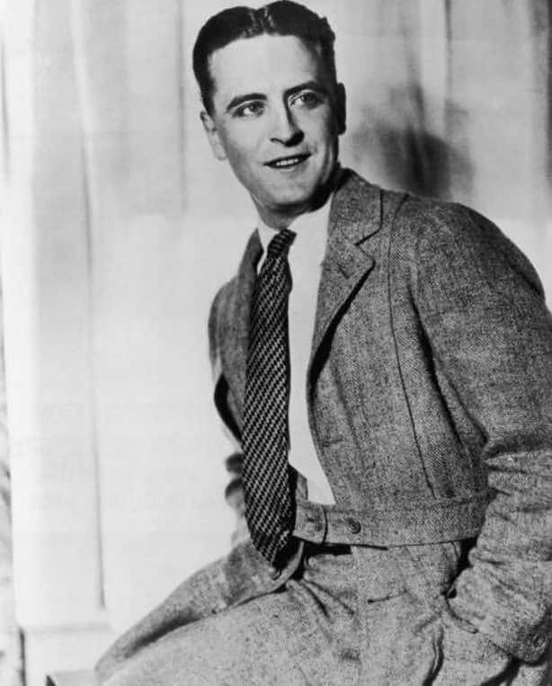

## The model

It is made to measure using open source parametric design patterns.
A tailor still needs to take the measurements and someone has to
cut the cloth and sew the pieces together with skill, and then
there still need to be fittings. The initial cut and assemble part
may well be outsourced.

Tailors who insist on keeping those measurements private are simple
overplaying their hands. For example, the Jaeger design pattern simply
requires fourteen measurements. There is little to protect.  Their
skill is still needing in the sewing and the judgement exercised
during fittings.

## Lots of goodies

Samatoa is a social enterprise trying to generate income for Cambodian
locals using a locally available resource, the lotus plant. So, not
only could we get prototype sport coats manufactured for Atelier
Padonma, we also hope to integrate them into the Padonma Network, that
is, garments made for Atelier Padonma would have Padonma Network QR ID
bands. Then moving forward they would be free to sell the sport
coat to anyone they wish to without Atelier Padonma being involved, 
although the Padonma Network would continue to facilitate such
transactions. 

Working with Samatoa would be an example of the envisioned model:
Atelier Padonma serves primarily as a bootstrapper of the Padonma
Network. We get the artisans and the customers together via the
Network and then we get out of the way. Atelier Padonma's purpose is
to be a marque member of the Network, one known for a high level of
quality and style. As such we can act as the flagship and initial
poster child of the Network, engaging face-to-face with the ateliers
of the world so they can touch the goods and then go order them
directly over the Network. All we ask for is invites to the
after-parties.

# Intro

Atelier Padonma is trying to stay on theme with Burmese inspired
fashion, while staying away from anything folkloric (despite the
stunning richness of Burma's sartorial herritage). The goal of
limiting ourselves to that niche/theme is to leave room for other
fashion designers to go off in other areas of fashion. We want
them to be able to benefit from the novelty. The Padonma Network
is concerned about the "how" more than the "what" with the
goal of empowering the lotus artisans.

Fortunately for us, the British spent over a century in Burma doing
what the Britain used to do. So, designing a British inspired sport coat
is arguably part of Burmese history. Indeed, those aristocratic inbred
pinheads are exactly the folks who invented the sport coat in the
nineteenth century, contemporanious with their nasty adventures in
Southeast Asia. (Yay?)

  - [florentine cut sport coat - Google Search](https://www.google.com/search?num=10&sca_esv=65b7e97ddd6b1b65&sxsrf=APpeQntVH4BaW5TwHCAokl0Rndcv5XNSvw:1791111191873&udm=2&fbs=ABfTbFVyMZGZf1hfvX9uKjN_-G8c4u0nXx4bEIpwm1lnNH832SMIiTl3t-JZ4hGJOxPbHYRzcy6GgySVUpZky6o6nTl3OG98qpkeeTCM9JzouvaRJUa2eRuUWrmVKZaYAjAscHwsZsSxYn8wCYS6DqDecnx7T6u_vII1iSDx2pY3wzSrPAeAkgfdbsq6hdmufgD_hzq5hHcVW4Iu4fG0v7Ue2bHUstXEyA&q=florentine+cut+sport+coat&sa=X&ved=2ahUKEwjA1uCSmaCXAxXZHzQIHbxAGnYQtKgLegQIFhAB&biw=1271&bih=823&dpr=2)

Shakeresque

Italians cut is closer to what would have been going on in Burma that
the suits one would find in Savile Row. Or one could argue that
the soft-sholdered "drape cut" of Anderson & Sheppard is the historical reference.

[How a Savile Row Suit is Really Made: The Rest Is History goes to Anderson & Sheppard - YouTube](https://www.youtube.com/watch?v=vUwp_ZYen8k)
- [Dissing Craig](https://youtu.be/vUwp_ZYen8k?t=205)

Note, this jaeger is made of linen. Lotus does not wrinkle like linen
https://cdn.freesewing.eu/showcase/linnen-jaeger-by-paul/main.webp

Part of the open source deliverables of the Padonma Networks is
the pattern designs for the garments. This enables the artisans to have 
plans to work off of sell, perhaps to Atelier Padonma. So, we come 
up with the designs, bang out a few prototypes through the Atelier,
and once debugged publish the pattern designs via the Network.

Our styling is about classic timeless style not some short term
fashion trend. This is well-made, expensive clothing that should stay
current for years. Think [Allan Flussers Dressing The Man: Mastering the art of permanent fashion](https://www.realmenrealstyle.com/dressing-man-book-review-flusser/).

TODO: book cover

maybe the padonma license is attribution i.e. the wordmark yet
no control is given up.

Classic style not fast fashion. But neither should this be costume art
bordering on steampunk. We want to make the finest clothing that folks
can wear casually in a Westernized context (with inspiration from
the history of Burma yet definitely not folkloric, including that of
the British).

The Italian cut is the sweet spot between the American "sack suit" and
the stuffy, pretentious British cut.

Oscar Wilde quiped about fashion trends: "Fashion is a form of
ugliness so intolerable that we have to alter it every six months."
Versus classics that never go out of style. This is was we are going
with mid-width notched lapels. Super high notches, and wide or narrow
lapels come and go as folks try to signal they are hip.  Lotus has no
need to signal beyond being its elegant self. This also means our
design patterns (the blueprints for a garment) will stay current
and the loosely confederated lotus producers do not have to worry
about their work going out of fashion. Lotus is slow to produce
and slow to go out of fashion, the exact opposite of fast fasion.

Atelier Padonma's collection is Burma inspired. And although we love
the rich, rich sartorial history of Burma, in terms of design
aesthetic Padonma intentionally keeps away from the boisterous
folkloric richly colored end of the spectrum.

Supposedly the first thing that the Loro Piana kid did when he found
out about lotus fabric was make himself a sport coat, which must have
been very similar to the ones he sold for $5600 in 2012.

# Prior art: 100% lotus jackets

- The Hope's jacket for women: /topics/lotus-fiber/companies/hope/jacket.png
  - Good demo of the drape of the fabric in a tropic sport coat
  - Atelier Padonma would level out those pockets, bring the label notch down, and get 3 real buttons in the middle
- Loro Piana's sport coat for men: ____________

# Modern sport coat

- [Salvatore Cotton Blazer](https://atelieroliver.com/products/salvatore-cotton-blazer?variant=54040568398162)
- [Prada: Single-breasted linen jacket](https://www.prada.com/us/en/p/single-breasted-linen-jacket/SD196_19VM_F0036_S_OOO)
- [Ralph Lauren: Polo Soft Tailored Fit Chino Sport Coat](https://www.ralphlauren.com/men-clothing-sportcoats/polo-soft-tailored-fit-chino-sport-coat/0075361345.html)

## Jackets of Southeast Asia

- [Men’s Lanna Cotton Shirt – Thai Style Mandarin Collar Shirt | Traditional Northern Thailand Fashion](https://www.etsy.com/listing/4450491872/chest-42-50-mens-lanna-cotton-shirt-thai)

## The original British sport coat

The Norfolk jacket, which became prominent around the
1860s–1880s. Removing the Norfolk jacket's belt and sporting details
gets you quite close to the modern sport coat. For example, here is F. Scott Fitzgerald sporting a Norfolk.

## British military tropical jackets

The British were in Burma, being British for over a
century (1826 to 1948). This provides us an excuse to dabble in
some Western attire.

[The bush jacket](https://sallyantiques.co.uk/product/british-ww2-era-royal-navy-khaki-drill-bush-shirt-tropical-tunic/)
is sort of like a sport coat, as can be seen on Daniel Craig
above. Both came from the British of a certain period. Take a bush
jacket, lose the chest pockets, belt, and epaulette and we are getting
close to the original sport coat of 1800s England. Absolutely [no
apaulettes](https://www.youtube.com/shorts/WPz0HGx4qwQ?t=160&feature=share)
allowed.

[The white tropical jacket of the British Navy](https://www.awm.gov.au/collection/C109623?image=1)
demonstrates the pattern design of an unstructured coat. Check the inside picture.

[Bush jacket of Captain Joan Griffin, Women's Auxiliary Service (Burma), 1945](https://collection.nam.ac.uk/detail.php?acc=1991-10-51-2): notice the weight of the fabric (light shining through bottom).

# Prior art: lotus jackets

The actual first known example of lotus thread being used by a Western
fashion house is the actual jacket one of the Loro Piana "kids" (Pier
Luigi Loro Piana) had made for himself.

# Risks

Atelier Padonma does have access to Burmese tailors living in the
USA. This talent is being used to make longyi (the Burmese sarong) and
fisherman trousers because they are have experience with those
garments, and these are very simple and unstructured designs.

Moving up to a sport coat is another level of talent and
experience. The following risks have been identified.

### Tailoring talent

The core of the Padonma Network team is essentially just a software programmer with
no textile experience besides handweaving QR Code ID bands. 

This also aligns with the open source nature of the Padonma
Network. These Southeast Asians have extremely sophisticated
styles 

- Adressing with an open source established patern design
  - Reduces design flaws and sets the style of the coat's cut
- Inlays are bits of extra fabric so that a garment can be let out later.
  - If remotely manufacturing in Southeast Asia, adjustment round
    trips would get a bit elaborate.
  - This way an Aletier customer can be measured, a bespoke coat
    ordered and shipped to local tailor for the later fitting rounds
  

### 
  - 
- Fabric weightiness/weave density for a suit not a scarf or saong
- thread quality: consistant gauge and degree of slubbiness

- color consistency

### Generic risks of global commerce and war

- remote business loss (civil war, scams, etc)
- Fraud: lots of folks claiming 100% lotus, but it aint necessaaily so

Given all the above risks, rather that learning everything the hard way, we
would like to partner with lotus artisans that have
experience. Fortunely, there is Samatoa in Cambodia.

## Samatoa as collaborator

      
Samatoa has experience with making Western fashion out of lotus
fabric. They have a lotus farm and a tailoring shop which caters to
local tourists in the luxury hotels. Their dresses were reportedly
selling for [$3000 to $4000 in
2015](https://youtu.be/P-emTaSUuS0?t=284) in boutiques. They locally
tailor lotus apparel for tourist in the local luxury hotels. These
folks know what they are doing on the physical front, they would make a
great Padonma Network member, and sound like they like to collaborate.

In a traditional situation a, say, American tailor measuring a client
and ordering a suit to be cut remotely would be a type of contract
manufacturing called outsourced tailoring. And if the American were to
sell the suit under their shop's label that would be called
private-label manufacturing.

Atelier Padonma is simply a mechanism to bootstrap the Padonma
Network. We don't care about what label things are sold under as long
as there is a Padonma Network QR ID band on the garment. Indeed we
want other brands to get the credit as this will generate more work
for the lotus artisans, which is the main goal of the Padonma
project. In this way the Padonma Network is a Collective Mark
Organization (CMO), similar to Woolmark ro the Silk Mark Organization.

We are not positive that Samatoa wants to do outsourced tailoring but
they do report having difficulty getting through to foreign markets
and focusing as of 2024 on domestic markets especially tourists (see,
[the 2024 EU funded report on Samatoa]({})). 

Nonetheless, Samatoa is a social enterprise whose main mission is
generating work for the ~150 lotus artisans they have trained up and
are available for contract work. So, they may well prove interested.

More generally, we can use such a collaboration to get them onto the
Padonma Network. We would train up one of their artisans on how to
handweave QR ID bands and have such bands tailored into a few
prototype sport coats.

  - Maybe (probably not), a throat strap but not one that is visible unless in use
  - But not this from Flusser video: note the lapel is too archival,
    yes functional but that strap nees to be hidden by folding and
    attaching to a hidden button
