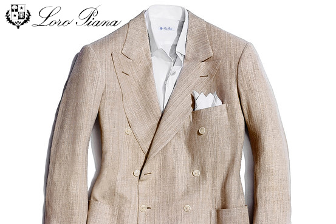
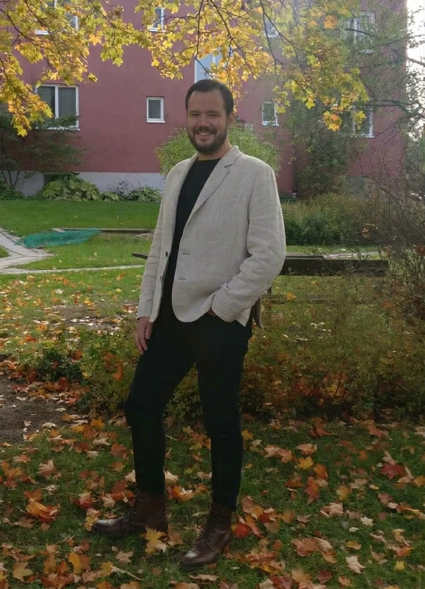
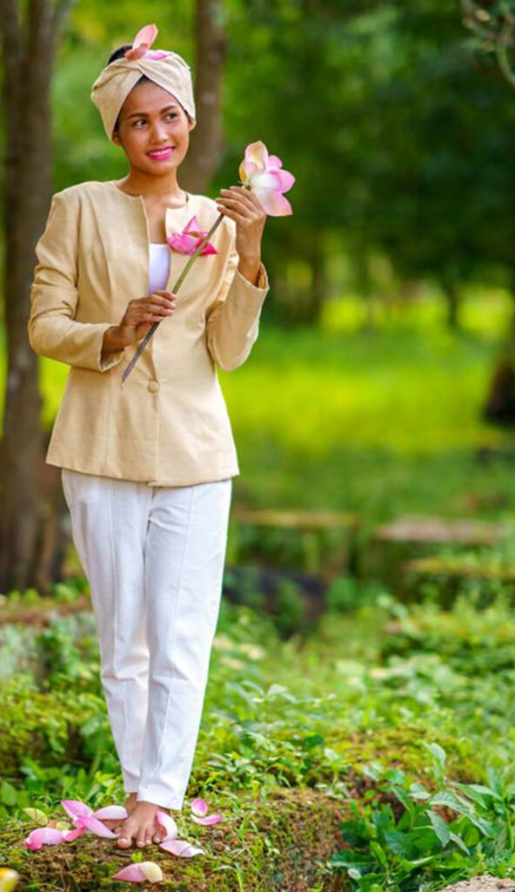

When Pier Luigi Loro Piana -- a member of the family that fully owned
Loro Piana, the Italian luxury clothing brand, until 2013 -- first
encountered lotus fabric in 2009 his first instinct was to have his company
make him a sport coat out of the fabric. We feel him.

[WSJ, 2010](https://www.wsj.com/articles/SB10001424052748703506904575592441000440092):
> When a friend from Japan handed Pier Luigi Loro Piana a swath of beige
> fabric last year, the textile baron had a hard time believing the
> story he was told: that the thread had been hand-spun from the fibers
> of the lotus plant.
> 
> The fabric looked like a blend of linen and raw silk. It was slubbed
> and soft to the touch. With the nonchalance of a man who has his own
> clothing company, Mr. Loro Piana had the fabric made into a jacket. "I
> wore it all fall," he says.

He then produced a lotus jacket for customers, for $5600 USD in 2010
(~$8,600 in 2026). This product is not currently listed on their site;
perhaps the civil war in Burma has interrupted his supply of lotus
fabric.

# Atelier Padonma's sport coat plans

A sport coat is definitely on Atelier Padonma's short list for its
open source collection. Yet such is not first-up as we want to reduce
risk by starting with garments that are simpler than a sport coat. To
wit, we are using the lotus fabric we have acquired to produce
in-house less constructed garments like wrap skirts (longyis, sarongs)
and fisherman trousers which are by nature rather "one size fits all"
and so require much less tailoring talent. 

Nonetheless, we have found existence proofs that sport coats can be
made of lotus fabric.

We have also stumbled upon the Hope Company's lotus jacket for women.

Clearly, Loro Piana has sourced excellent lotus fabric (from Inle
Lake, where lotus fiber was first used for textiles) which is still
slubby by nature, and they have excellent tailoring talent on hand in
their atelier, which it to be expected of an haute couture atelier.

Further, we have identified an experienced lotus manufacturer,
[Samatoa of Cambodia](), whose production model
is fully integrated, so quality is internally controlled from farming
lotus and harvesting stalks for yarn, through to finished garment,
including custom tailoring. From what we have seen they have the
technical skill to cut sport coats and even more complicated work. Their
dresses were reportedly selling in boutiques in fifteen countries for
[$3000 to $4000 in 2015](https://youtu.be/P-emTaSUuS0?t=284).

Finally, we have a specific open source parameteric design pattern, 
[the Jaeger](https://freesewing.eu/designs/jaeger/) by Joost De Cock,
that we are going to work off of to make prototypes. This design
requires a tailor to simply take fourteen measurments which get plugged
in a parameters to the design and out come to blueprint block. (Providing the
various lotus artisans with an open source catalog of Atelier
Padonda's collection is one of the goals of the Padonma Network.)
 
Note the following example of the Jaeger design is made of
linen. Lotus has a similar color but unlike linen it does not wrinkle
easily.

# Next step: find some guinea pigs

Next step would be to find some folks who wants to get involved with
the Padonma project as a guinea pig customers. Atelier Padonma would
collaborate with Samatoa to specify the work order based on the open
source design pattern, including a unique QR ID band, charging nothing
to either the customer nor Samatoa.

**Note:** Samatoa has not yet been directly contacted so maybe this
plan is stillborn. So, Atelier Padonma has some pitching to do before
we can proceed with them. There is no way they have heard of the Padonma
Network yet. But, they do have a - [B2B inquiry page](https://www.lotussilkfarm.com/en/b2b-partner-in-sustainable-luxury.html).

> Are you a professional in need of a sustainable partner?
> HAVE A QUESTION? +855 92 529 001
> WRITE EMAIL: b2b@lotussilkfarm.com
 
The guinea pigs would go to their local tailor to get their
measurements taken. They would directly pay Samatoa (beware their lead
time). The sport coat would be manufactured in Cambodia with inlays.
The sport coat would Fed Ex'd to the tailor who would perform the
final fittings. (Inlays are bits of extra fabric so that a garment can
be let out later, in this model firstly during the final fittings once
the customer and the coat are with the tailor.)

The Padonma Network is intentionally designed to directly connect
lotus artisans with customers (both individuals and fashion houses)
without any intermediaries wetting their beaks. The Padonma Network is
just a catalyst; membership costs nothing, and the Network makes no
money off of any transactions. Similarly, the goal of Atelier Padonma
is simply to be the midwife and poster child of the decentralized
Padonma Network, although the Atelier does charge money for actual
physical lotus goods, but only as a peer member of the Network. The
system is intentionally design for the Atelier to not have a
privileged status.

The guinea pigs:
- Are risking their own money, but avoiding intermediary mark-up
- Have to find a tailor willing to collaborate in this fashion
- Get to be involved with a cool project (the QR ID band is a good conversation piece, which when scanned leads to the individual garment's page on the Padonma Network)
- Hopefully each get a beautiful sport coat of timeless style made of the
  most luxurious fabric, each with its own unique QR code and web page on the Padonma Network

What would that cost? No idea, but if Loro Piana was selling 100%
lotus sport coats for $5,600 in 2010 and Samatoa
dresses were selling for three or four thousand in the same time
period… Take out the middlemen and the ludicrous pricing of
haute couture… Possibly a lot less because Samatoa was advertising
[off-the-rack ladies lotus jackets](https://web.archive.org/web/20241006140730/https://lotussilkfarm.com/product/lotus-silk-jacket/) 
for $390 [sic] in 2025.

# Design details

We have a clear idea of the styling of the sport coat we wish to
produce. The garment will have classic timeless style with strong
historical roots yet nothing archival nor costumey.

## Include

- Color: natural only to start
  - Later: indigo dyed blue blazer (referencing the time of the British in Burma).
    Have some tasteful solid brass buttons made with lotus designs
    which could be easily shipped around to lotus tailors. (The
    Burmese has a long history of brassworks.)
- [Functional cuff](https://us.mossbros.com/inside-pocket/post/functional-cuffs-working-detail) with real buttons and buttonholes on the OG surgeon's cuff
- English style double vents in the rear, not American single vent
- Buttons
  - For the natural colored coat, button color will match the fabric, see Loro Piana's example
  - Front buttons: three rolled to two
- [Functional lapel](https://www.instagram.com/reel/DPMiPmBCNnJ/)

## Exclude

- Not double breasted
- No [epaulettes](https://www.youtube.com/shorts/WPz0HGx4qwQ)
- No peaked lapels, too archival or if going modern can come off as
  pretentious. Also very on and off in terms of being au courant. While notched is more timeless.
- No chest patch pockets, maybe flap pockets at waist, maybe jetted
- Sure bush jacket roots for that structure but not retro-styled to look like a costume piece
- No visible throat latch: [Allan Flussers Dressing The Man](https://www.realmenrealstyle.com/dressing-man-book-review-flusser/)
- No machined pick stitching, but maybe it truly handstitched

