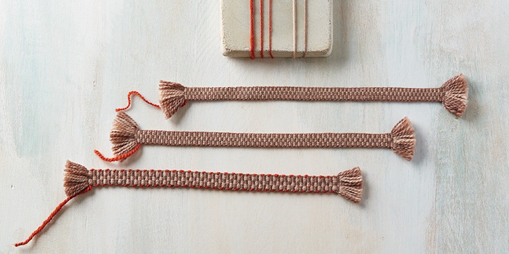
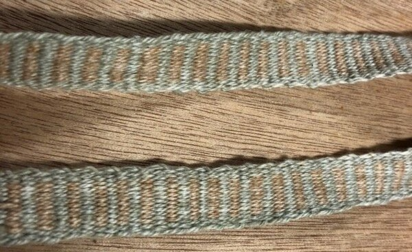

---
aliases:
  - /bandgrinding.html
  - /banggrinding.html
title: Bandgrind experiments
weight: 140
social_image: "02-bandgrind-heddle.png"
---

The [Padonma Network](/topics/padonma-network/) project seeks to encode UUIDs in QR codes
handwoven into bands. This mini blog records various band weaving
experiments carried out in order to discover how best to go about
such encoding using a simple traditional rigid heddle, which the Sweeds
call a bandgrind. (To hear how a Sweed would pronounce "bandgrind"
[listen to Google Translate pronounce "bandgrind."](https://translate.google.com/;?sl=sv&tl=en&text=bandgrind%0A&op=translate))

The goal of these bandgrinding sessions is to do a full write and
subsequent read test of rMQR ID bands. The "write" part of the test
is the weaving of the bands. The "read" part is QR reader software
successfully scanning the woven rMQR codes.

Success is pretty much guaranteed as there are many examples on the
web of previously handwaven square QR codes, and rMQRs are simply a
variant of QR. The real question is how fast and easy can it be done
with minimal weave tooling.

There is [an on-line rMQR generator](https://rmqr.oudon.xyz/) which can be used to create
downloadable rMQR code PNG images which encode arbitrary
messages\|data. That tool was used to create the first test rMQR being
handwoven, the following R7x43 rMQR code:

Note, the above R7x43 rMQR only encodes five text characters (~40
bits). All UUIDs are 128 bits and so require an rMQR of size R7x77. A
real UUID encoded to an R7x77 rMQR will be the second test
subject.

The rMQR standard, [ISO/IEC 23941](https://cdn.standards.iteh.ai/samples/77404/e103bf2d1f0d4162b34ca493efdaf9c4/ISO-IEC-23941-2022.pdf), was ratified by ISO in May of 2022,
and by the end of 2023 there were multiple free software apps that
could read rMQRs. Although, at the dawn of 2024 neither the Android
nor iOS default camera apps could yet read rMQRs. So, this particular
innovation is still diffusing to the mainstream devices. Nonetheless,
free apps such as QRQR and [Scandit](https://www.scandit.com/products/barcode-scanning/symbologies/rectangular-micro-qr-code/) are capable of recognizing rMQR
codes. ([Someone](https://hackaday.io/project/192082-rectangular-micro-qr-code-rmqr) found QRQR to be able to scan more codes than
Scandit.)

The above QR code is part structure and part encoded data (think:
envelope versus letter). The follow illustrates only the structure part:

As for why handwoven QR code bands would be useful
(and why not just print the codes?), read the
intro to the [Padonma Network](/topics/padonma-network/).

## Testing tools

- QRQR is a free app that can read rMQR codes.
  - iOS: [QRQR - QR Code® Reader on the App Store](https://apps.apple.com/us/app/qrqr-qr-code-reader/id911719423)
  - Android
    - Android [QRQR - QR Code® Reader - Apps on Google Play](https://play.google.com/store/apps/details?id=com.arara.q&hl=en)
      - [ ] From Denso or from this arara?

## Bandgrinding experiments

There are many variables that can affect the handweaving of rMQR ID
bands (the writing of data to band) and how well QR reader software
can read the bands. The purpose of this mini-blog is to record various
experiments seeking to find the cheapest, easiest, fastest way to
handweave rMQR ID bands.

For example, the following image shows three bands, that essentially
differ only in weft thread size. Obviously a dialed-in size ratio of
warp thread to weft thread would make it easier to make better rMQR ID
bands. Three warp thread wide QR modules ("modules" ~= "pixels") work
well. But perhaps with the right combination of warp and weft thread
it could be gotten down to two warp threads wide QR modules (not shown
in the below image) which might be more quickly ground out. So,
experiments need to be done to test that.

Another experiment might be to figure out how to bandgrind with only
one type of thread (say, cheap white cotton, which could be locally
dyed dark to get two colors). That imposes the requirement that the
size ratio of warp:weft must be 1:1. What encoding weave would work in
that context?

An extremely talented weaver might even be able to get down to 0.25mm
per module (a single stictch, one stitch per module). At that scale,
an R7x77 rMQR would be [approximately 2mm x 20mm](https://www.qrcode.com/en/codes/rmqr.html). That (single stitch
per module) certainly seems to be what is currently being done in
India by some handloomers.

Which sizes of rMQR are optimal in terms of trade off of width (number
of warp thread ends) versus length (number of picks, a shuttle pass
left or rigth)? A tablet weaver would probably be less bothered by
width than a rigid heddle weaver (that is, without the square cards that are
used in tablet weaving).

We need test cases to see how much human variability can be handled by
QR reader software. Consider this example of a handwoven band with
uneven beat leading to irregular lines. Would an rMQR ID band woven as
irregularly shaped as this band be scanable? Or would it be
[unscannable](https://www.youtube.com/watch?v=81_NcN7yANM&ab_channel=BestComedyCut)?

Essentially we need to handweave some rMQR ID bands and see if QR
readers will recognize the QR codes woven into the bands. Success is
pretty much guaranteed so the main question is how fast, easy, and
cheap can it be done at low scale. This "blog" includes a record of
some experiments.

## Sessions

- [Band #6](/topics/bandgrind-band-6/)
- [Session #13](/topics/bandgrind-session-13/)
- [Session #12](/topics/bandgrind-session-12/)
- [Session #11](/topics/bandgrind-session-11/)
- [Session #10](/topics/bandgrind-session-10/)
- [Session #9](/topics/bandgrind-session-09/)
- [Session #8](/topics/bandgrind-session-08/)
- [Session #7](/topics/bandgrind-session-07/)
- [Session #6](/topics/bandgrind-session-06/)
- [Session #5](/topics/bandgrind-session-05/)
- [Session #4](/topics/bandgrind-session-04/)
- [Session #3](/topics/bandgrind-session-03/)
- [Session #2](/topics/bandgrind-session-02/)
- [Session #1](/topics/bandgrind-session-01/)
