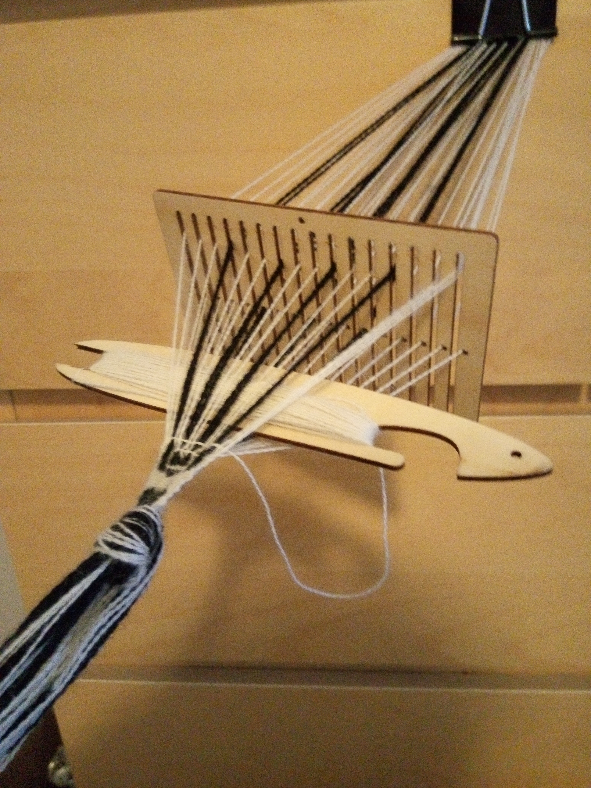

Randomly we acquired some black and white wool and started learning how to backstrap weave bands.

[\$9 on Amazon](https://www.amazon.com/dp/B0B6M7Z82H?psc=1&ref=ppx_yo2ov_dt_b_product_details)

<figure height="300px" data-align="center">

<figcaption>Bandgrind Session #1</figcaption>
</figure>
