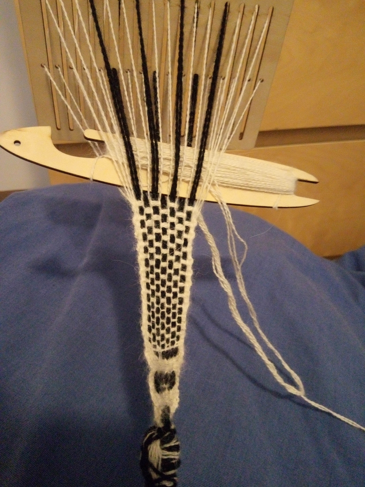

Addressing the "narrow" warp of Session \#2, Session \#3 saw a monotonic
thickening of the weft. During the session, one then two then
four threads were used to make the single white weft which eventually was as wide
as the black warp.

Still wool threads all :(

<figure height="300px" data-align="center">

<figcaption>Bandgrind Session #3</figcaption>
</figure>
