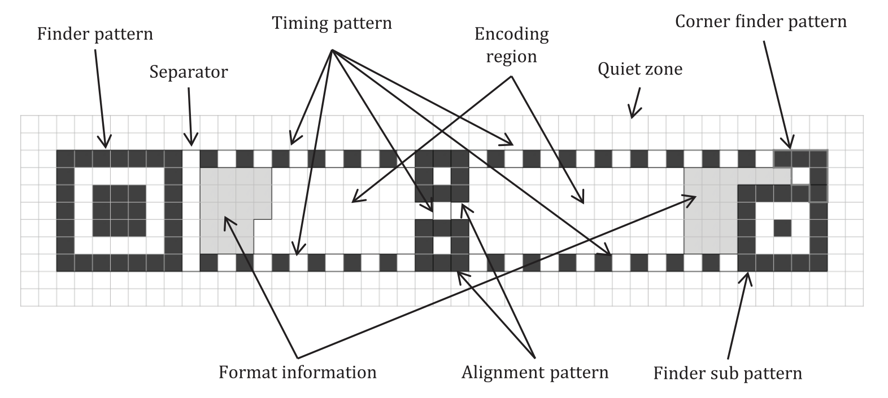
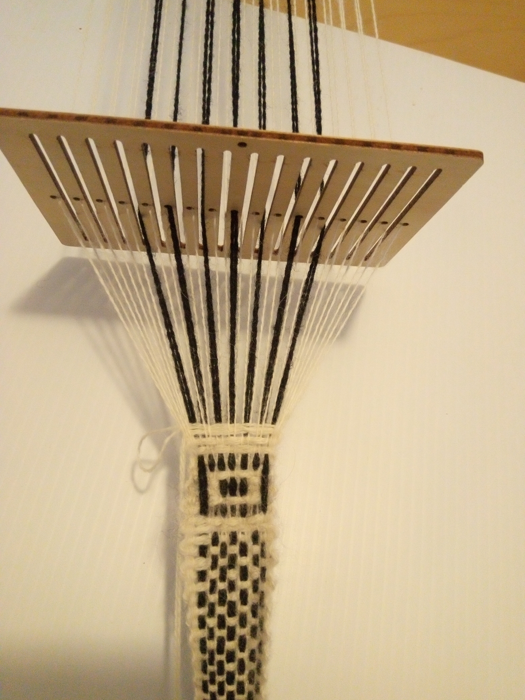

By the end of Session \#3, "square enough" QR modules were happening.
So, in Session \#4 started trying to make rMQR components, starting with
the black "finder" pattern i.e. the square that starts all rMQR codes:

<figure height="200px" data-align="center">

<figcaption>Structure of an rMQR</figcaption>
</figure>

Still all wool:

<figure height="300px" data-align="center">

<figcaption>Bandgrind Session #4</figcaption>
</figure>
