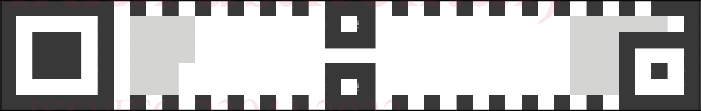
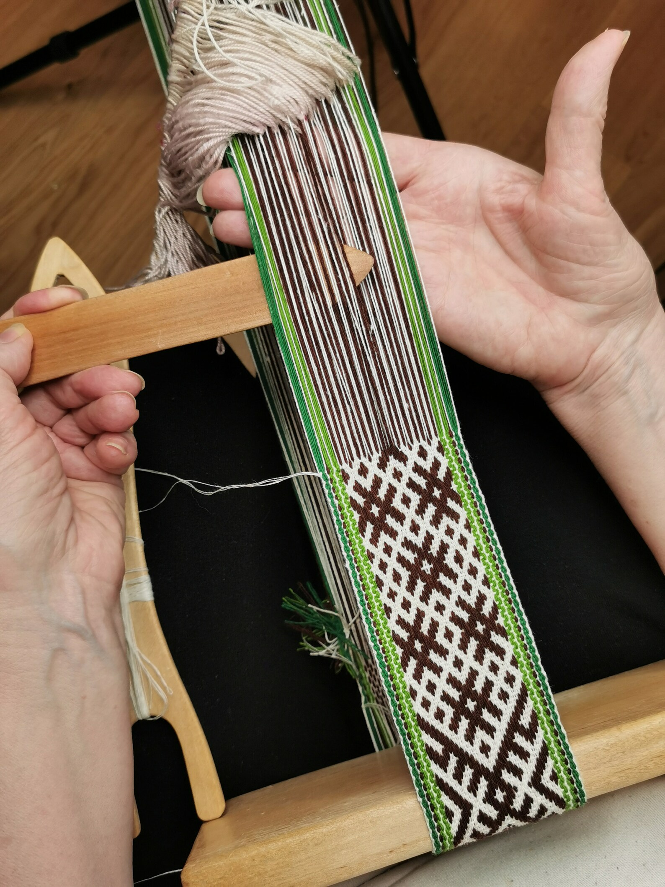
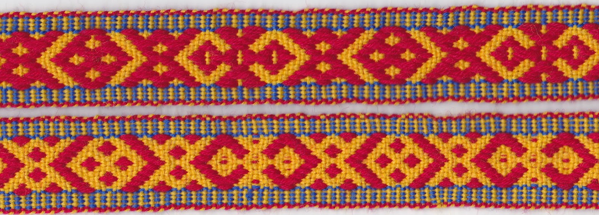
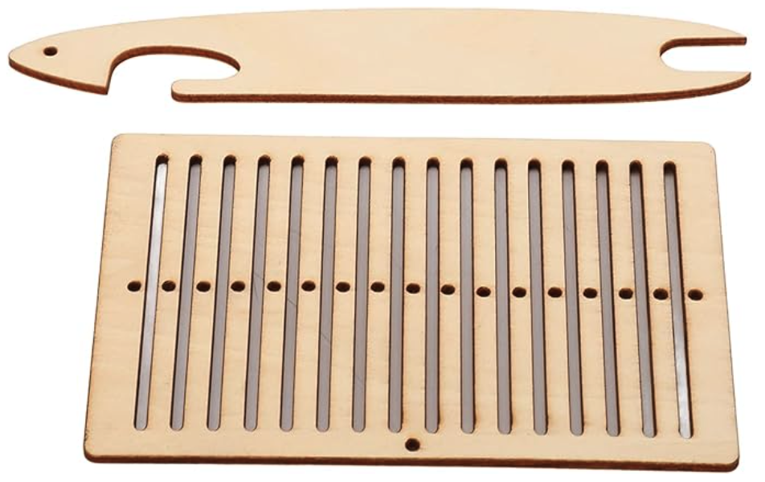
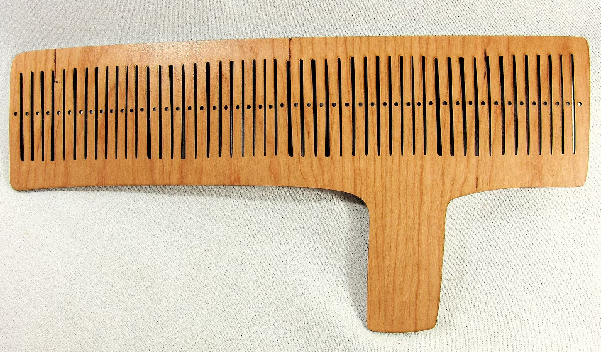

Session \#11 is when work started on Band \#5.
Session \#11 is also the first time weaving with Heddle \#2.

<figure height="400px" data-align="center">

<figcaption>Band #5 on Heddle #2, end of Session #11</figcaption>
</figure>

## Ladder infra-structured bands

There is an interesting coincidence between the physical structure of
woven bands and the visual structure of rMQR codes which might be put
to good engineering use: they both have structure along the long
edges. This coincidence should be explored: perhap best thought of as
a **physical ladder** infra-structure underlying better encoding of
a band's rMQR code's **visual data structure.**

<figure width="70%">

<figcaption>The non-cargo part of an rMQR code</figcaption>
</figure>

Stronger warp threads on the edges of a rMQR ID band might make for
more readable QR codes. Such would be analogous to having strong side
rails on a ladder. To visualize such warp patternings, refer to the
following band and imagine if each green warp were thicker than the
rest:

An interesting variation beyond simply using stronger-thicker thread
for the quiet zone edge warps, might be to also have stronger-thicker
threads in the warps that make up the two outer rows of QR modules
(think: wider, stronger side rail of the ladder). Having that part
(the timing patterns) rectilinear and evenly spaced would probably
increase scanability, because those two always contain the
on-off-on-off timing pattern as required by the spec and illustrated
above along the top and bottom edges.

## Band \#5 started

In Session \#11, Band \#5 was started. Band \#5 is an R7-wide rMQR band
with each QR module rendered 3 warps wide, using size 10 warp
threads.

By definition double faced warp weaving has warp threads that come in
pairs, of which one of the pair will always be on the opposite side of
the band as its pair partner (this fact is why double faced bands
always have the same pattern on both faces, one the inverse of the
other).

As Band \#5 uses a double faced warp weave, "modules rendered 3 warps
wide" requires 6 warps per QR module. Within a given QR module, all 3
warp pairs will show the same color on a face, thereby making a single
module.

Since rMQR bands are monochromatic by design, each warp pair will have
1 dark and 1 light thread, in other words 3 black and 3 white per each
QR module, a six adjacent to each other.

Six adjacent warp ends (3 blacks and 3 whites) per QR module would
require a heddle with at least 66 dents in order to weave an R7-wide
rMQR. An R7-wide rMQR code actually require 11 not 7 module of band
width: the core 7 modules wide code + 2 quiet zone margins each 2 modules wide = a band 11
modules wide. 11 modules X 6 threads/module = 66 threads.

As such, the warping plan for Band \#5 is symetrical left-to-right:

- 13 white, size 5 crochet yarn (DMC pearl cotton ecru)
- 42 warps alternating black and white, all size 10
- 12 white, size 5 crochet yarn

Band \#5 is the first experiment involving stronger warp threads in the
[selvage](https://en.wikipedia.org/wiki/Selvage) (the size 5 warps above). The goal hear is to prevent the
edges of the band from stretching. So the 12 all white warps on each
edge are size 5; these make up the edges of the band which make up the
required two QR module wide "quiet zone" around the data encoding part
of an rMQR. The warp threads in the middle of the band (where data is
actually recorded) are white size 10 and black size 10. The idea is
that a large weft thread (1mm) and medium/large warp threads (size 5)
creat a sort of ladder struction, and the small (size 10) central
warps encode the data more finely, potentially leading to smaller bands.

## Heddle \#2 with 91 dents, up from a max of 31

As seen in the first ten bandgrinding sessions, Heddle \#1, the
first rigid heddle used in these bandgrinding experimens, has 33 dents
– 17 holes plus 16 slots.

The current experimental goal is to get a QR reader to recognize an
R7-wide rMQR handwoven onto a band. The earliest experiments used only
one warp thread per QR module. Starting in Session \#9, experiments
started using three warp threads to render each QR module. At that
point, Heddle \#1 was not large enough to handle 6 threads per QR
module (3 warps on each side of the band means 6 warps per QR
module). Heddle \#1 has 31 dents, and so can render at most a QR code 5
modules wide. The minimum width on rMQR code is 7 modules. 31 \<
(6\*7). So, Heddle \#1 is a deadend for modules 3 warp ends wide.

So, Heddle \#2 was ordered on \[2023-12-11 Mon\]. Heddle \#1
has 33 dents and Heddle \#2 has 91 dents. (Not two two previous pictures not to the same scale.) 91 will be enough to even
get wasteful of dents (and experiment with novel heddle designs).
