Rigid heddle looms can be purchased for [less than \$10](https://www.amazon.com/Bannt-Ashford-Heddle-Backstrap-Weaving/dp/B0CJFQ5C75/ref=sr_1_1) on the web.

The 15-string heddle on the left has seven slots for the pattern
threads, and eight for the background threads i.e. a 15-string heddle
should be sufficient for a R7-sized rMQR band.

[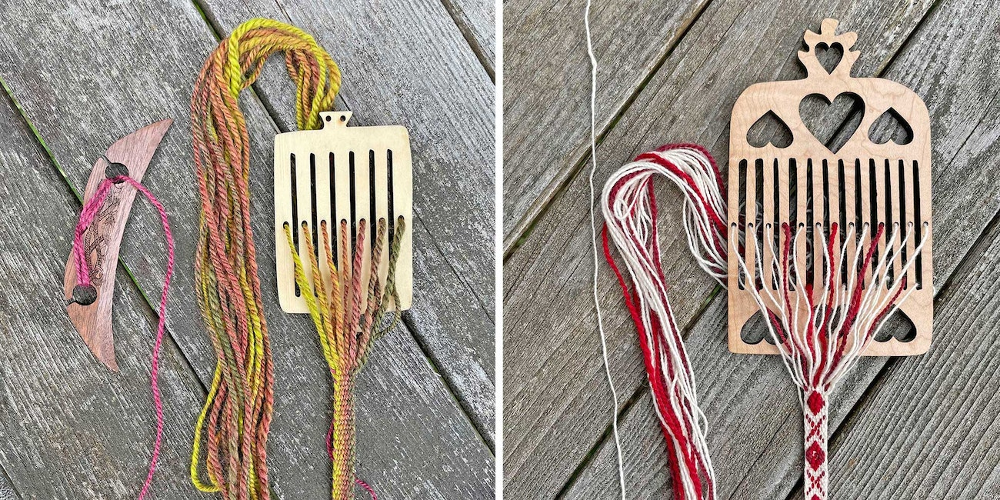](https://spinoffmagazine.com/backstrap-rigid-heddle-basics-get-weaving-handspun-bands/)

Kedma's smallest rigid heddle, a 15-thread rigid heddle, could
probably do an R7-sized rMQR: 8 holes (background) and 7 slots
(black foreground)

- [Kedma Backstrap Loom - YouTube](https://www.youtube.com/watch?v=C3KczNNjJis)
- [אריגת דוגמא בנול מותן של קדמה - YouTube](https://www.youtube.com/watch?v=7wWy1pI1lOQ)

Clearly arbitrary patterns can be manually encoded with simply two
pick-up sticks on a rigid heddle loom. One thing that needs to be
figured out is if a single thread can serve as a data module in a
rMQR. Here we see two thread being used in a repeating 11001100
pattern.

[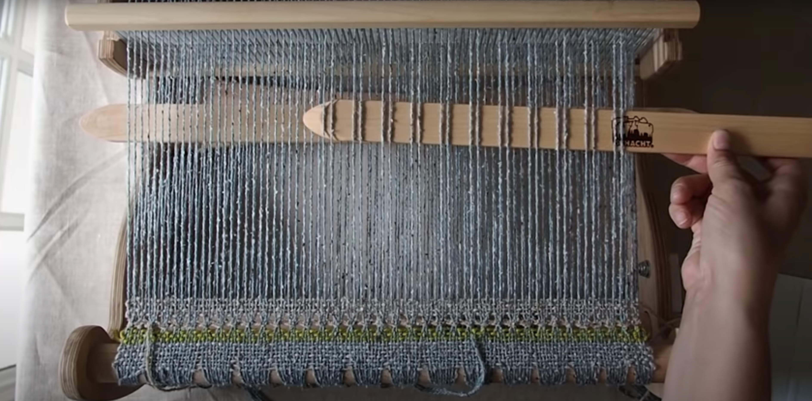](https://youtu.be/7kJCG63zXqE?t=200)

Testing will need to be
done on weave patterns, thread thickness (pattern versus background
threads, 2:1?), spin direction, et cetera to find the minimum that
makes a phone camera happy to read a handwoven rMQR.

Alternatively, the above could be interpreted as 1010, where each
two threads is a single data module? Would it be safer if a data module
were two threads wide and two wefts tall, which is known as basket weave:

Bandweaving QR module squares

To weave a single QR code module (i.e., bit or pixel), three same-color adjacent stitches
in a weft row seems to look like a square, at least enough for a QR
reader to play along.

So then, since a QR module is the same thing as a bit, the following
band could be read as encoding a list of 7-bit binary numbers. Each
weft row can be seen as a seven bit binary number, each three adjacent
weft threads a bit of that row's number. (Ignore the fact that the
yellow margins would be white if the rMQR spec were to have its way.)
In the list shown below, the elements are alternating rows of all 1s
and then all 0s, except the 0s rows each has a single 1-bit on (the
green diagonal).

[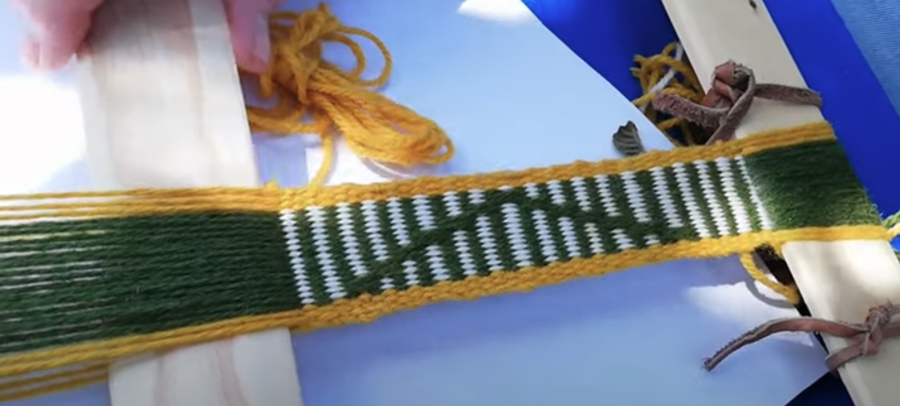](https://youtu.be/l9mIje4wmgo?t=3343)

As for how long it should take a practiced weaver to create an R7x77? [About 15 minutes.](https://www.youtube.com/watch?v=d2A1K8oEWTU)

A human can hand encode individual bits on a single stitch, but can
QR reader applications handle that? Probably not in this case:

[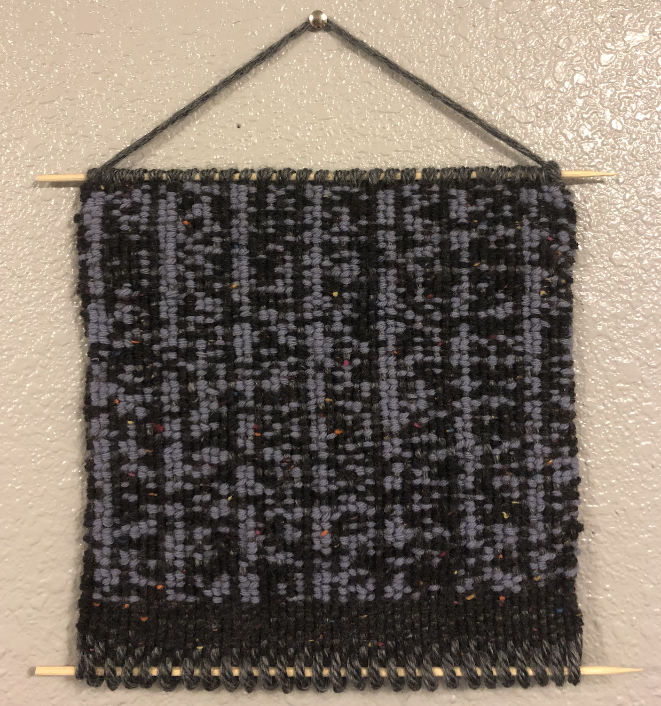](https://chrstnb.github.io/translation/)

It sure looks like three stitches will be sufficient to render a
single QR data module. Might two work? Maybe. Need to run tests.

[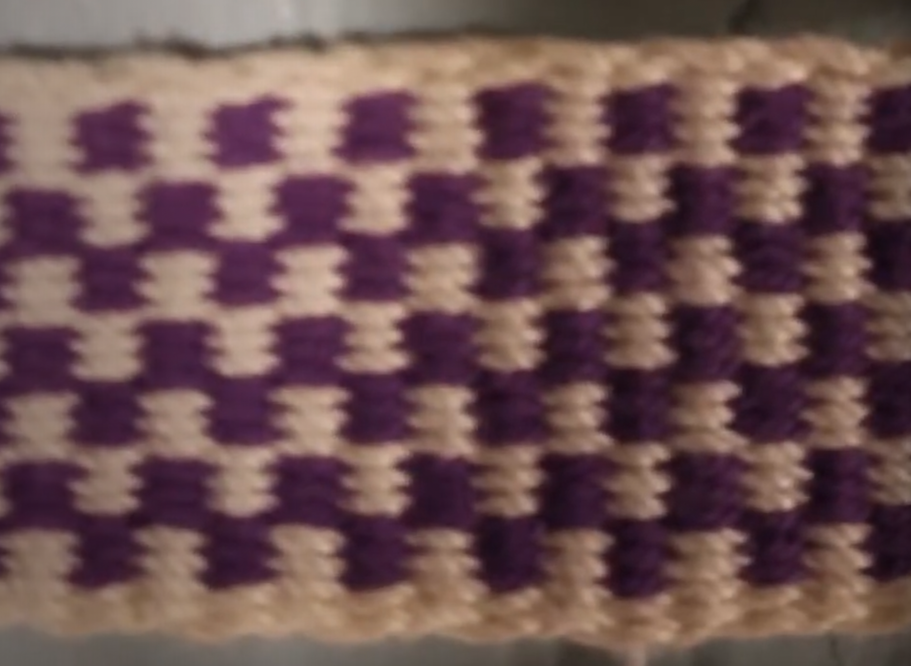](https://www.youtube.com/watch?v=dKLudDihe_I)

For another example of weaving square-ish modules, observe in the
following image that in the horizontal lines of the Ns that the
"pixels" are three warp wide. Also note that the font is five "pixels"
tall, so the band is essentially the size of an R11 wide rMQR with the
required two "pixel" quiet zone white margin around the code:

[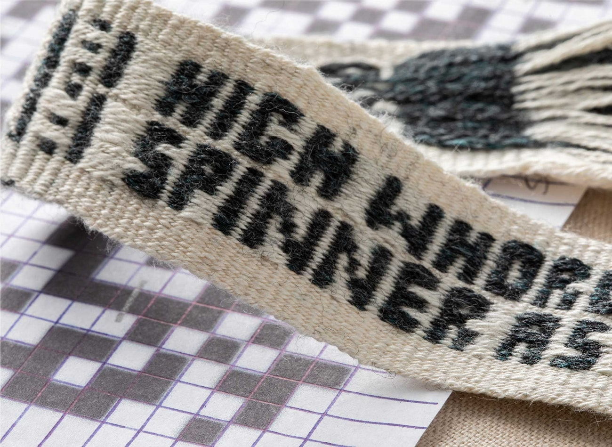](https://spinoffmagazine.com/a-spinner-s-journey-in-inkle-bands/)

People already weave letters into bands ("letter pick-up"). For example,
[Weaving Letters on an Inkle Band - YouTube](https://www.youtube.com/watch?v=C-JTo2kzF9Y). So, somewhere between
those two extremes of "print resolution" (single stitch versus block
letters that OCR could read) is where a QR code reader will fail to
read a code.

[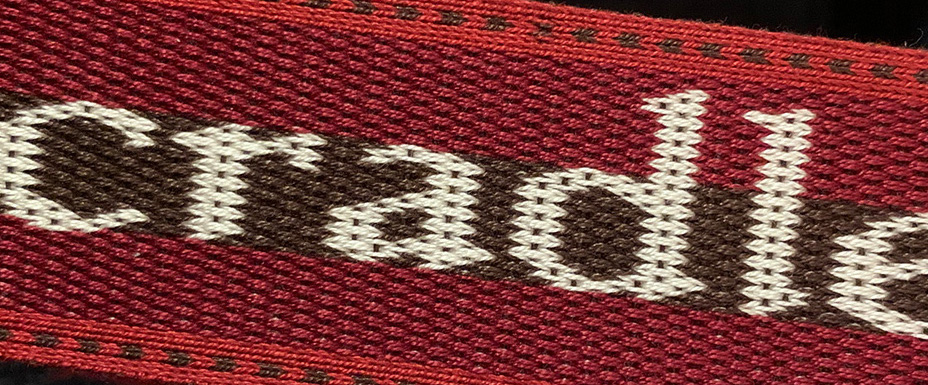](https://www.inkleweavingpages.com/uncategorized/woven-poem/)

For QR codes weaving, black and white thread will work (although any
pair of contrasting colors would work, testable by photographing in
black and white). Only needing two colors of thread is nice and
minimal in terms of sourcing and stocking supplies.

With pattern weaving, the default is that the pattern warps are
doubled threaded (two warp threads in a hole or slot), compared to the
background colored warp threads which are single threaded. Seemingly a
ratio of 2:1 for pattern to background is suggested. Some
experimentation has to be done to find the ideal ratio for weaving QR
modules. In pattern weaving the pattern (i.e. the visual foreground)
is more important than the background, for appreciation by humans. But
for QR codes the foreground (black) and background (white) are both
equally important, for "appreciation" by QR code readers. Thread
ratios will also affect background coloring showing between on-pattern
QR modules. For example the background shows through in the following
band (note that in this example, dark is the background color). Surely
QR readers can handle some inter-module border&margin coloring. Dunno.

[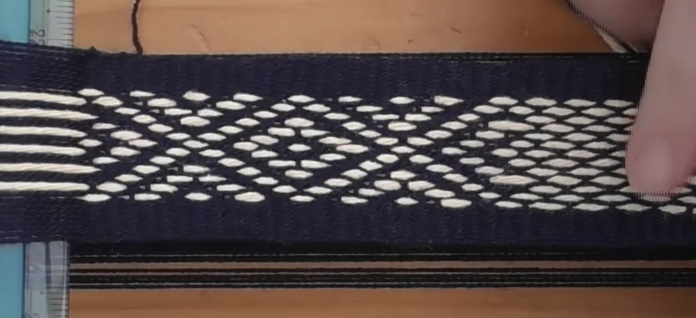](https://youtu.be/tz2SM0_a7Us?t=942)

A [simple band width guide](https://youtu.be/ZzhuDomPtxE?t=191) might help make rMQRs that are easier for
a smart camera to read:

[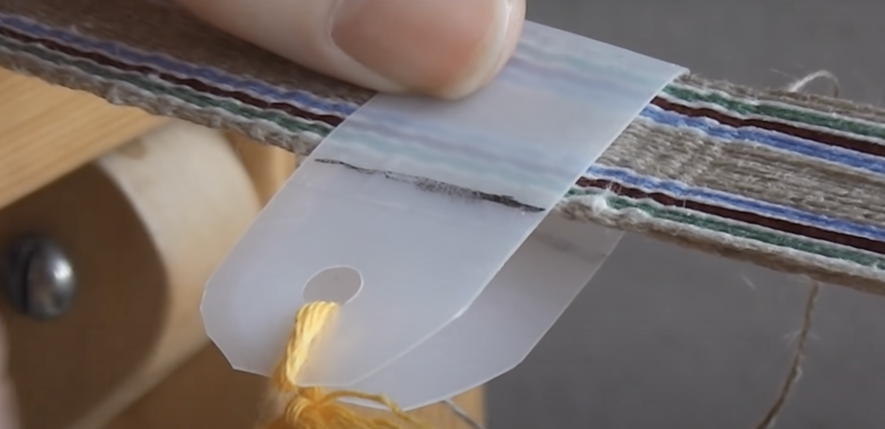](https://www.youtube.com/watch?v=ZzhuDomPtxE&t=191s)

Additionally, there is a serendipitous overlap with the nature of band
weaving and the rMWR spec. The outer side edges of all rMQRs are
dashed on/off black/white, as per the spec. This is a timing feature
intended to make alignment easier for the QR code reader software. The
spec says, "alternating sequence of dark and light modules enabling
module coordinates in the symbol to be determined." So, if a weaver is
inconsistent with how tightly the weft is beated down or narrow the
band is made, the timing dashed pattern will help correct for
abberations.

Some close examples.

[Pattern Weaving with Pick Up Stick Rigid Heddle Loom - YouTube](https://www.youtube.com/watch?v=2BI-4fVDKog&ab_channel=rigidheddleweaving):
pick up stick is the manual programming part of the weaving processs

[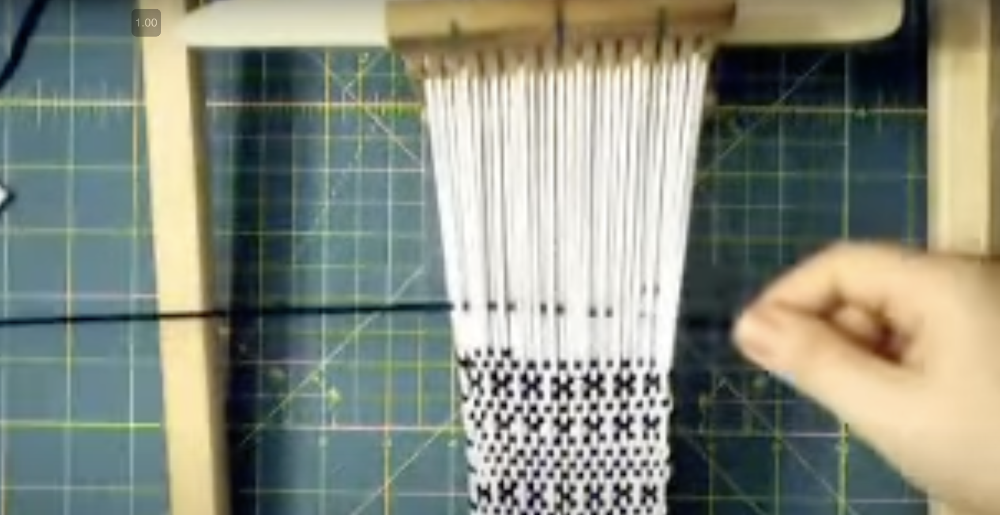](https://youtu.be/2BI-4fVDKog?t=97)

From earlier, on YouTube a guy banding like a rMQR with a rigid heddle, ~9 pattern modules:

Seemingly 8-by-8 modules would work well. But 8-by-8 seems like
overkill in terms of return on investment. That is, one of the goals
herein is to find out the minimum amount of work to get a QR reader to
recognize a handwoven rMQR code. (Of course, if someone wants to have
a larger than minimally required rMQR that might be an intentional
part of the look. For example, perhaps someone would like to have a
band all along the bottom of a skirt, where only a section contains a
rMQR – go for it.)

[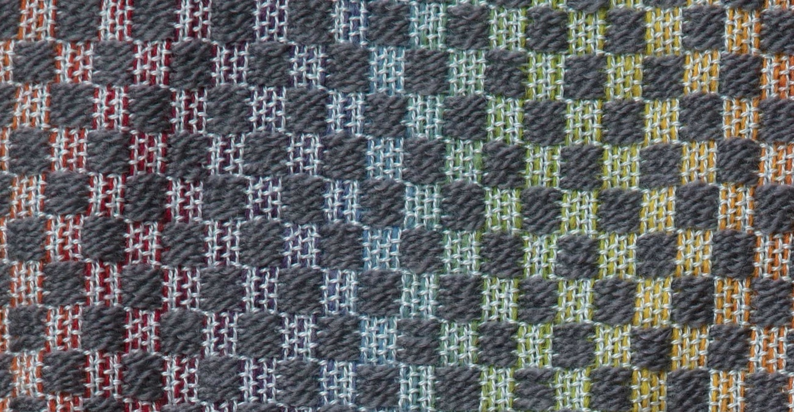](https://littlelooms.com/weaving-in-color-color-theory-basics/)

Primers

- Narrow Band Weaving
  - [Narrow Band Weaving Part 1: Getting Started - YouTube](https://www.youtube.com/watch?v=byzsdSFR4yI)
  - [Narrow Band Weaving part 2: Warping the Loom - YouTube](https://www.youtube.com/watch?v=SoLU8Eg-Xoo&t=12s&ab_channel=DanaHarrisSeeger)
  - [Narrow Band Weaving part 3: Weaving Techniques - YouTube](https://www.youtube.com/watch?v=gwkzJyKFF2U)
- [Bandweaving Using Rigid Heddles and Inkle Looms eBook \| Spin Off Library](https://spinoffmagazine.com/library/106411227)
  - Free ebook of instructional articles
  - "we’ve collected seven of our favorite bandweaving articles and projects together"
- [Backstrap Rigid Heddle Basics: Start Weaving Handspun Bands - YouTube](https://www.youtube.com/watch?v=7M3omYQGi9Q)
  - mentions [pickup bands](https://youtu.be/7M3omYQGi9Q?t=42)
- [How to use pick up sticks - YouTube](https://www.youtube.com/watch?v=G4WOMi-WnVs&ab_channel=KellyCasanova)
