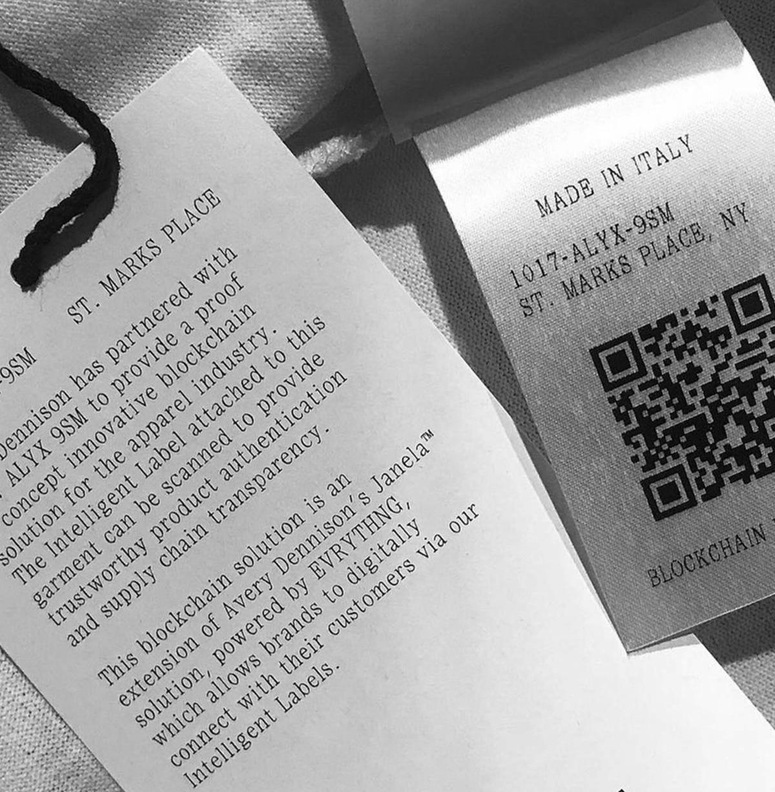

[Exploring the potential of blockchain technology within the fashion and textile supply chain with a focus on traceability, transparency, and product authenticity: A systematic review](https://www.frontiersin.org/articles/10.3389/fbloc.2023.1044723/full)

- [Review article, 20 February 2023](https://doi.org/10.3389/fbloc.2023.1044723)

- School of Fashion and Textiles, Australia

- Abstract

  > ..This review highlights the opportunities that exist in adapting
  > Blockchain Technology in the fashion and textile supply chain, while
  > also providing insight into the challenges of adopting this
  > technology. This paper provides a systematic review of the potential
  > of Blockchain Technology within the fashion and textile industry’s
  > supply chain to analyse its role in traceability, transparency, and
  > product authenticity. To achieve this, a substantive number of
  > research papers and non-scholarly resources have been
  > scrutinised. ..

[Blockchain In Fashion: Is It Ready? - The Interline](https://www.theinterline.com/2022/03/10/blockchain-in-fashion-is-it-ready/)

- 2022-03

- Quotes

  > Marjorie Hernandez, founder of LUKSO champions blockchain
  > technology as the best solution to enhance flexibility,
  > transparency and agility in supply chain operations.
  >
  > When it comes to those experimenting with blockchain technology,
  > one of the first early adopters was a collaboration between Danish
  > fashion designer **Martine Jarlgaard** and blockchain technology
  > provider, Provenance.

[Blockchain: Unlocking Transparency And Traceability In The Fashion Supply Chain - The Interline](https://www.theinterline.com/2022/02/28/blockchain-unlocking-transparency-and-traceability-in-the-fashion-supply-chain/)

[How Blockchain Technology is Transforming the Fashion Industry?](https://appinventiv.com/blog/blockchain-in-fashion-industry/)

> Blockchain technology makes it convenient to track royalty
> payments. It doesn’t just allow the designers to develop an
> unchangeable proof of creation but it can also be used for creating
> and tracking trademarks, license designs in addition to royalty
> programs or sales originating through these designs.

[How digital fashion, the metaverse, and NFTs could change the fashion industry - Vox](https://www.vox.com/the-goods/22893254/digital-fashion-metaverse-real-clothes)
