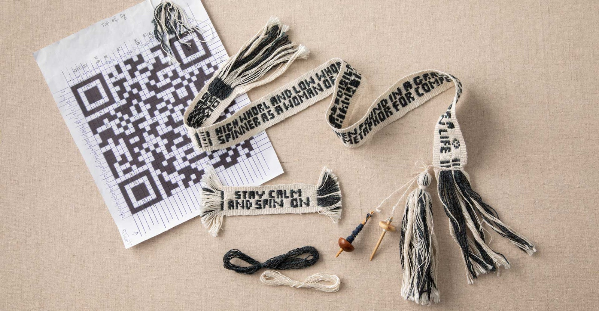
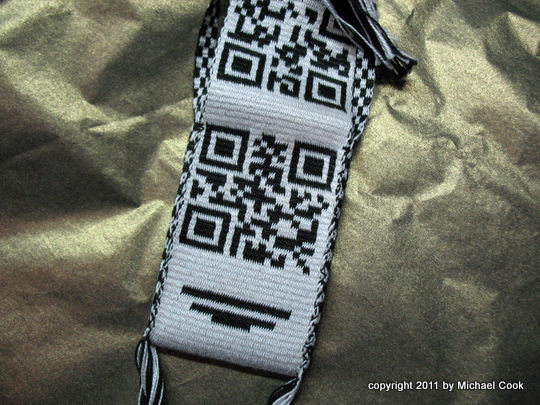
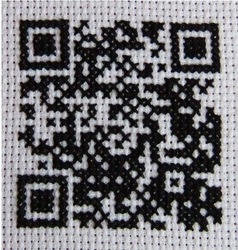

In, [A Spinner’s Journey in Inkle Bands](https://spinoffmagazine.com/a-spinner-s-journey-in-inkle-bands/), author Jeannine Glaves
descibes how she wove regular square QR codes and then went on to
embed text into bands she wove.

<figure height="300px" data-align="center">

<figcaption>Notice the draft pattern for a square QR code in the background</figcaption>
</figure>

Note she uses the term "letter pick-up" so perhaps this Padonma
project is trying to work out "QR code band pick-up" or just "QR
pick-up." It would seem that her work could be extended to weave rMQR
codes into bands, which could then be sewn into garments.

Note also that is sounds like she was able to get a QR reader to work
using only a single stitch per QR module. Perhaps a rMQR reader will
be able to work with that resolution.

> While homebound during COVID-19, I looked for something new to try
> with the bands. I thought it would be fun to weave my vaccination QR
> code. The code pattern needed 29 pairs of warp threads. A pattern pair
> consists of a light background and a dark, heavier pattern
> thread. Since the QR code would be square, it would take only 29
> pattern wefts to weave the code

In [Why, yes… yes I did! Weaving QR code](http://www.wormspit.com/2012/01/26/why-yes-yes-i-did-weaving-qr-code/), we see an example of 3 warps
per QR data module:

- Examples of handicrafted QRs
  - [On Etsy, one stitched QR patch](https://www.etsy.com/nz/listing/741540773/the-original-never-gonna-give-you-up-qr) The Original Never Gonna Give You Up QR Code Patch
  - [A gallery of QRs all handmade: woven, knitted, croceted \| QR-3D](http://qr-3d.weebly.com/gallery.html)
    - A gallery of "woven" QR codes on various objects large and small

Crochet QR code

- [How to make a QR crochet bomb – the ageing young rebel](https://theageingyoungrebel.com/how-to-make-a-qr-crochet-bomb/)
  - <https://web.archive.org/web/20220122171615/https://theageingyoungrebel.com/how-to-make-a-qr-crochet-bomb/>

<figure height="150px" data-align="center">

<figcaption>An example crocheted QR code</figcaption>
</figure>

