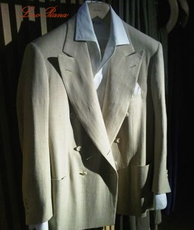
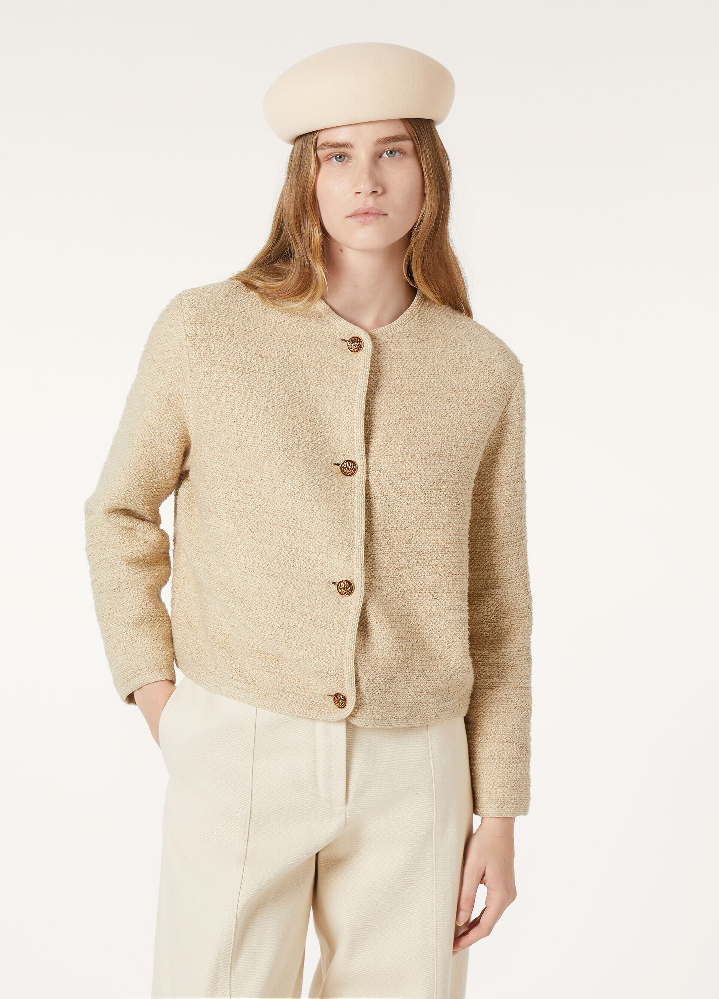
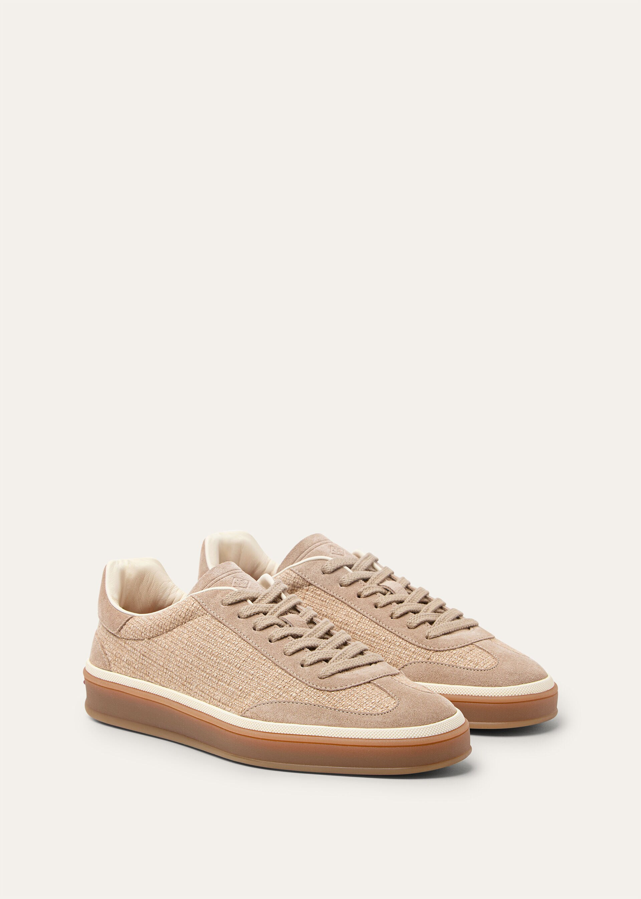
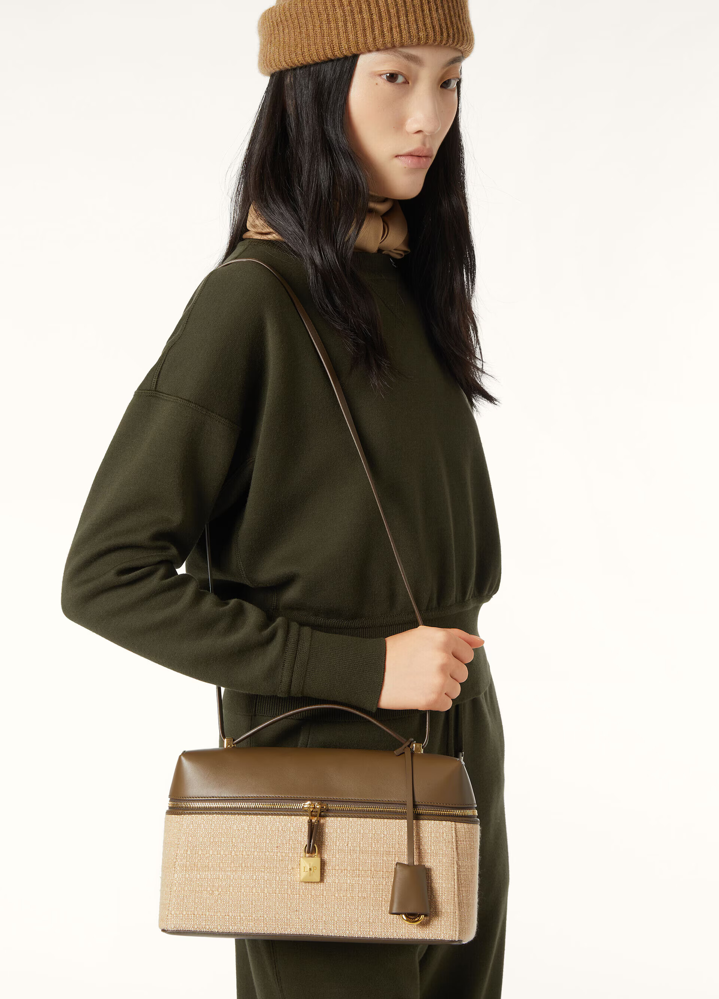

## Loro Piana family

[Source for image of PLLP](https://wwd.com/eye/people/pier-luigi-loro-piana-sailing-my-song-competition-music-1235656296/)

Loro Piana is a [storied](https://muslindhaka.com/loro-piana-review/#elementor-toc__heading-anchor-7) Italian fashion maison, that began as a
textile mill in 1924 and later expanded to producint their own luxury
garments. The founding family remains involved, even though the
company is now majority-owned by LVMH.

With regards to lotus fiber, Pier Luigi Loro Piana

- their site text: Pier Luigi Loro Piana himself forged direct ties with Burmese
  artisans to honor and preserve this century-old heritage.

- 2010: https://www.wsj.com/articles/SB10001424052748703506904575592441000440092
  - $5,600 Lotus Jacket
  - PLLP first touched the fabric in 2009, it seems

## Loro Piana's excellences

In their own words:
> **Restlessly seeking nature's gifts**
>
> It is the desire for excellence that led six generations in search of the rarest and most precious raw materials in the most remote places in the world."

They describe three materials as their excellences:
- Lotus fiber
- Vicuña
- Baby cashmere

## Example apparel

### Men's Sport Coat

- $5,600 (2010 price)
- Composition: 100% lotus fiber?

### Women's Lotus Jacket

- Composition: 83% Cotton, 17% Lotus
- $4,620.00
- Out of stock (shown as "Coming soon")
  - Perhaps they simply cannot get the fiber out of Burma currently

### Tennis Walk Sneaker

- Composition: 48% Cashmere, 35% Lotus Flower, 17% Silk
- $1,110.00

### Extra Bag L27

- $4,800.00
- Composition: 48% Cashmere, 35% Lotus Flower, 17% Silk
- Out of stock
