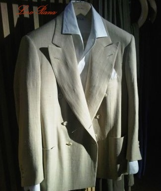
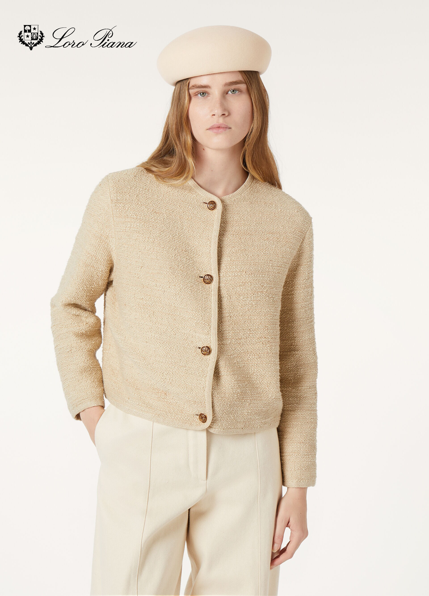
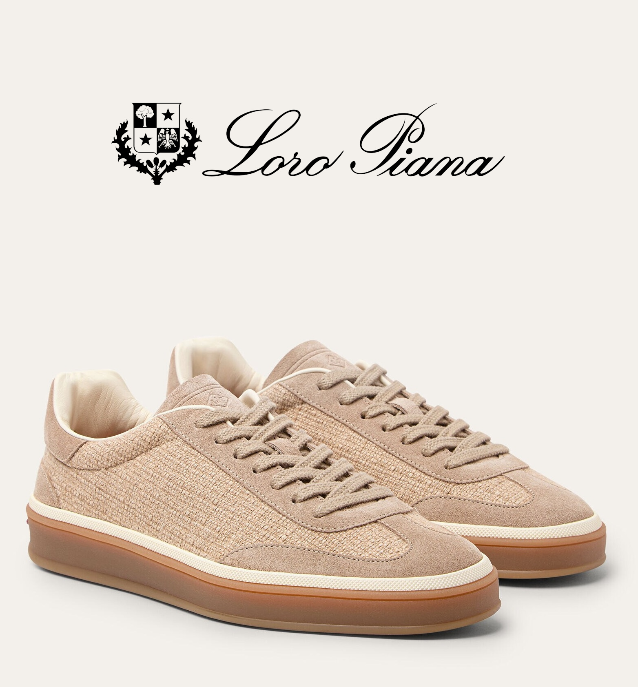
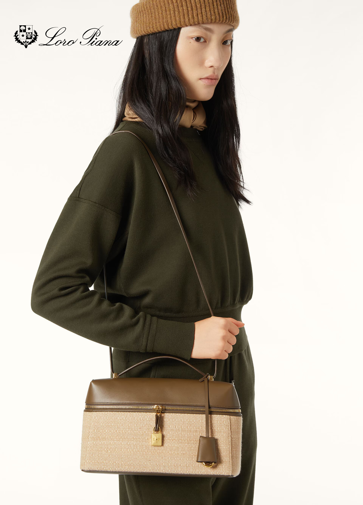

Loro Piana is an Italian luxury clothing brand. The company positions
itself as a specialist in rare natural fibers, specializing in the
processing of cashmere, vicuña, extrafine wool, and dabbles in lotus
fiber. They refer to themselves as a Maison and "the House."

## Loro Piana family

[Source for image of PLLP](https://wwd.com/eye/people/pier-luigi-loro-piana-sailing-my-song-competition-music-1235656296/)

Loro Piana is a [storied](https://muslindhaka.com/loro-piana-review/#elementor-toc__heading-anchor-7) Italian fashion maison, that began as a
textile mill in 1924 and later expanded to producint their own luxury
garments. The founding family remains involved, even though the
company is now majority-owned by LVMH.

With regards to lotus fiber, Pier Luigi Loro Piana

- their site text: Pier Luigi Loro Piana himself forged direct ties with Burmese
  artisans to honor and preserve this century-old heritage.

- 2010: https://www.wsj.com/articles/SB10001424052748703506904575592441000440092
  - $5,600 Lotus Jacket
  - PLLP first touched the fabric in 2009, it seems

## Loro Piana's excellences

In their own words:
> **Restlessly seeking nature's gifts**
>
> It is the desire for excellence that led six generations in search of the rarest and most precious raw materials in the most remote places in the world."

They describe three materials as their excellences:
- Lotus fiber
- Vicuña
- Baby cashmere

## Mueller und Sohn article

[Lotus Silk – Yarn from Buddhas Flower](https://www.muellerundsohn.com/en/allgemein/lotus-silk/)
- Written by Staff, 11. October 2022

> But in 2010, the Italian entrepreneur Pier Luigi Loro Piana
> discovered the preciousness of the substance. The traditional
> family-owned Loro Piana (sixth generation since 1924) belongs to the
> luxury group LVMH since 2013 and became famous for its products made
> from only the finest of cashmere. Now he sees the silk of the lotus
> flower as the non-plus ultra for his fashion. For Pier Luigi, this
> lotus fiber has all the qualities one could wish for in a fabric: it
> is very light, breathable, water repellent, cool in summer and warm
> in winter, and does not wrinkle. The brand name is “Loro Piana Lotus
> Flower®”. Only about 100 exclusive Made-to-Measure jackets are
> produced per year out of the fine cloth (for a jacket you need 26000
> panzers), at a cost of about 6,000 euros per blazer. Loro Piana
> receives about 50 meters of fabric per month from the contract
> weaving mill, which means a whole village solely works for him.

## Example apparel

Note that Loro Piana likes to call the color, Wheat Land.

### Men's Sport Coat

- $5,600 [WSJ, 2010](https://www.wsj.com/articles/SB10001424052748703506904575592441000440092)
- Composition: 100% lotus fiber?

### Lotus Shirt

[Sustainable textiles from lotus](http://researchgate.net/publication/340279701_Sustainable_textiles_from_lotus) (2019)/

> Loro Piana, an Italian luxury brand that designed and showcased a
> 100% lotus fiber garment in the Parisian fair. Their lotus shirt is
> priced at Euros 4000.

### Women's Lotus Jacket

- Composition: 83% Cotton, 17% Lotus
- $4,620.00
- Out of stock (shown as "Coming soon")
  - Perhaps they simply cannot get the fiber out of Burma currently

### Tennis Walk Sneaker

- Composition: 48% Cashmere, 35% Lotus Flower, 17% Silk
- $1,110.00

### Extra Bag L27

- $4,800.00
- Composition: 48% Cashmere, 35% Lotus Flower, 17% Silk
- Out of stock
