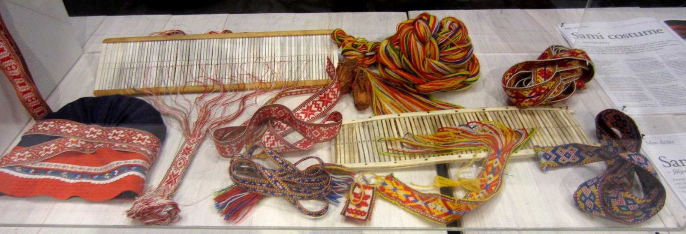
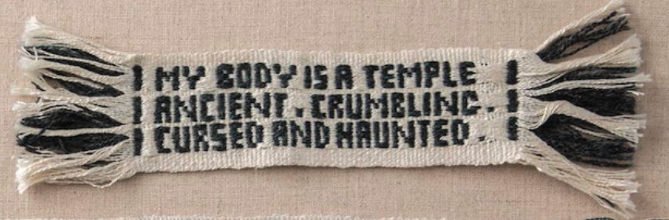

The Padonma Network is exploring the possibility of tracking cottage
industry garments via handwoven QR codes. The goal is to design the
easiest on-ramp imaginable by which a single artisan could make their
products globally traceable via handmade QR codes.

The ancient handweaving technology of the rigid heddle loom seems like
it may well be fit for the purpose of handweaving rMQR ID bands. Read
the [Bandgrind Experiments](/bandgrinding.html) pages for a log of ongoing experiments into
weaving rMQR ID bands via a rigid heddle.

This project is exploring the potential of tagging garments with
handwoven labels containing rMQR codes, which are a novel variant of QR
codes. The rMQR specification was ratified as an ISO standard in May
of 2022. The name "rMQR code" is short for "rectangular Micro Quick Response
code." Whereas original style QR codes are square, rMQR codes are
narrow and rectangular, resembling ribbons or bands:

There are many prior examples of handcrafted QR codes being recongized
by QR reader software. The relative advantage of rMQR over QR in this
project is that while handweaving it is easier to weave seven "bits"
per row than the "wider" rows of traditional QR codes, and the
machinery required to do so is minimal ([fingerweaving](https://www.instructables.com/How-to-Fingerweave-Something/) would not even
require a loom). The goal is to make it as easy as possible for
artisans to join the Padonma Network.

It would seem like an rMQR code such as the one above could be
woven into textile bands which would look something like the small band in the
following example, but the black pattern "pixels" of the words would
be replaced with rMQR code data modules:

A simple rigid heddle backstrap loom would be sufficient to weave such
a band, which would look much like this exaple:

The weaving term "letter pick-up" refers to using pick-up techniques
to weave letters into bands. So this Padonma Network project is trying
to work out "QR code band pick-up weaving," or more succinctly "QR pick-up."
