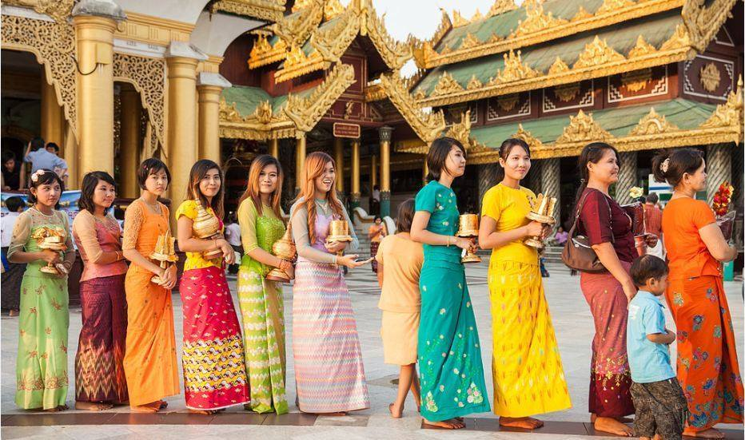

There is some wildly sophisticated styling to be found in the
historical and still living cultures within Burma. Some of it is
palaciously luxurious but that is not a goal of Atelier Padonma. And
the ethnic tribal fashion is even wilder and would make for beautiful
clothing but is simply too folkloric for the Atelier. On the other
hand, the simple and plain (longyi, backstrapped two-planel tunic,
etc.) but in lotus fiber is definitely in our sights. But a coutry
which counts 135 indiginous ethinic identities is fertile pickings for
inspiration.

## Formal attire is very proudly multi-ethnic

Supposedly there are 135 ethnicities in Burma. During holiday events
they break out their OG roots outfits making for an amazingly diverse
crowd behaving completely organicly, grassroots.



## The longyi is the Burmese garment

The longyi has long been THE quintesential Burmese leg garment, not
pants. (Some folks, like the Shan, do still have very nice traditional
pants). Check out this 1983 street footage from the capital,
Yangon. Almost everyone is wearing a longyi.



Longyi around the waiste and thanaka on the face? You're in Burma.



 

**2 minutes**:



 

Notice how in@2m45 when they compare the traditional tubural style to
the modern wrap and that they explain why the traditional is better:



### How to wear a longyi

- [The story of Longyi – An impressive Myanmar traditional dress](https://www.indochinavoyages.com/travel-blog/myanmar-travel-guide/whats-special-traditional-clothes-myanmar)
  - 2 minutes
  


## Sources

- [Burmese jacket made of lotus](https://www.alamy.com/stock-photo-a-jacket-woven-from-lotus-fibres-at-a-workshop-on-inle-lake-in-myanmar-92699291.html)
- [Handwoven Hemp Fabric, Karen Shirt, Boho Tribal Textile](https://www.etsy.com/listing/728551994/handwoven-hemp-fabric-karen-shirt-boho)
