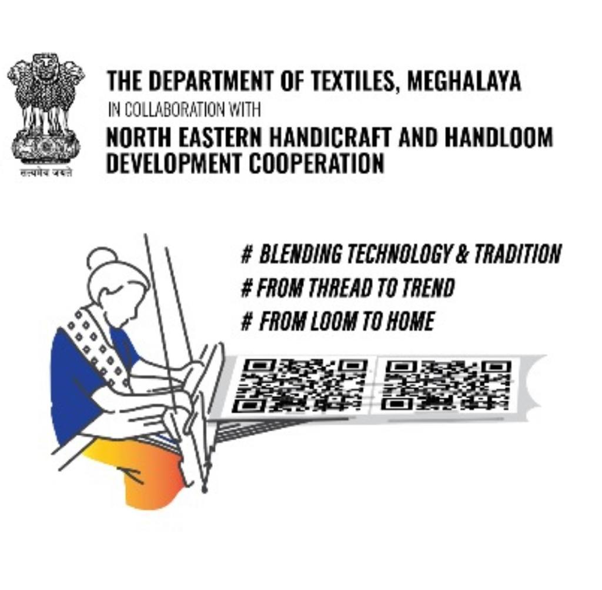
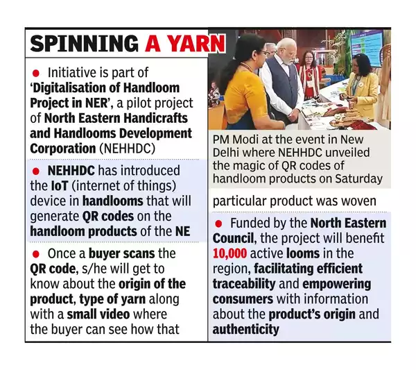

QR codes are already being used to track all manner of handicraft
products. For example handmade carpets: [QR Codes Seen as Key to Reviving the Fading Glory of Kashmiri Carpets](https://www.voanews.com/a/qr-codes-seen-as-key-to-reviving-the-fading-glory-of-kashmiri-carpets-/6487753.html). 

The closest prior art
to Padonma is what the Indian government is doing with woven
products. 

[A 3 minute short on Facebook about NEHHDC's QR & blockchain authenticator of handloom items](https://www.facebook.com/MdonerIndia/videos/the-nehhdc-north-eastern-handicrafts-and-handlooms-development-corporation-scann/1823727242369001/)

The following articles serve to illustrate the goings on in India.

[NEHHDC-textiles department collab to encompass over 10,000 looms](https://themeghalayan.com/nehhdc-textiles-department-collab-to-encompass-over-10000-looms/) (2023-10)

> In alignment with this initiative, NEHHDC, in collaboration with the
> Department of Textiles, aims to adopt an additional 500 weavers in
> Meghalaya, with a particular focus on the Silk Village.

[Banarasi Saree To Have QR Code Woven In, IT-BHU Develops New Technique to Identity Genuineness of the Handloom Products \| LatestLY](https://www.latestly.com/india/news/banarasi-saree-to-have-qr-code-woven-in-it-bhu-develops-new-technique-to-identity-genuineness-of-the-handloom-products-2673359.html) (LatestLY, 2019-07)

> The manufacturer can weave the QR code on saree with details of
> his own firm and manufacturing. Whenever customers want to know
> about a product, he has to use the scanner in his mobile to know
> about it. He will get all details entered in the QR code, like
> place of the manufacturer, date of manufacture, etc. These
> measures will create confidence in customers and increase
> sales.
>
> Research scholar M. Krishna Prasanna Naik, who is working
> on the growth of the Banaras handloom industry, said that the
> **Banaras handloom industry is facing major issues, with MARKETING
> being one of them.**
>
> According to his study, **most customers are not
> aware of the difference between handloom and power-loom made**
> saree. Only a limited number of customers know about the handloom
> mark and GI mark.
>
> His study also shows that customers are unaware
> of whether sellers provide real handloom marks or duplicate
> handloom marks with products. **So, he came up with the idea of
> sarees having logos and QR code.**
>
> Naik said that the fully designed
> saree consists of 6.50 meters in length in which 1-meter blouse
> pieces are included. After the sari part is completed, a part of
> 6-7 inches of plain fabric before the blouse is weaved. This patch
> contains the QR code and the other three logos.
>
> Incorporating these **logos in this extra fabric piece,** will not
> reduce the **fabric strength and style and the looks of the saree
> will remain intact.** Amresh Kushwaha, chairman, Angika co-operative
> society and Angika, a Varanasi based designer, have implemented
> the idea for the first time.

[Handloom: Now, Qr Codes In Fabric To Carry Info On Ne’s Handloom Products \| Times of India](https://timesofindia.indiatimes.com/city/guwahati/now-qr-codes-in-fabric-to-carry-info-on-nes-handloom-products/articleshow/104097748.cms) (2023-10)

- [How digital fashion, the metaverse, and NFTs could change the fashion industry - Vox](https://www.vox.com/the-goods/22893254/digital-fashion-metaverse-real-clothes)
