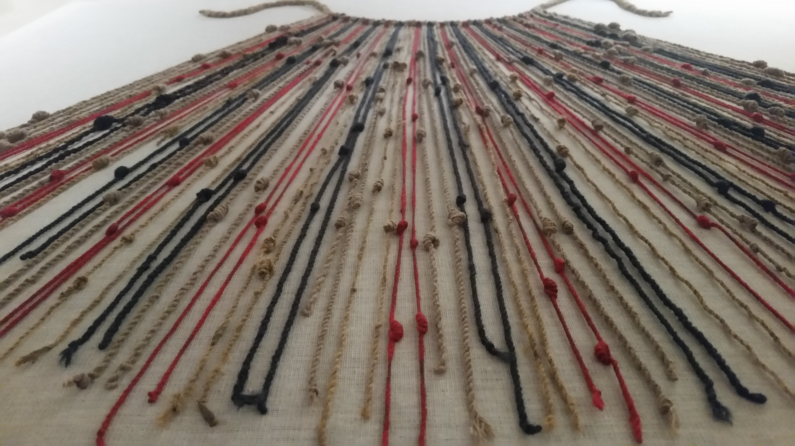

# Bandgrinding

Bands are arguable the earliest woven textiles. Bandgrind is the
Swedish word for a band weaving tool a.k.a. a rigid heddle. We logged
our rmQR bandgrinding experiments.

## Quipus

The Padonma Network is encoding digital data into handwoven
structures, that is QR Codes in bands. Curiously this is nothing new.
The Incans were doing the same centuries ago.

