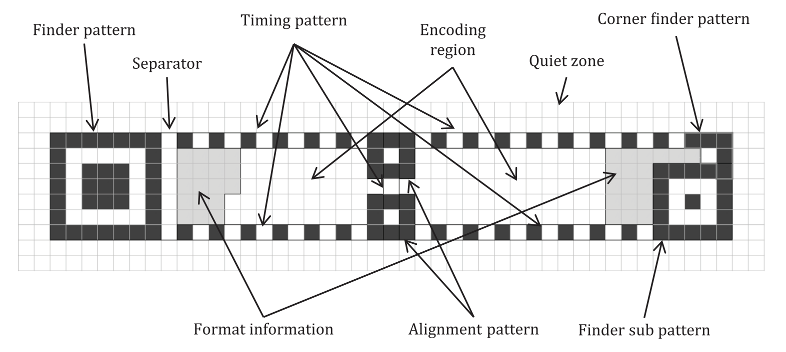

By the end of Session #3, "square enough" QR modules were happening.
So, in Session #4 we started trying to make rMQR components, starting
with the black "finder" pattern i.e. the square that starts all rMQR
codes:

<figure height="200px" data-align="center">

</figure>

Still all wool. The stuff we have is too stretchy. It is thread from
Alpaca Lace made of 100% baby alpaca. That was not tightly spun yarn
and as such would prove to stretch for weaving QR codes, at least when
done by a complete noob to weaving.

Perhaps worsted wool would work. That is not an experiment that has
been conducted; wool is not what lotus weavers will have on hand.  We
have since moved on to hemp and cotton experiments. Moving forward
only cotton and lotus thread is all we will be work with in the
foreseeable future.
