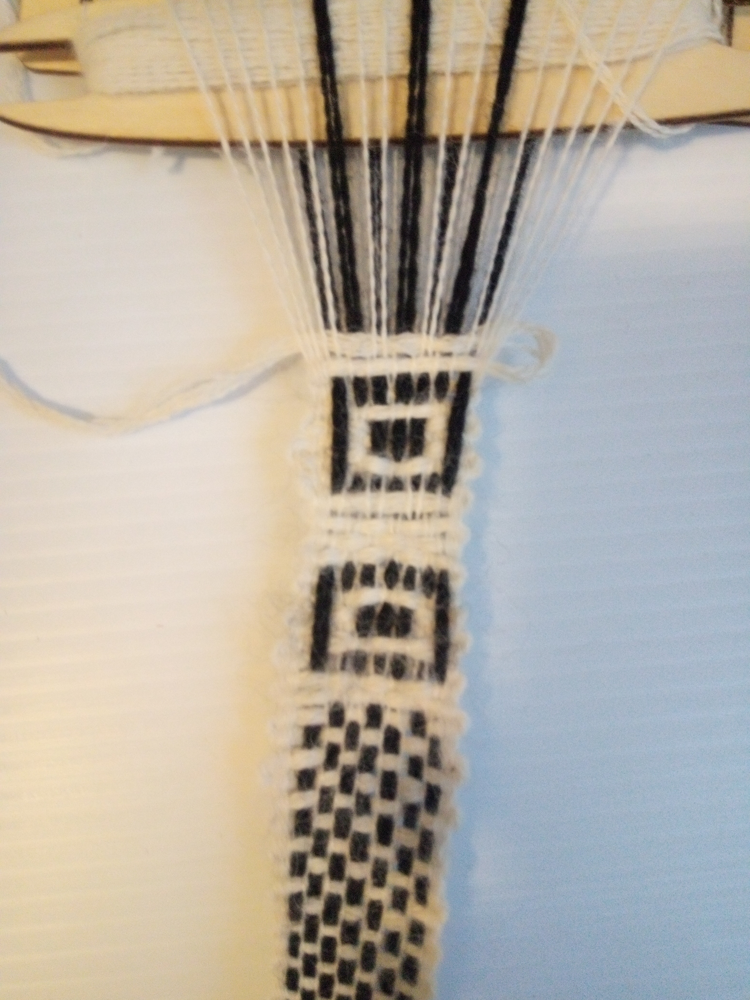

Session \#5 was a second attempt at the finder pattern, the black start square. Last time
with the wool threads.

<figure height="300px" data-align="center">

<figcaption>Bandgrind Session #5</figcaption>
</figure>
