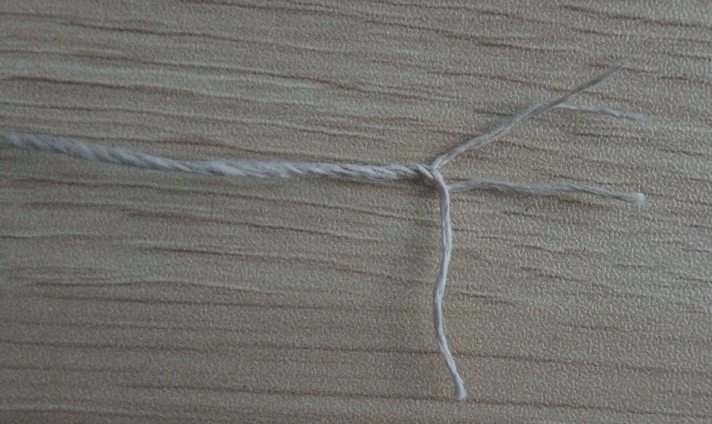

Session #6 was using multiple size 10 threads to make a thick weft.
In Session #7 (between the two squares below) the weft was changed
to 1mm thick natural color hemp from [Hemptique](https://hemptique.com/).

<figure height="300px" data-align="center">

<figcaption>Structure of Hemptique 1mm</figcaption>
</figure>

 

The hemp aspect is just an experiment; we needed thicker thread and
1mm hemp was simply what was on hand. That was good enough for
experimenting.  The real solution needs to used cotton or lotus. Hemp
would be more difficult to source in remote parts of the world.)
