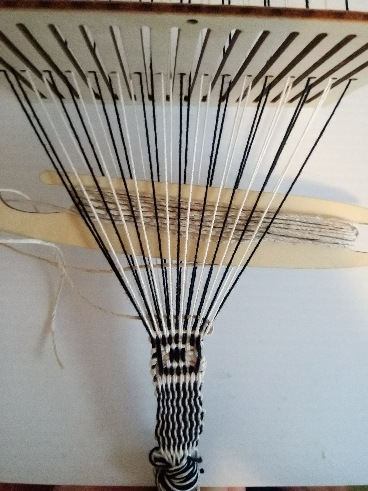

By Session #8, the basics of what theads to work with had been solved
well enough. Since Session #1 though #8, the same warping pattern was
used (double black, white, white, repeat) as taken from Baltic band
weaving technique for pattern weaving. That warping pattern naturally
exposes parts of the weft, which in the end is simply a design
deadend, which ended right here:

<figure height="300px" data-align="center">

<figcaption>Bandgrind Session #8</figcaption>
</figure>
