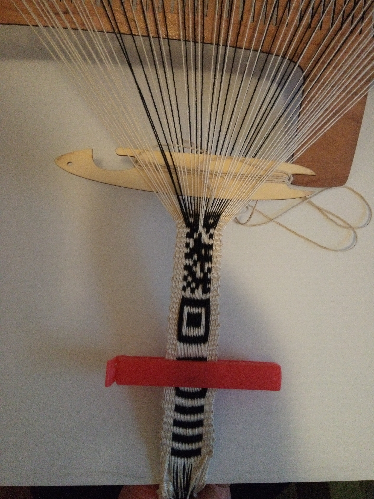

[2023-12-27 Wed]

This was the first session to get beyond just the finder symbol (the
size 7 (1-1-3-1-1) square that a starts all rMQR codes. This session
ground out a finder symbol and half the data code body of the rMQR.

<figure height="400px" data-align="center">

<figcaption>Band #5 on Heddle #2, end of Session #12</figcaption>
</figure>
