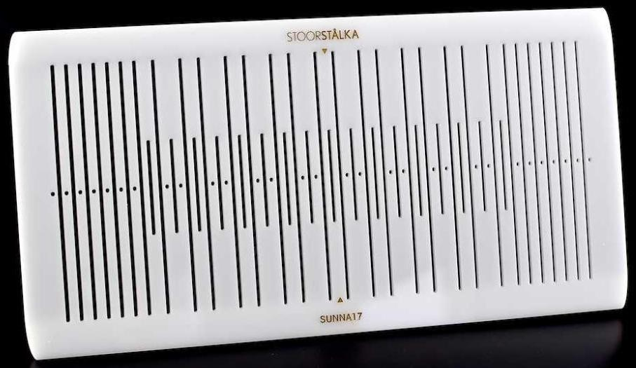

## Tooling: band width guide

A [simple band width guide](https://youtu.be/ZzhuDomPtxE?t=191) might help make rMQRs that are easier for
a smart camera to read:

One made of just paper [Bandweaving – Jumaka](https://jumaka.com/2019/01/bandweaving/)
<https://jumaka.com/wp-content/uploads/2019/01/IMG_4584-576x1024.jpg>

## New tool type: rMQR heddles

When weaving mRQR codes into double-faced bands, each QR module square
can be represented via 4 (2x2) or 9 (3x3) stitches. Whether 4 or 9,
for any give weaving/encoding all the stitches of a module will be
white or black together, all making up a dark or light QR module – a
One or a Zero. That fact could be used to design task specific
heddles, optimized for cranking out rMQR bands. Dents could be spaced
horrizontally on the heddle in groups of 4 or 6 for, respectively 2x2
or 3x3 sized renderings.

One could even imagine lazer cutting a heddle designed to weave
nothing but rMQR codes, with the above mentioned gapping carved into
the heddle.

The rMQR spacing could also be merged with the short slots seen
in Baltic pattern stitching heddles:

Such a theoretical task specific rMQR heddles is absolutely not
required to grind out a rMQR, but one might well make band grinding go
quicker. Even without a task specific heddle an experienced weaver can
probably grind out an rMQR band in 15 to 30 minutes.

For example, Heddle \#2 has 91 dents. 91 is wide enough to get
luxurious with regard to a warping plan by setting up a warping
pattern having 2-dent gaps between 6-dent groups (three black ends,
three white ends), each 6-dent group being used to render a single QR
module, so BWBWBWxx repeated for each QR module. The group-by-six
pattern would probably make it easier to weave QR modules, which
always will be woven as either three black threads up or three white
threads up to fill in a QR module as a one or a zero. If doing the
above "standard heddle odd warp planning" helps, then could also make
heddles specifically designed for the task
