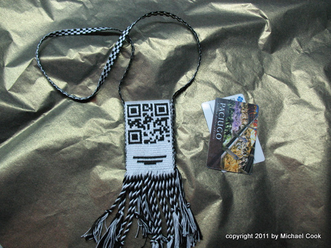
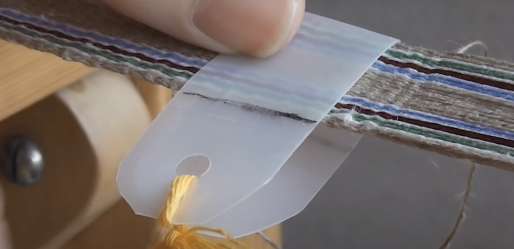
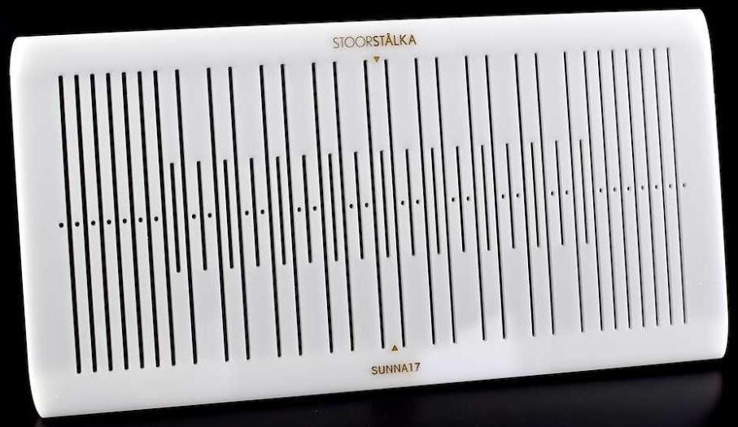
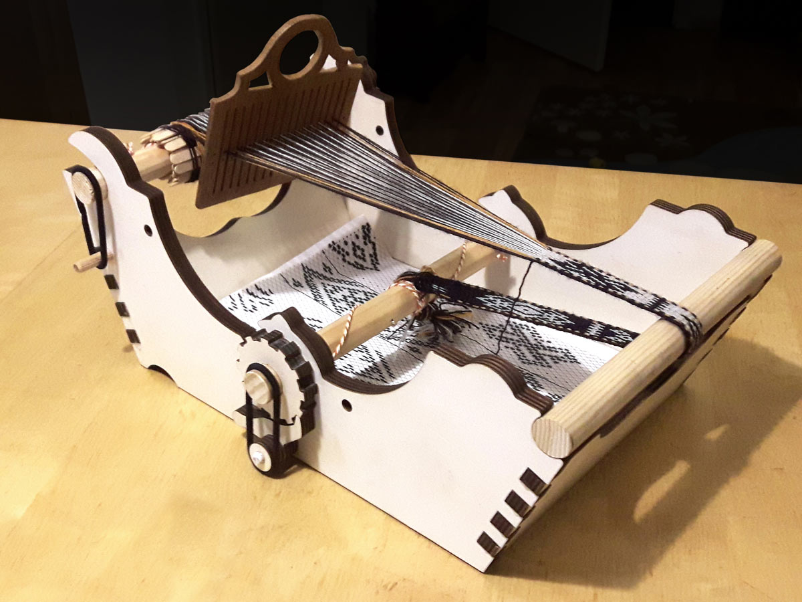

Padonma's weaving experiments have proven unsurprisingly that indeed rMQR
bands can be woven and successfully scanned. Next up: better, faster, cheaper.

## Smaller ID bands

The first bands that proved to be actually woven and then scanned used three
warp threads per module. We should be able to get that down to one thread
per module, which would make handpicking module (read: pixel) patterns easier.

Smaller bands might just seem cleaner or fit better into smaller garments.

QR Codes can be scanned by mobile phone as small as about half a millimeter
per Code module.

## Tablet weaving

We have found prior art of folks handweaving QR Codes via tablet weaving,
a.k.a. card weaving. 

This might prove very fast, especially for the case
of multiple warp threads pre module/pixel because multiple adjacent tablets
can be turned in one hand motion. Also, turning cards seems faster
than handpicking multiple warps. 

So, we know it can work (prior art) but how much time is saved has to
be tested.

A nice feature of tablet weaving is than when not in use a tablet
weaving set-up can stored out of the in a bag (it is just thread and
cards) or a more permanent set-up would be a simple inkle loom, which
can be small but still the size of a tabletop appliance.

## Tooling: band width guide

A [simple band width guide](https://youtu.be/ZzhuDomPtxE?t=191) might help make rMQRs that are easier for
a smart camera to read:

One made of just paper [Bandweaving – Jumaka](https://jumaka.com/2019/01/bandweaving/)
<https://jumaka.com/wp-content/uploads/2019/01/IMG_4584-576x1024.jpg>

# rMQR tooling

Band weaving tools designed specifically for producing rMQR ID bands
would assuredly speed things up. The quicker and easier it is to
handweave QR codes, the more likely is the innovation to be
adopted. **Blueprints for such tools are one of the deliverables of the
Padonma Network's open source work.**

When weaving mRQR codes into double-faced bands, each QR module square
requires either 4 (2x2) or 6 (2x3) warp ends. (Hopefully we can
get this down to 1x1 but that has not been proven yet.) Whether 4 or
6, for any give weaving/encoding all the stitches of a module will be
white or black together, all making up a dark or light QR module – a
One or a Zero. That fact could be used to design task specific
heddles, optimized for cranking out rMQR bands. Dents could be spaced
horrizontally on the heddle in groups of 4 or 6 for, respectively 2x2
or 2x3 sized renderings.

## rMQR specialized heddle

First, simply a rigid heddle with dent designed for weaving rMQR ID
bands (dents are the slots and holes in the heddle; the bars between
the slots and holes are sometimes called the heddle's "teeth.")  Such
heddles would be configured specifically for producing rMQR ID bands
of various heights; R7, R9, and R11 tall rmQR Codes are the three
sizes for which we have worked out combomarks, that is the sort of
image you see at the top of the page. Beyond simply be a unique brand
images, the "Padonma" wordmark is for the humans to understand the
significance of the rMQR code (image recognition software might also
use the wordmark as a clue as to what to do with the rMQR Code).

One could even imagine lazer cutting a heddle designed to weave
nothing but rMQR codes, with the above mentioned gapping carved into
the heddle.

The rMQR spacing could also be merged with the short slots seen
in Baltic pattern stitching heddles:

### A nicety not necessary

Such a theoretical task specific rMQR heddles is absolutely not
required to grind out a rMQR, but one might well make band grinding go
quicker. Even without a task specific heddle an experienced weaver can
probably grind out an rMQR band in thirty minutes to an hour. For a
garment that tooks months to produce, that is not a major additional
amount of work.

For example, in Padonma's experiments, Heddle #2 has 91 dents. 91 is
wide enough to get luxurious with regard to a warping plan by setting
up a warping pattern having 2-dent gaps between 6-dent groups (three
black ends, three white ends), each 6-dent group being used to render
a single QR module, so **BWBWBWxx** repeated for each QR module. The
group-by-six pattern would probably make it easier to weave QR
modules, which in the 3-warp-ends-per-module case always will be woven
as either three black threads up or three white threads up in order to
fill in a QR module as a one or a zero. Since doing the above
"standard heddle odd warp planning" helps, then probably making
heddles specifically designed for the task would make the work go even
faster.

## rMQR box loom

A box loom is the next step up. This is just a mini-loom with a ridig
heddle.

The real innovation might be "mini-heddles." Think of a box loom with
"switches" to flip a module 1/black or 0/white. It may well be that
these "switches" are "sub-heddles" mounted on the main ridid heddle, or
separate but then that really is a box loom, more than just a
heddle. 

Just a heddle not a loom would be easier to store when not in use, but
there are foldable box looms that can be stored compactly.

