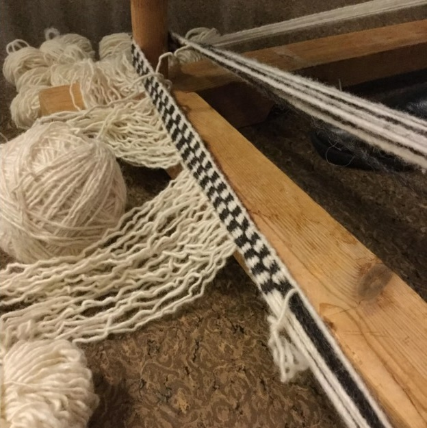
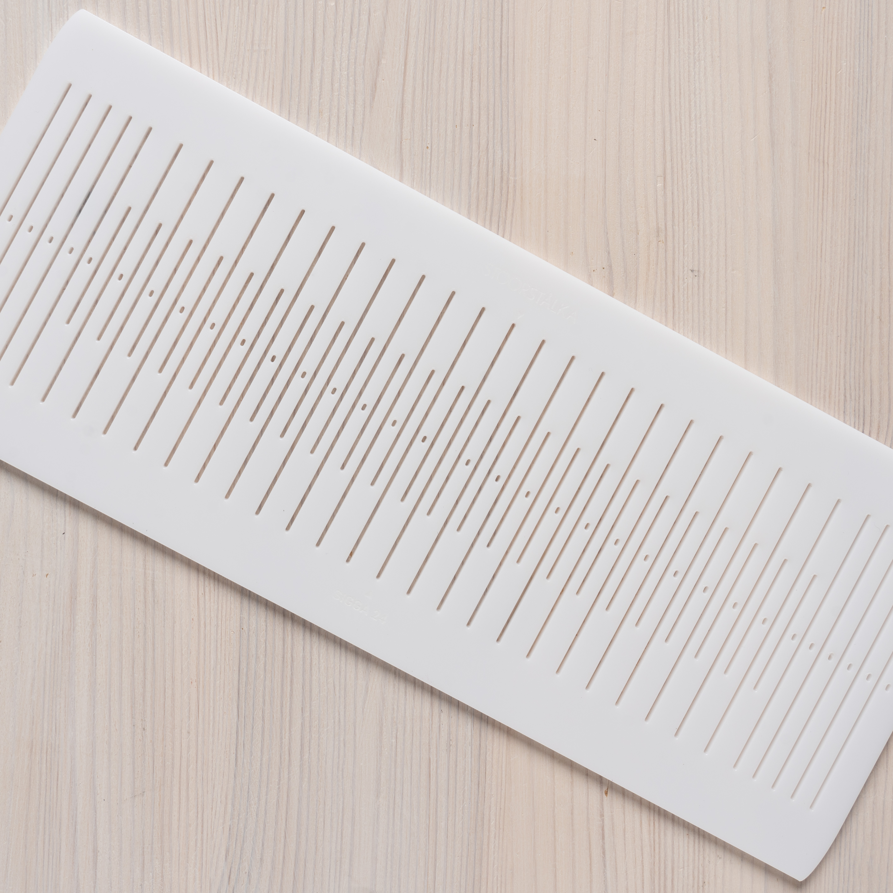
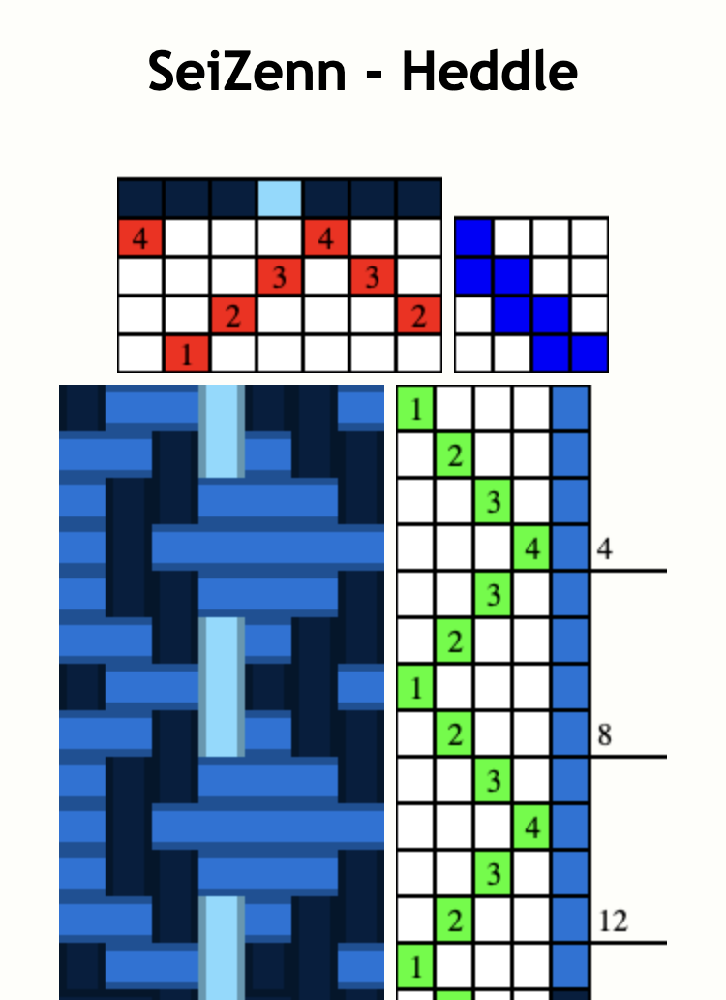
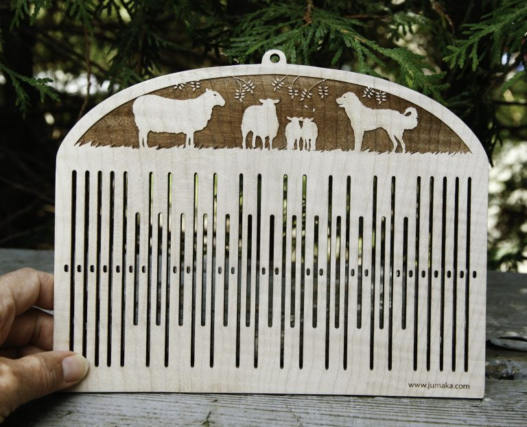
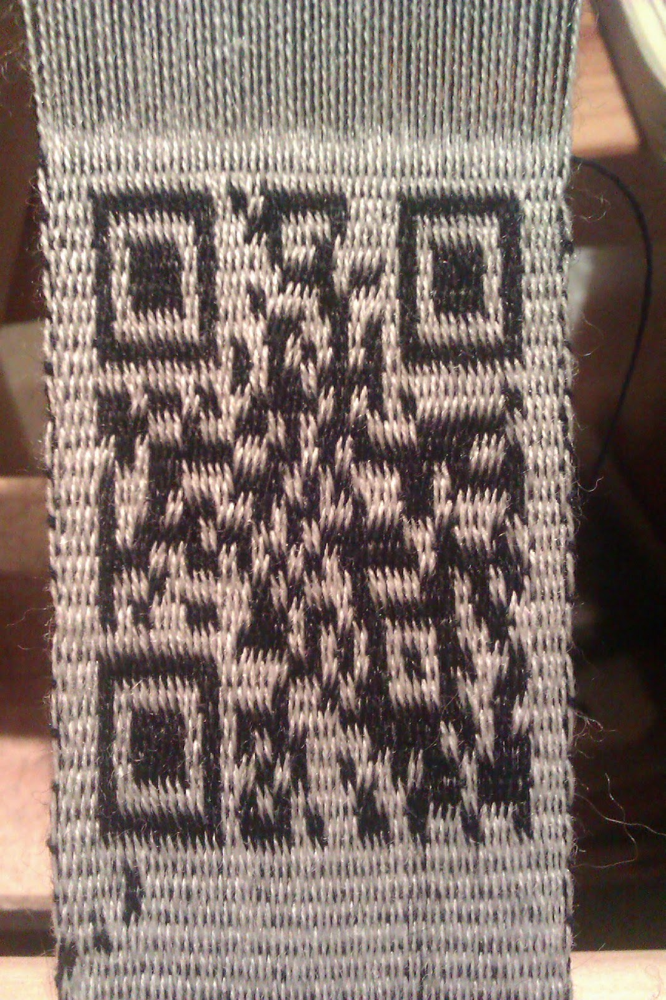
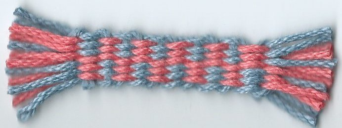

## QR pattern complexity is negligable for a skilled weaver

The the skill to weave the complexity of many a weaving pattern is far
beyond what is required to weave a QR code, although granted the
pattern may seem random to the untrained eye. This is yet another
reason why we went with rMQR codes over standard square QR codes:
it is easier to eye-jump between QR pattern design and loom when
the Code is narrow as with R7, R9, and some folks like R11 because
greater height makes for shorter weave length.

## Pre chunked

**We need to test this idea and actually weave some rMQR codes; see
what can actually be scanned.** For a primer on backstrap rigid heddle
weaving, see [Bandweaving: an ancient minimalist weaving technology](/topics/weaving/bandweaving/).

The rMQR spec defines some terminology:

> A dark module is nominally a binary one and a light module is
> nominally a binary zero.
>
> Each rMQR symbol shall be constructed of nominally square modules set
> out in a rectangular array.

In other words, the "pixels" in rMQR codes are called modules. The
black ones are 1s. We want to weave modules that are nominally square
enough to make a QR reader happy. The woven bands should be rectangular –
consistent in width and straight enough.

To imagine what a handwoven rMQR band would look like, observe this weaver. The
pattern he is weaving is rather similar to what a rMQR band would look
like (a rMQR would just be black and white): [Patterned band ~24 warps, backstrap, rigid heddle - YouTube](https://www.youtube.com/watch?v=ooQfL0U6eYU):

<figure height="300px" data-align="center">

<figcaption>A potential rMQR band factory?</figcaption>
</figure>

Weaving an R7-sized rMQR would be be simpler than as demonstrated in
[Pattern Weaving with Pick Up Stick Rigid Heddle Loom](https://www.youtube.com/watch?v=2BI-4fVDKog). As illustrated,
the pick-up stick is how the weaver sets or resets a module in the
rMQR.

The only tool needed to handweave the rMQR band is a simple small
rigid heddle with 7 slot, and 8 holes. This is a very simple form of
backstrap weaving. To weave an R7-sized rMQR code, the loom set-up
would be as simple as in this video, [Kedma Backstrap Loom](https://www.youtube.com/watch?app=desktop&v=C3KczNNjJis), except the
colors would be diferent: for weaving the rMQR codes the holes get white
background threads and the slots get black pattern threads.

Note: the rMQR spec calls for a two module wide margin "quiet zone"
all around the active data modules, which makes it easier for QR reader
software to isolate a QR code from the image background. So a R7 rMQR
with quite margin would require a warp wide enough to handle 11 data
modules, although the four modules of margin (two on each end) do not
need patterning controls in the heddle, as they will be always white
background. This is starting to sound like a rMQR-specilized rigid
heddle design: a 21 (3X7) pattern thread pick-up heddle with extra
holes and slots on both ends for quiet zone margin threads. Pattern
threads grouped in threes, three adjacent pattern threads for each QR
data module. The following \$35 bandgrind heddle would suffice, even if
each QR data module requires three pattern threads (3x7 = 21 \< 24):

According to [a backstrap rigid heddle article in Spin Off](https://spinoffmagazine.com/backstrap-rigid-heddle-basics-get-weaving-handspun-bands/) it sounds
like the pattern (black) and background (white) thread should be in a
ratio 2:1 in diameter, and that S versus Z twisting might help the
software recongize the rMQR code (or just do not use tablet weaving):

> For pick-up patterns like I used here to create a red and white
> patterned band, **the pattern threads (red) need to be at least twice
> as large as the background threads (white).**
>
> An interesting thing I’ve learned by band sleuthing in museum
> collections is that Norwegian bands often have a different twist
> direction in pattern versus background threads. Here, my red,
> 2-ply threads have a S-ply twist, and my white charkha-spun cotton
> threads are 2-ply with an Z-ply twist.

In the end, if their phone can scan the rMQR code, they've done it
correctly and their garment would exist on the blockchain as an NFT
with that same rMQR serving as the NFT image (with more info buried in
the code and the NFTs metadata). The rMQR spec was ISO certified in
May of 2022. There are already many QR reading apps which can read
rMQR codes (but not default Android as of 2023; need to install free
reader app).

Bonus: imagine displaying the rMQR on the weaver's phone as a weaving
draft WYSIWYG assistant for rMQR weaving. Perhaps the phone could even
be inserted into the loom while the pick-up stick is used. In order to
create weaving drafts of rMQR, esxisting web apps could be used, such
as [Seizenn \| loom pattern editor](https://www.raktres.net/seizenn/v2/#/heddle).

Existing loom pattern editing software can be used to layout rMQRs:
[Seizenn \| loom pattern editor](https://www.raktres.net/seizenn/v2/#/heddle) is a mobile app (packaged as a [PWA](https://developer.mozilla.org/en-US/docs/Web/Progressive_web_apps)).
Such patterns could be shown on a phone, and the phone shoved into a
small rigid heddle loom as a visual guide to the rMQR to be woven.

It may well be that a more complex type of rigid heddle called a
"pattern heddle" may make the weaving easier. A pattern heddle, or
pick-up heddle, has both short and long slots, which makes picking up
only pattern threads easier (so faster rMQRs?). Notice that the heddle shown below
has only long slots on both outer ends, which is how "two modules" of
pure white selvedge would be woven, as called for in the rMQR spec:

See, [Bandweaving on Jumaka.com](https://jumaka.com/2019/01/bandweaving/), for valuable heddle designs such as
double holed and double slotted (DIY lazer cut out of wood), and
pointed tip heddles which makes pick-ups of threads eaiser (for faster
rMQR weaving).

And there may well be other pickup weave techniques the could adapted
for high-speed rMQR codes weaving. For example, [How to Weave Pickup on a Band Loom](https://allfiberarts.com/2017/how-to-weave-pickup-on-a-band-loom.htm).

Tablet weaving might also be a quick process. For example, [Double faced tablet weaving - YouTube](https://www.youtube.com/watch?v=XGMpoP8hThM&ab_channel=JasonGriggs). Tablet weaving by nature has a
diagonal orientation to the warp threads. QR modules woven via tablet
weaving might be harder for QR readers to recognise. Although in
[Tablet Weaving a QR code \| BushcraftUK Community](https://bushcraftuk.com/community/threads/tablet-weaving-a-qr-code.97056/), there is a tablet
woven QR that surprising does scan:

For the situation where the artisan already has a large loom and
wishes to encorporate an rMQR into the garment but not as a tag, an
rMWR codes could be added into the loom as a separate layer via a
"supplemental warp" as illustrated in, [Rigid Heddle loom - Weaving a Supplemental Warp - YouTube](https://www.youtube.com/watch?v=ZjJdRK427MM&ab_channel=MargeryErickson).

