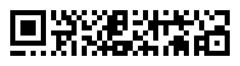
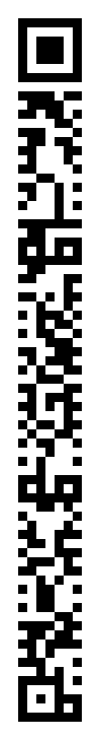
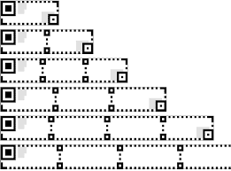

<figure width="75%">

<figcaption>The rMQR Code for "Padonma"</figcaption>
</figure>

# rMQR Codes

Critical to the Padonma Network is the relatively new QR variant,
rMQR, which became an ISO standard in May of 2022. An apropos analogy
would be: QR is to square as rMQR is to rectangle. Traditional QRs are
all square shaped. The 21 module size QR is the minimum size QR that
can contain the 16 bytes of a UUID. On the other hand a rMQR can be as
narrow as 7. Handpicking warp threads to make a black versus white module
is a lot easier around 7 at a go versus 21 per weaving pass.

# Padonma's free rMQR software

As of late 2026, both iOS and Android default camera apps cannot
recognize rMQR Codes dispite ISO publishing the rMQR standard in 2022.
Nonetheless, there are free apps for both platforms (for example, the
app QRQR) that can scan rMQR Codes.

One of the things that the Padonma Network has produced is free
open source code for web pages that read and write rMQRs with UUIDs
in them.

The webpage is packaged as a PWA which means the page can work
offline, say, in the middle of the jungle of Burma during a civil war
which does not help with network coverage.

It is on the roadmap to package the software via
[Capacitor](https://capacitorjs.com/) which is simply a way to
wrap a webpage into an iOS and/or Android native app. For
now the PWS is sufficient to work in the jungle. Having native
apps would simply make it easier to discover in apps stores. Sure
why not? Once development settles through usage testing.

# UUIDs inside rMQR Codes

An R7-sized rMQR is – as the name implies – 7 modules ("pixels")
tall. Here is what an example R7x77 rMQR looks like.

<figure width="50%" data-align="center">

</figure>

This is the smallest rMQR Code which is large enough to encode a UUID,
which would be a very useful garment ID by which Padonma could track
garments in a distributed inventory system.

(Note the rMQR spec calls for a two module wide margin "quiet zone"
around an rMQR Code, so the white background margin has to be
accounted for when weaving a rMQR Code. More importantly, a R7-sized
rMQR would require an 11 module wide band to be handwoven, although
those 4 extra modules do not require handpicking so they are easier to
weave. Note that the rMQR specs considers the narrow dimension to be
height, while from the weavers perspective -- potentially confusingly
-- the narrow dimension is the width of the band.)

All [Universally Unique Idenfifiers](https://en.wikipedia.org/wiki/Universally_unique_identifier)
(UUIDs) are 128 bits long or, in other words, 16 bytes in
size. According to [ISO
23941](https://www.qrcode.com/en/codes/rmqr.html), an rMQR Code of
size R7x77 at error correction level "M" can handle a
maximum byte-mode payload 160 bits (or 19 bytes max). Or an R9x77
(error correction "H") can also handle exactly
16 bytes of data.

For Padonma, the QR code will contain a UUID that IDs the garment.
For example, one of those UUIDs might look like the following:

    170bf486-a96f-47e9-90e6-632373d27924

- Demo create rMQR codes: [Online rMQR Generator](https://rmqr.oudon.xyz/)

# Development history of rMQR Codes

QR Codes were first open sourced by DENSO (Toyota Group) in 1994.
From the begining, QR Codes have always been squares, orignally
size 21 to 73. In 2000, the QR spec work was transfered to the
ISO/IEC standards bodys which published the QR Code standard as
18004, with square size extended from a max of 73 to 177. Over the
years that spec has been updated (the latest being 2024) yet those
QR Codes are always remained squares, now sized 11 to 177.

rMQR was also invented by DENSO and in 2022 ISO/IEC pusblished the
rMQR standard as 23941. It was this standard that defines the
first standard non-square QR codes.

In May of 2022, ISO standardized a new QR code variant. Standard
[ISO/IEC 23941](https://cdn.standards.iteh.ai/samples/77404/e103bf2d1f0d4162b34ca493efdaf9c4/ISO-IEC-23941-2022.pdf) defines this new type of QR code, called rMQR
codes. They are designed to be narrow (7 to 17 "modules" wide), and
come in various lengths as needed to address data storage
requirements.

<figure height="150px" data-align="center">

<figcaption>Six blank rMQR codes of various sizes</figcaption>
</figure>

## Tech primers

- [rMQR Code | DENSO WAVE](https://www.qrcode.com/en/codes/rmqr.html)

- [What is rMQR Code?｜Technical Information of automatic identification｜DENSO WAVE](https://www.denso-wave.com/en/adcd/fundamental/2dcode/qrc/rmqr.html)

- [DENSO WAVE Develops “rMQR Code”, a new rectangular QR Code that can even be printed in long, narrow spaces.](https://www.denso-wave.com/en/adcd/info/detail__220525.html)

- Capacity
    > a standard QR code can hold up to 7,089 numerical digits or 4,296
    > English letters. A Micro QR code can only contain up to 35 numbers
    > or 21 letters, but **a rMQR code ups it to 361 numbers or 219 letters**
    > with only a slight increase in size over the Micro QR code.
    > (via [QR codes evolve into their newest form: a bar QR code - Japan Today](https://japantoday.com/category/tech/qr-codes-evolve-into-their-newest-form-a-bar-qr-code))

## Relevant standards

- [ISO/IEC 23941](https://cdn.standards.iteh.ai/samples/77404/e103bf2d1f0d4162b34ca493efdaf9c4/ISO-IEC-23941-2022.pdf)
  - First edition: 2022-05
- [ISO/IEC 23941:2022 — Rectangular Micro QR Code (rMQR) bar code symbology specification](https://www.iso.org/standard/77404.html)
- 2020, was draft ISO standard: [(24) Rectangular Micro QR Code \| LinkedIn](https://www.linkedin.com/pulse/rectangular-micro-qr-code-terry-burton/)
