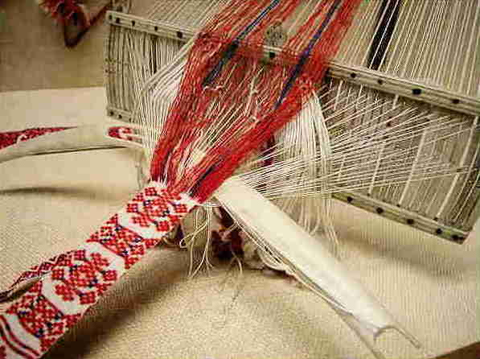
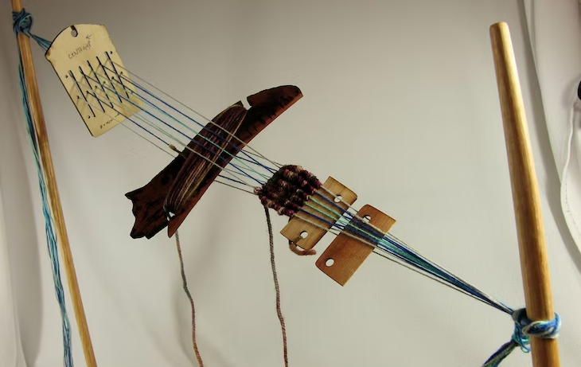
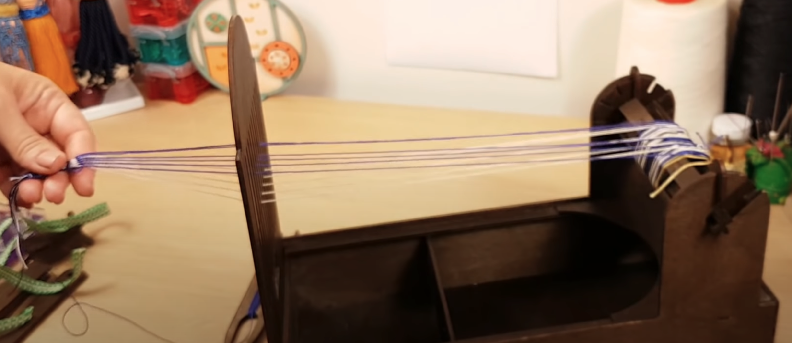
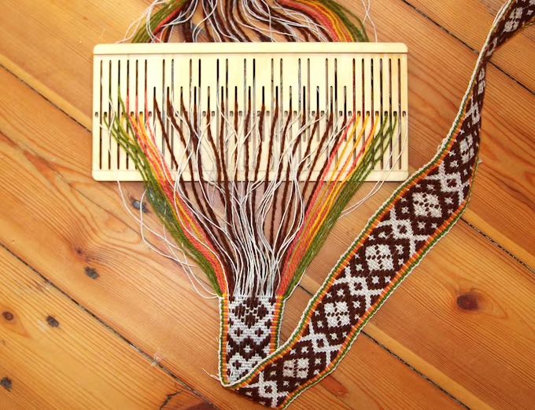

Bandweaving is an ancient weaving technology.

Completely separately, recording data in threads (interwoven and/or
knotted) is also an ancient technology. For example the bean counters
of the Incan empire went about their business using [quipu](https://en.wikipedia.org/wiki/Quipu), data recording devices fashioned
from systems of knots on strings.

<figure height="250px" data-align="center">

<figcaption>An Incan quipu</figcaption>
</figure>

A bandweaving loom is about a simple as looms come, requiring only a
small sheet of wood (called a rigid heddle as seen above) and thread,
of course. In an extreme case, a rigid heddle loom could be
constructed completely by hand, for example see [How to Make Your Own Backstrap Loom](https://www.kimberlyhamill.com/blog/2019/5/22/how-to-make-your-own-backstrap-loom). To weave a band, a rigid heddle backstrap loom is all
that is required:

The above loom demonstrates that the barrier to entry to bandweaving
is very low. More sophisticed looms enable producing bands faster at
higher quality. For example there are task-specific stand alone
tape looms where the heddle is integrated into a box frame loom:

Bandweaving can seemingly be easily adapted to pattern QR codes into
small handwoven tags. In weaver's jargon, such tags are referred to by
terms such as band, tape, ribbons, or more generally as narrow
ware. In the Padonma Network, the term "band" has been selected,
etymologically following the Sweeds, who use the word "bandgrinds" for
rigid heddles, as in a bandgrind is a machine for grinding out bands.

<figure height="300px" data-align="center">

<figcaption>A band in a Sweedish bandgrind</figcaption>
</figure>

Such ID tagged bands could be sewn into garments without disrupting
the original design of a garment. Optionally an rMQR code code be
added into the weave of a fabric using, for example, "supplimental
weft" techniques. Once tagged such a garment could be digitally
tracked through supply chains, yet an artisan would require no
sophisticated computer control tooling, nor even power tooling, to
join such a global economic market.

Each garment would have a unique QR code woven and/or sewn into
it. Since each QR code would be unique to a specific garment, each
garment would have a unique ID number assigned to it by its QR code.
For the Padonma Network, the QR codes would just contain a UUID, a [Universally Unique Idenfifiers](https://en.wikipedia.org/wiki/Universally_unique_identifier). UUIDs are globally unique IDs that are 16 bytes of
data in size. That is small yet a UUID is all that is needed for
**global** digital inventory tracking. The smaller the data encoded,
the quicker the tags can be handwoven.

The specific variant of QR pattern to be handwoven for Padomma is
called an rMQR code (etymologically, "rMQR" expands to r-M-QR, or
"r"ectangular-"M"icro-"QR"). The rMQR standard, [ISO/IEC 23941](https://cdn.standards.iteh.ai/samples/77404/e103bf2d1f0d4162b34ca493efdaf9c4/ISO-IEC-23941-2022.pdf), was
ratified in May of 2022. An rMQR ribbon that is seven or nine "pixels"
wide is easier to weave by hand, when compared to "traditional" square
QR codes which are 21x21 or 29x29 module ("pixels") in size. A R7x77
rMQR could encode a UUID, that is, could store 128 bits of data.

There are easy to use tools on the web that anyone can use to generate
rMQRs, for example, [Online rMQR Generator](https://rmqr.oudon.xyz/). For software developers, open source
software source code is available to implement rMQR readers and
writers that could work off-line in web pages:
<https://github.com/cozmo/jsQR>

With simply these handwoven QR codes, handmade garments could be
tracked globally throughout supply chains. In Padonma, the barrier to
entry to join such a global supply system has been intentionally
designed to be minimal, requiring only extremely minimal weaving
machinery. A simple rigid heddle loom ( a piece of flat wood
about the size of a flashcard) and thread in two colors is all the
capital investment required, all of which could be manufactured by a
single weaving artisan, from spinning thread to carving a heddle.
