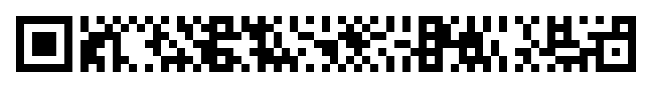

<figure width="75%">

<figcaption>The above is the rMQR Code for "<a href="https://padumma.com">https://padumma.com</a>"</figcaption>
</figure>

Critical to this proposal is the relatively new QR variant, rMQR,
which became an ISO standard in May of 2022. An apropos analogy would
be: square is to rectangle as QR is to rMQR. It seems like these rMQR
codes would be easier to handweave than the original large square QR
codes.

In May of 2022, ISO standardized a new QR code variant. Standard
[ISO/IEC 23941](https://cdn.standards.iteh.ai/samples/77404/e103bf2d1f0d4162b34ca493efdaf9c4/ISO-IEC-23941-2022.pdf) defines this new type of QR code, called rMQR
codes. They are designed to be narrow (7 to 17 "modules" wide), and
come in various lengths as needed to address data storage
requirements.

<figure height="150px" data-align="center">

<figcaption>Six blank rMQR codes of various sizes</figcaption>
</figure>

An R7-sized rMQR is – as the name implies – 7 modules wide. Here is what
an example R7x77 rMQR looks like. This is large enough to encode a
UUID, which would be a very useful garment ID by which Padonma could
track garments in a distributed inventory system. (Note the rMQR spec
calls for two a two module wide margin quiet zone around an rMQR Code,
so the white background margin below is technically part of the rMQR
Code. More importantly, a R7-sized rMQR would require an 11 module wide
band to be handwoven.)

<figure width="50%" data-align="center">

<figcaption>An example rMQR, of size R7 x 77, long enough to contain a UUID</figcaption>
</figure>

All [Universally Unique Idenfifiers](https://en.wikipedia.org/wiki/Universally_unique_identifier) (UUIDs) are 128 bits long or, in
other words, 16 bytes in size. According to [ISO 23941](https://www.qrcode.com/en/codes/rmqr.html), an rMQR Code of
size R7x77 at error correction level "M" can handle 160 bits (or 19
bytes max). Or an R9x77 (error correction "H") can also handle exactly 16
bytes of data.

For Padonma, the QR code will contain a UUID that IDs the garment.
For example, one of those UUIDs might look like the following:

    170bf486-a96f-47e9-90e6-632373d27924

- Demo create rMQR codes: [Online rMQR Generator](https://rmqr.oudon.xyz/)
- Tech primers
  - [rMQR Code \| QRcode.com \| DENSO WAVE](https://www.qrcode.com/en/codes/rmqr.html)

    - Standardization 05.2022 Obtained ISO approval

  - [What is rMQR Code?｜Technical Information of automatic identification｜DENSO WAVE](https://www.denso-wave.com/en/adcd/fundamental/2dcode/qrc/rmqr.html)

  - [DENSO WAVE Develops “rMQR Code”, a new rectangular QR Code that can even be printed in long, narrow spaces.](https://www.denso-wave.com/en/adcd/info/detail__220525.html)

  - Capacity

    > a standard QR code can hold up to 7,089 numerical digits or 4,296
    > English letters. A Micro QR code can only contain up to 35 numbers
    > or 21 letters, but **a rMQR code ups it to 361 numbers or 219 letters**
    > with only a slight increase in size over the Micro QR code.
    > (via [QR codes evolve into their newest form: a bar QR code - Japan Today](https://japantoday.com/category/tech/qr-codes-evolve-into-their-newest-form-a-bar-qr-code))
- The spec
  - [ISO/IEC 23941](https://cdn.standards.iteh.ai/samples/77404/e103bf2d1f0d4162b34ca493efdaf9c4/ISO-IEC-23941-2022.pdf)
    - First edition: 2022-05
  - [ISO/IEC 23941:2022 — Rectangular Micro QR Code (rMQR) bar code symbology specification](https://www.iso.org/standard/77404.html)
  - 2020, was draft ISO standard: [(24) Rectangular Micro QR Code \| LinkedIn](https://www.linkedin.com/pulse/rectangular-micro-qr-code-terry-burton/)
