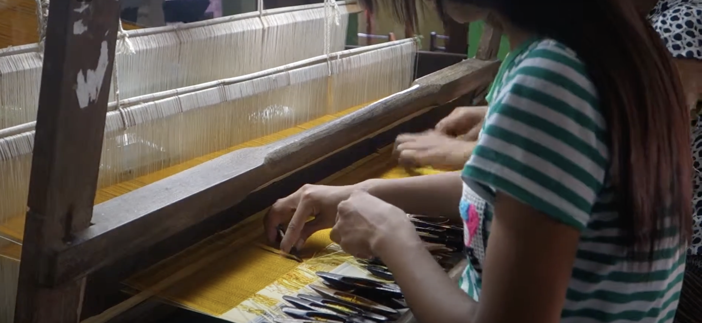

Near Mandalay in Burma, they weave silkworm silk on looms and hand
pick patters, on the loom. Certainly they could hand-pick a rMQR code
but separate band tag seems simpler. But, either way would probably work.

Manual pattern picking [Weaving a longyi at a shop near Mandalay - YouTube](https://www.youtube.com/watch?v=O8aakfoU-TE&ab_channel=JonWedell). Sounds slow: they supposedly weave an inch a day!

