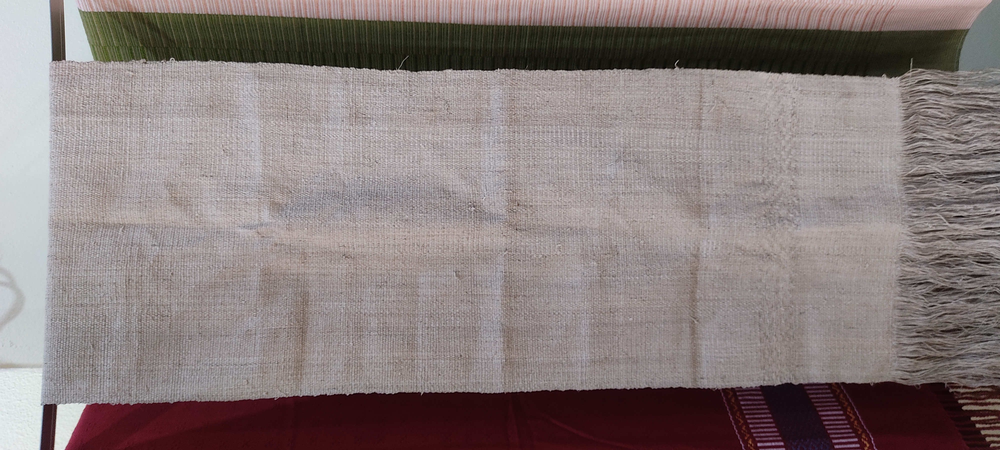

* Padonma garment prototypes

As [[https://youtu.be/RLqTV8OSCUc?t=339][the fashion designer Jan Jan said]], based in the cultural roots
  #+begin_quote
  If you make fabrics on a handloom,
  
  Build a pattern language that is always straigth lines in a certain
  way, or that we always keep some of these principles.
  
   "but then without making it folkloric."
  He also likes "openness"
  #+end_quote

** Two panel tops
- Tunic
- Thigh-high dress
- Long dress
  
** Shan fisherman's pants
   
** Longyi
[[https://youtu.be/RLqTV8OSCUc?t=438][Jan Jan's "trowser feel" tubular pants]] is very much like a longyi
cover image contains "sustainable slow fashion"

** Prototype #1: a scarf

#+attr_html: :height 600px
   
