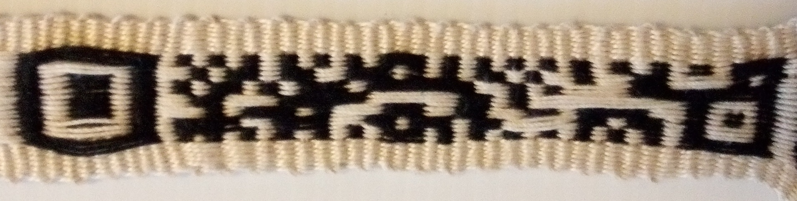
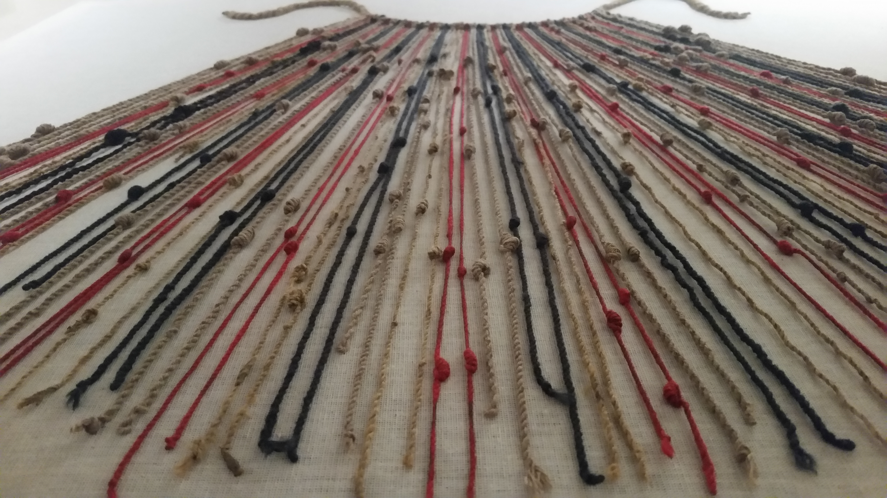
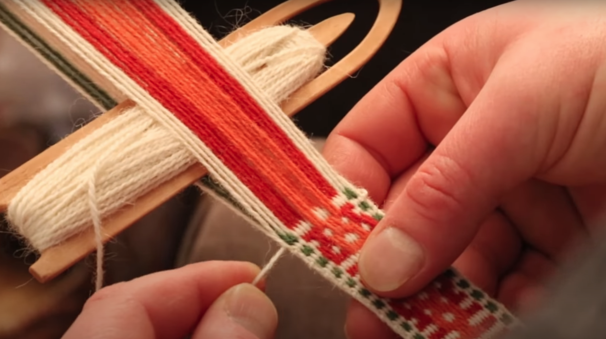
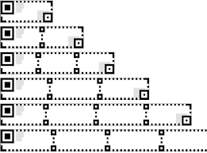
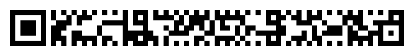
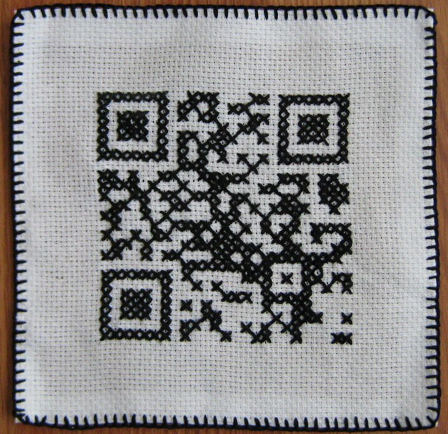
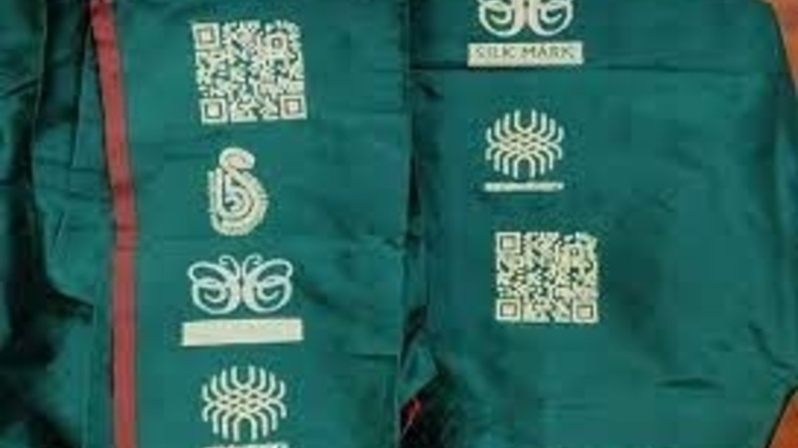

#+title: Padonma Network
#+subtitle: Handmade QR codes for globally tracking artisanal garments
#+author: John Tigue
# Https://sandyuraz.com/articles/orgmode-css/
# #+html_head: <link rel="stylesheet" href="https://sandyuraz.com/styles/org.css">
#+OPTIONS: toc:nil
#+OPTIONS: ^:nil
#+OPTIONS: num:nil
#+HTML_HEAD: <link rel="stylesheet" type="text/css" href="cached/org.css"/>
#+HTML_HEAD_EXTRA: 

#+attr_html: :width 100% :align center
#+caption: An rMQR band, handwoven with a rigid heddle

Version: 2.4.1

* TEMP                                                                                                                  :noexport:  
#+attr_html: :width 100%

* Padonma Network
  :PROPERTIES:
  :CUSTOM_ID: TargetSection
  :END:

The Padonma Network is exploring the possibility of tracking cottage
industry garments via handwoven QR codes. The goal is to design the
easiest on-ramp imaginable by which a single artisan could make their
products globally traceable via handmade QR codes.

The ancient handweaving technology of the rigid heddle loom seems like
it may well be fit for the purpose of handweaving rMQR ID bands. Read
the [[file:bandgrinding.org][Bandgrind Experiments]] pages for a log of ongoing experiments into
weaving rMQR ID bands via a rigid heddle.

#+attr_html: :height 300px :align center
#+caption: Sámi bandgrinds, a.k.a. rigid heddles
[[https://durhamweaver64.blogspot.com/2015/01/travels-around-baltic-sami-weaving.html][file:cached/images/weaving/sami_heddles.jpg]]

This project is exploring the potential of tagging garments with
handwoven labels containing rMQR codes, which are a novel variant of QR
codes. The rMQR specification was ratified as an ISO standard in May
of 2022. The name "rMQR code" is short for "rectangular Micro Quick Response
code." Whereas original style QR codes are square, rMQR codes are
narrow and rectangular, resembling ribbons or bands:

#+attr_html: :height 75px :align center

There are many prior examples of handcrafted QR codes being recongized
by QR reader software. The relative advantage of rMQR over QR in this
project is that while handweaving it is easier to weave seven "bits"
per row than the "wider" rows of traditional QR codes, and the
machinery required to do so is minimal ([[https://www.instructables.com/How-to-Fingerweave-Something/][fingerweaving]] would not even
require a loom). The goal is to make it as easy as possible for
artisans to join the Padonma Network.

It would seem like an rMQR code such as the one above could be
woven into textile bands which would look something like the small band in the
following example, but the black pattern "pixels" of the words would
be replaced with rMQR code data modules:

#+attr_html: :height 150px :align center
[[https://spinoffmagazine.com/a-spinner-s-journey-in-inkle-bands/][file:cached/images/weaving/jeannie_glaves_example_band.png]]

A simple rigid heddle backstrap loom would be sufficient to weave such
a band, which would look much like this exaple:

#+attr_html: :height 250px :align center
#+caption: A band, 7 data modules ("pixels") wide
[[https://www.youtube.com/watch?v=dKLudDihe_I][file:cached/images/weaving/r7_wide_band.png]]

The weaving term "letter pick-up" refers to using pick-up techniques
to weave letters into bands. So this Padonma Network project is trying
to work out "QR code band pick-up weaving," or more succinctly "QR pick-up." 

** Table of Contents
   :PROPERTIES:
   :UNNUMBERED: notoc
   :END:

#+TOC: headlines 2 :target #TargetSection

** Introduction

Bandweaving is an ancient weaving technology. 

#+attr_html: :height 300px :align center
#+caption: Sami band weaving
[[https://allfiberarts.com/2012/samidrafts.htm][file:cached/images/weaving/heddle_2_hole_sami_reed.jpg]]

Completely separately, recording data in threads (interwoven and/or
knotted) is also an ancient technology.  For example the bean counters
of the Incan empire went about their business using [[https://en.wikipedia.org/wiki/Quipu][quipu]], data recording devices fashioned
from systems of knots on strings.

#+attr_html: :height 250px :align center
#+caption: An Incan quipu

A bandweaving loom is about a simple as looms come, requiring only a
small sheet of wood (called a rigid heddle as seen above) and thread,
of course. In an extreme case, a rigid heddle loom could be
constructed completely by hand, for example see [[https://www.kimberlyhamill.com/blog/2019/5/22/how-to-make-your-own-backstrap-loom][How to Make Your Own
Backstrap Loom]]. To weave a band, a rigid heddle backstrap loom is all
that is required:

#+attr_html: :height 300px :align center
#+caption: A rigid heddle in a backstrap loom
[[https://www.etsy.com/listing/1369139761/oseberg-tape-loom-back-strap-weaving-on][file:cached/images/weaving/backstrap_and_ridig_heddle.png]]

The above loom demonstrates that the barrier to entry to bandweaving
is very low. More sophisticed looms enable producing bands faster at
higher quality. For example there are task-specific stand alone
tape looms where the heddle is integrated into a box frame loom:

#+attr_html: :height 300px :align center
#+caption: A tape loom
[[https://youtu.be/vq0NjbWH568?t=946][file:cached/images/weaving/tape_loom.png]]

Bandweaving can seemingly be easily adapted to pattern QR codes into
small handwoven tags. In weaver's jargon, such tags are referred to by
terms such as band, tape, ribbons, or more generally as narrow
ware. In the Padonma Network, the term "band" has been selected,
etymologically following the Sweeds, who use the word "bandgrinds" for
rigid heddles, as in a bandgrind is a machine for grinding out bands.

#+attr_html: :height 300px :align center
#+caption: A band in a Sweedish bandgrind 
[[file:cached/images/weaving/pickup_weaving.png]]

Such ID tagged bands could be sewn into garments without disrupting
the original design of a garment. Optionally an rMQR code code be
added into the weave of a fabric using, for example, "supplimental
weft" techniques. Once tagged such a garment could be digitally
tracked through supply chains, yet an artisan would require no
sophisticated computer control tooling, nor even power tooling, to
join such a global economic market.

Each garment would have a unique QR code woven and/or sewn into
it. Since each QR code would be unique to a specific garment, each
garment would have a unique ID number assigned to it by its QR code.
For the Padonma Network, the QR codes would just contain a UUID, a [[https://en.wikipedia.org/wiki/Universally_unique_identifier][Universally
Unique Idenfifiers]]. UUIDs are globally unique IDs that are 16 bytes of
data in size. That is small yet a UUID is all that is needed for
**global** digital inventory tracking. The smaller the data encoded,
the quicker the tags can be handwoven.

The specific variant of QR pattern to be handwoven for Padomma is
called an rMQR code (etymologically, "rMQR" expands to r-M-QR, or
"r"ectangular-"M"icro-"QR"). The rMQR standard, [[https://cdn.standards.iteh.ai/samples/77404/e103bf2d1f0d4162b34ca493efdaf9c4/ISO-IEC-23941-2022.pdf][ISO/IEC 23941]], was
ratified in May of 2022. An rMQR ribbon that is seven or nine "pixels"
wide is easier to weave by hand, when compared to "traditional" square
QR codes which are 21x21 or 29x29 module ("pixels") in size. A R7x77
rMQR could encode a UUID, that is, could store 128 bits of data.

There are easy to use tools on the web that anyone can use to generate
rMQRs, for example, [[https://rmqr.oudon.xyz/][Online rMQR Generator]]. For software developers, open source
software source code is available to implement rMQR readers and
writers that could work off-line in web pages:
https://github.com/cozmo/jsQR

With simply these handwoven QR codes, handmade garments could be
tracked globally throughout supply chains. In Padonma, the barrier to
entry to join such a global supply system has been intentionally
designed to be minimal, requiring only extremely minimal weaving
machinery. A simple rigid heddle loom ( a piece of flat wood
about the size of a flashcard) and thread in two colors is all the
capital investment required, all of which could be manufactured by a
single weaving artisan, from spinning thread to carving a heddle.

** Proposal

This proposal has a hardware part and a software part.  

The hardware part is the bands with UUIDs encoded into rMQR codes
handwoven into them, which in the Padonma Network are called "rMQR ID
bands." Each garment has a unique UUID encoded in the rMQR code on its
ID band.

The software part is using a garment's unique UUID ID to represent the
garment in the digital domain. The same (UUID) ID can be used
consistently across both public and private databases. The same tag
would be used in both context.

For an example of private database, artisans could track their
inventory privately in a spreadsheet using the UUIDs. And when a
garment leaves from its place of manufacture the same UUID will
represent it outside in the wild. For an example of public database, a
blockchain could be used solely as a public domain global inventory
tracking system (not cryptocurrencies but garments will probably have
NFTs that contain garment UUIDs), using the same UUIDs to represent
garments globally.

Both parts of this proposal are addressed in the following subsections:

#+TOC: headlines 2 local

*** Handweave rMQR codes

#+attr_html: :height 300px :align center
#+caption: A ridig heddle loom making a band, two "pixels" wide
[[https://norwegiantextileletter.com/article-categories/band-weaving/][file:cached/images/weaving/band_2_modules_wide.jpg]]
    
**We need to test this idea and actually weave some rMQR codes; see
what can actually be scanned.** For a primer on backstrap rigid heddle
weaving see the below section, [[*Bandweaving, an ancient minimalist weaving technology][Bandweaving, an ancient minimalist
weaving technology]].

#+attr_html: :height 260px :align center
#+caption: Structure of Version R7x43 rMQR symbol
[[https://cdn.standards.iteh.ai/samples/77404/e103bf2d1f0d4162b34ca493efdaf9c4/ISO-IEC-23941-2022.pdf][file:cached/images/qr_tech/rmqr_r7_43_structure.png]]

The rMQR spec defines some terminology:
#+begin_quote
A dark module is nominally a binary one and a light module is
nominally a binary zero.

Each rMQR symbol shall be constructed of nominally square modules set
out in a rectangular array.
#+end_quote

In other words, the "pixels" in rMQR codes are called modules. The
black ones are 1s. We want to weave modules that are nominally square
enough to make a QR reader happy. The woven bands should be rectangular --
consistent in width and straight enough. 

To imagine what a handwoven rMQR band would look like, observe this weaver. The
pattern he is weaving is rather similar to what a rMQR band would look
like (a rMQR would just be black and white): [[https://www.youtube.com/watch?v=ooQfL0U6eYU][Patterned band ~24 warps,
backstrap, rigid heddle - YouTube]]:

#+attr_html: :height 300px :align center
#+caption: A potential rMQR band factory?

Weaving an R7-sized rMQR would be be simpler than as demonstrated in
[[https://www.youtube.com/watch?v=2BI-4fVDKog][Pattern Weaving with Pick Up Stick Rigid Heddle Loom]]. As illustrated,
the pick-up stick is how the weaver sets or resets a module in the
rMQR.

The only tool needed to handweave the rMQR band is a simple small
rigid heddle with 7 slot, and 8 holes. This is a very simple form of
backstrap weaving. To weave an R7-sized rMQR code, the loom set-up
would be as simple as in this video, [[https://www.youtube.com/watch?app=desktop&v=C3KczNNjJis][Kedma Backstrap Loom]], except the
colors would be diferent: for weaving the rMQR codes the holes get white
background threads and the slots get black pattern threads.

Note: the rMQR spec calls for a two module wide margin "quiet zone"
all around the active data modules, which makes it easier for QR reader
software to isolate a QR code from the image background. So a R7 rMQR
with quite margin would require a warp wide enough to handle 11 data
modules, although the four modules of margin (two on each end) do not
need patterning controls in the heddle, as they will be always white
background. This is starting to sound like a rMQR-specilized rigid
heddle design: a 21 (3X7) pattern thread pick-up heddle with extra
holes and slots on both ends for quiet zone margin threads. Pattern
threads grouped in threes, three adjacent pattern threads for each QR
data module. The following $35 bandgrind heddle would suffice, even if
each QR data module requires three pattern threads (3x7 = 21 < 24):

#+attr_html: :height 300px :align center
#+caption: An rMQR band heddle? A band heddle with 24 pattern thread (short) slots
[[https://bandweaving.com/handicrafting-diy/yarn/weaving/bandweaving-heddles/heddle-sigga/heddle-sigga-24-floating-threads-white][file:cached/images/weaving/heddle_24_pattern_bands.jpg]]

According to [[https://spinoffmagazine.com/backstrap-rigid-heddle-basics-get-weaving-handspun-bands/][a backstrap rigid heddle article in Spin Off]] it sounds
like the pattern (black) and background (white) thread should be in a
ratio 2:1 in diameter, and that S versus Z twisting might help the
software recongize the rMQR code (or just do not use tablet weaving):
    #+begin_quote
    For pick-up patterns like I used here to create a red and white
    patterned band, **the pattern threads (red) need to be at least twice
    as large as the background threads (white).**

    An interesting thing I’ve learned by band sleuthing in museum
    collections is that Norwegian bands often have a different twist
    direction in pattern versus background threads. Here, my red,
    2-ply threads have a S-ply twist, and my white charkha-spun cotton
    threads are 2-ply with an Z-ply twist.
    #+end_quote

In the end, if their phone can scan the rMQR code, they've done it
correctly and their garment would exist on the blockchain as an NFT
with that same rMQR serving as the NFT image (with more info buried in
the code and the NFTs metadata). The rMQR spec was ISO certified in
May of 2022.  There are already many QR reading apps which can read
rMQR codes (but not default Android as of 2023; need to install free
reader app).

Bonus: imagine displaying the rMQR on the weaver's phone as a weaving
draft WYSIWYG assistant for rMQR weaving. Perhaps the phone could even
be inserted into the loom while the pick-up stick is used. In order to
create weaving drafts of rMQR, esxisting web apps could be used, such
as [[https://www.raktres.net/seizenn/v2/#/heddle][Seizenn | loom pattern editor]].

Existing loom pattern editing software can be used to layout rMQRs:
[[https://www.raktres.net/seizenn/v2/#/heddle][Seizenn | loom pattern editor]] is a mobile app (packaged as a [[https://developer.mozilla.org/en-US/docs/Web/Progressive_web_apps][PWA]]).
Such patterns could be shown on a phone, and the phone shoved into a
small rigid heddle loom as a visual guide to the rMQR to be woven.

#+attr_html: :height 250px :align center
#+caption: SeiZenn weaving draft editor
[[https://www.raktres.net/seizenn/v2/#/heddle][file:cached/images/weaving/seizenn.png]]

It may well be that a more complex type of rigid heddle called a
"pattern heddle" may make the weaving easier. A pattern heddle, or
pick-up heddle, has both short and long slots, which makes picking up
only pattern threads easier (so faster rMQRs?). Notice that the heddle shown below
has only long slots on both outer ends, which is how "two modules" of
pure white selvedge would be woven, as called for in the rMQR spec:

#+attr_html: :height 400px :align center
[[https://jumaka.com/2022/02/resources-for-baltic-pick-up-weaving/][file:cached/images/weaving/hedddle_pickup_13.jpeg]]

See, [[https://jumaka.com/2019/01/bandweaving/][Bandweaving on Jumaka.com]], for valuable heddle designs such as
double holed and double slotted (DIY lazer cut out of wood), and
pointed tip heddles which makes pick-ups of threads eaiser (for faster
rMQR weaving).

And there may well be other pickup weave techniques the could adapted
for high-speed rMQR codes weaving. For example, [[https://allfiberarts.com/2017/how-to-weave-pickup-on-a-band-loom.htm][How to Weave Pickup on a Band Loom]].

Tablet weaving might also be a quick process. For example, [[https://www.youtube.com/watch?v=XGMpoP8hThM&ab_channel=JasonGriggs][Double
faced tablet weaving - YouTube]]. Tablet weaving by nature has a
diagonal orientation to the warp threads. QR modules woven via tablet
weaving might be harder for QR readers to recognise. Although in
[[https://bushcraftuk.com/community/threads/tablet-weaving-a-qr-code.97056/][Tablet Weaving a QR code | BushcraftUK Community]], there is a tablet
woven QR that surprising does scan:

#+attr_html: :height 400px :align center
#+caption: A tablet woven QR code
[[https://bushcraftuk.com/community/threads/tablet-weaving-a-qr-code.97056/][file:cached/images/weaving/tablet_woven_qr.jpg]]

For the situation where the artisan already has a large loom and
wishes to encorporate an rMQR into the garment but not as a tag, an
rMWR codes could be added into the loom as a separate layer via a
"supplemental warp" as illustrated in, [[https://www.youtube.com/watch?v=ZjJdRK427MM&ab_channel=MargeryErickson][Rigid Heddle loom - Weaving a
Supplemental Warp - YouTube]].

#+attr_html: :height 200px :align center
#+caption: Basic weave for QR code modules, here two rows
[[https://www.handsonknittingcenter.com/module/class/230311/inkle-weaving-on-a-rigid-heddle-loom-with-peggy-via-zoom][file:cached/images/weaving/two_row_module_band.jpg]]

*** Track garment rMQRs on a blockchain

QR codes can encode any arbitrary digital data. In the use case of
Padonma, the QR code will encode the unique digitial ID of the garment
into which it is sewn. For Padonma, the digital ID data standard used
is called UUIDs, short for [[https://en.wikipedia.org/wiki/Universally_unique_identifier][Universally Unique Idenfifiers]]. The garment
IDs can be tracked in a distribute inventory system, which for the
Padonma project would be implemented using blockchain technology.

In other words, the handspun QR code encodes the ID of the garment's
unique NFT. The NFT is simply the unique ID of the garment in the
distributed global inventory tracking system, which happens to be a
blockchain. (There are no overpriced JPEGs in this blockchain use
case.) This is how a handcrafted garment can be tracked in a global
inventory system as the garment travels the global supply chain.

A garment's physical tag will have its QR code handwoven into the
fabric, using simple techniques to make what weavers call bands (or
narrow wares, or ribbons). The encoded IDs correspond to NFT IDs, each
garment has its own NFT. The NFT is simply for inventory tracking
identity, think of it like a digital passport for the garment. This is not a
silly collectors game based on overpriced JPEGs. The NFT gives the
garment an identity in the distributed database that is the
blockchain, which serves as the inventory tracking system.

Each garment will have its own unique rMQR tag and own unique NFT. A
collection of such NFTs tracked on a blockchain are the distributed
equivalent for a factory inventory system that could span the entire
supply chain.

** Background topics
*** rMQR codes are band shaped QR codes

#+attr_html: :width 75%
#+caption: The above is the rMQR Code for "https://padumma.com"
[[file:images/rmqr_https_padumma_com.png]]
    
Critical to this proposal is the relatively new QR variant, rMQR,
which became an ISO standard in May of 2022. An apropos analogy would
be: square is to rectangle as QR is to rMQR. It seems like these rMQR
codes would be easier to handweave than the original large square QR
codes.

In May of 2022, ISO standardized a new QR code variant. Standard
[[https://cdn.standards.iteh.ai/samples/77404/e103bf2d1f0d4162b34ca493efdaf9c4/ISO-IEC-23941-2022.pdf][ISO/IEC 23941]] defines this new type of QR code, called rMQR
codes. They are designed to be narrow (7 to 17 "modules" wide), and
come in various lengths as needed to address data storage
requirements.

#+caption: Six blank rMQR codes of various sizes
#+ATTR_HTML: :height 150px :align center

An R7-sized rMQR is – as the name implies – 7 modules wide. Here is what
an example R7x77 rMQR looks like. This is large enough to encode a
UUID, which would be a very useful garment ID by which Padonma could
track garments in a distributed inventory system. (Note the rMQR spec
calls for two a two module wide margin quiet zone around an rMQR Code,
so the white background margin below is technically part of the rMQR
Code. More importantly, a R7-sized rMQR would require an 11 module wide
band to be handwoven.)

#+attr_html: :width 50% :align center
#+caption: An example rMQR, of size R7 x 77, long enough to contain a UUID

All [[https://en.wikipedia.org/wiki/Universally_unique_identifier][Universally Unique Idenfifiers]] (UUIDs) are 128 bits long or, in
other words, 16 bytes in size. According to [[https://www.qrcode.com/en/codes/rmqr.html][ISO 23941]], an rMQR Code of
size R7x77 at error correction level "M" can handle 160 bits (or 19
bytes max). Or an R9x77 (error correction "H") can also handle exactly 16
bytes of data.

For Padonma, the QR code will contain a UUID that IDs the garment.
For example, one of those UUIDs might look like the following:
#+begin_src
170bf486-a96f-47e9-90e6-632373d27924
#+end_src

- Demo create rMQR codes: [[https://rmqr.oudon.xyz/][Online rMQR Generator]]
- Tech primers
  - [[https://www.qrcode.com/en/codes/rmqr.html][rMQR Code | QRcode.com | DENSO WAVE]]
    - Standardization 05.2022 Obtained ISO approval
  - [[https://www.denso-wave.com/en/adcd/fundamental/2dcode/qrc/rmqr.html][What is rMQR Code?｜Technical Information of automatic identification｜DENSO WAVE]]
  - [[https://www.denso-wave.com/en/adcd/info/detail__220525.html][DENSO WAVE Develops “rMQR Code”, a new rectangular QR Code that can even be printed in long, narrow spaces.]]
  - Capacity
    #+begin_quote
    a standard QR code can hold up to 7,089 numerical digits or 4,296
    English letters. A Micro QR code can only contain up to 35 numbers
    or 21 letters, but **a rMQR code ups it to 361 numbers or 219 letters**
    with only a slight increase in size over the Micro QR code.
    (via [[https://japantoday.com/category/tech/qr-codes-evolve-into-their-newest-form-a-bar-qr-code][QR codes evolve into their newest form: a bar QR code - Japan Today]])
    #+end_quote
- The spec
  - [[https://cdn.standards.iteh.ai/samples/77404/e103bf2d1f0d4162b34ca493efdaf9c4/ISO-IEC-23941-2022.pdf][ISO/IEC 23941]]
    - First edition: 2022-05
  - [[https://www.iso.org/standard/77404.html][ISO/IEC 23941:2022 — Rectangular Micro QR Code (rMQR) bar code symbology specification]]
  - 2020, was draft ISO standard: [[https://www.linkedin.com/pulse/rectangular-micro-qr-code-terry-burton/][(24) Rectangular Micro QR Code | LinkedIn]]

*** Handicrafted QR codes
In, [[https://spinoffmagazine.com/a-spinner-s-journey-in-inkle-bands/][A Spinner’s Journey in Inkle Bands]], author Jeannine Glaves
descibes how she wove regular square QR codes and then went on to
embed text into bands she wove. 

#+caption: Notice the draft pattern for a square QR code in the background
#+ATTR_HTML: :height 300px :align center
[[file:cached/images/weaving/qr_and_ribbons.jpg]]

Note she uses the term "letter pick-up" so perhaps this Padonma
project is trying to work out "QR code band pick-up" or just "QR
pick-up." It would seem that her work could be extended to weave rMQR
codes into bands, which could then be sewn into garments.

Note also that is sounds like she was able to get a QR reader to work
using only a single stitch per QR module. Perhaps a rMQR reader will
be able to work with that resolution.

#+begin_quote
While homebound during COVID-19, I looked for something new to try
with the bands. I thought it would be fun to weave my vaccination QR
code. The code pattern needed 29 pairs of warp threads. A pattern pair
consists of a light background and a dark, heavier pattern
thread. Since the QR code would be square, it would take only 29
pattern wefts to weave the code
#+end_quote

In [[http://www.wormspit.com/2012/01/26/why-yes-yes-i-did-weaving-qr-code/][Why, yes… yes I did! Weaving QR code]], we see an example of 3 warps
per QR data module:

#+caption: A handwoven QR code
#+ATTR_HTML: :height 300px :align center
[[http://www.wormspit.com/2012/01/26/why-yes-yes-i-did-weaving-qr-code/][file:cached/images/weaving/qr_on_bag.jpg]]

- Examples of handicrafted QRs
  - [[https://www.etsy.com/nz/listing/741540773/the-original-never-gonna-give-you-up-qr][On Etsy, one stitched QR patch]] The Original Never Gonna Give You Up QR Code Patch
  - [[http://qr-3d.weebly.com/gallery.html][A gallery of QRs all handmade: woven, knitted, croceted | QR-3D]]
    - A gallery of "woven" QR codes on various objects large and small

**** Crochet QR code
- [[https://theageingyoungrebel.com/how-to-make-a-qr-crochet-bomb/][How to make a QR crochet bomb – the ageing young rebel]]
  - https://web.archive.org/web/20220122171615/https://theageingyoungrebel.com/how-to-make-a-qr-crochet-bomb/

#+attr_html: :height 150px :align center
#+caption: An example crocheted QR code

#+attr_html: :height 150px :align center
[[file:cached/images/qr_tech/cross_stitched.jpg]]
*** India uses QR codes to ID artisanal handloom goods

QR codes are already being used to track all manner of handicraft
products.  For example handmade carpets: [[https://www.voanews.com/a/qr-codes-seen-as-key-to-reviving-the-fading-glory-of-kashmiri-carpets-/6487753.html][QR Codes Seen as Key to
Reviving the Fading Glory of Kashmiri Carpets]].  The closest prior art
to Padonma is what the Indian government is doing with woven
products. The following articles serve to illustrate the goings on in India.

[[https://themeghalayan.com/nehhdc-textiles-department-collab-to-encompass-over-10000-looms/][NEHHDC-textiles department collab to encompass over 10,000 looms]] (2023-10)
#+begin_quote
In alignment with this initiative, NEHHDC, in collaboration with the
Department of Textiles, aims to adopt an additional 500 weavers in
Meghalaya, with a particular focus on the Silk Village.
#+end_quote

#+attr_html: :height 300px :align center
[[https://themeghalayan.com/nehhdc-textiles-department-collab-to-encompass-over-10000-looms/][file:cached/images/qr_tech/themeghalayan_com_weaving_qrs.jpeg]]

[[https://www.latestly.com/india/news/banarasi-saree-to-have-qr-code-woven-in-it-bhu-develops-new-technique-to-identity-genuineness-of-the-handloom-products-2673359.html][Banarasi Saree To Have QR Code Woven In, IT-BHU Develops New Technique to Identity Genuineness of the Handloom Products | LatestLY]] (LatestLY, 2019-07)

#+attr_html: :height 200px :align center

  #+begin_quote
  The manufacturer can weave the QR code on saree with details of
  his own firm and manufacturing. Whenever customers want to know
  about a product, he has to use the scanner in his mobile to know
  about it. He will get all details entered in the QR code, like
  place of the manufacturer, date of manufacture, etc. These
  measures will create confidence in customers and increase
  sales.

  Research scholar M. Krishna Prasanna Naik, who is working
  on the growth of the Banaras handloom industry, said that the
  **Banaras handloom industry is facing major issues, with MARKETING
  being one of them.**

  According to his study, **most customers are not
  aware of the difference between handloom and power-loom made**
  saree. Only a limited number of customers know about the handloom
  mark and GI mark.

  His study also shows that customers are unaware
  of whether sellers provide real handloom marks or duplicate
  handloom marks with products. **So, he came up with the idea of
  sarees having logos and QR code.**

  Naik said that the fully designed
  saree consists of 6.50 meters in length in which 1-meter blouse
  pieces are included. After the sari part is completed, a part of
  6-7 inches of plain fabric before the blouse is weaved. This patch
  contains the QR code and the other three logos.

  Incorporating these **logos in this extra fabric piece,** will not
  reduce the **fabric strength and style and the looks of the saree
  will remain intact.** Amresh Kushwaha, chairman, Angika co-operative
  society and Angika, a Varanasi based designer, have implemented
  the idea for the first time.
  #+end_quote

#+attr_html: :height 300px :align center
[[https://timesofindia.indiatimes.com/city/guwahati/now-qr-codes-in-fabric-to-carry-info-on-nes-handloom-products/articleshow/104097748.cms][file:cached/images/qr_tech/modi_looking_at_qr_codes.png]]

[[https://timesofindia.indiatimes.com/city/guwahati/now-qr-codes-in-fabric-to-carry-info-on-nes-handloom-products/articleshow/104097748.cms][Handloom: Now, Qr Codes In Fabric To Carry Info On Ne’s Handloom Products | Times of India]] (2023-10)

- [[https://www.vox.com/the-goods/22893254/digital-fashion-metaverse-real-clothes][How digital fashion, the metaverse, and NFTs could change the fashion industry - Vox]]

*** Blockchain and the luxury fashion industry

#+attr_html: :height 300px :align center
#+caption: QR and blockchain in 2022 luxury goods
[[https://www.theinterline.com/2022/03/10/blockchain-in-fashion-is-it-ready/][file:cached/images/qr_tech/theinterline_qr_blockchain.jpg]]

[[https://www.frontiersin.org/articles/10.3389/fbloc.2023.1044723/full][Exploring the potential of blockchain technology within the fashion and textile supply chain with a focus on traceability, transparency, and product authenticity: A systematic review]]
- [[https://doi.org/10.3389/fbloc.2023.1044723][Review article, 20 February 2023]]
- School of Fashion and Textiles, Australia
- Abstract
  #+begin_quote
  ..This review highlights the opportunities that exist in adapting
  Blockchain Technology in the fashion and textile supply chain, while
  also providing insight into the challenges of adopting this
  technology. This paper provides a systematic review of the potential
  of Blockchain Technology within the fashion and textile industry’s
  supply chain to analyse its role in traceability, transparency, and
  product authenticity. To achieve this, a substantive number of
  research papers and non-scholarly resources have been
  scrutinised. ..
  #+end_quote

[[https://www.theinterline.com/2022/03/10/blockchain-in-fashion-is-it-ready/][Blockchain In Fashion: Is It Ready? - The Interline]]
- 2022-03
- Quotes
  #+begin_quote
  Marjorie Hernandez, founder of LUKSO champions blockchain
  technology as the best solution to enhance flexibility,
  transparency and agility in supply chain operations.

  When it comes to those experimenting with blockchain technology,
  one of the first early adopters was a collaboration between Danish
  fashion designer **Martine Jarlgaard** and blockchain technology
  provider, Provenance.
  #+end_quote

[[https://www.theinterline.com/2022/02/28/blockchain-unlocking-transparency-and-traceability-in-the-fashion-supply-chain/][Blockchain: Unlocking Transparency And Traceability In The Fashion Supply Chain - The Interline]]

[[https://appinventiv.com/blog/blockchain-in-fashion-industry/][How Blockchain Technology is Transforming the Fashion Industry?]]
#+begin_quote
Blockchain technology makes it convenient to track royalty
payments. It doesn’t just allow the designers to develop an
unchangeable proof of creation but it can also be used for creating
and tracking trademarks, license designs in addition to royalty
programs or sales originating through these designs.
#+end_quote

[[https://www.vox.com/the-goods/22893254/digital-fashion-metaverse-real-clothes][How digital fashion, the metaverse, and NFTs could change the fashion industry - Vox]]

*** Lotus thread industry research reports
Over the last decade or so, there have been multiple parties who have
studied the economics around lotus silk, in Burma and beyond. Listed
here are various studies of lotus silk. The first one is the most
germane and gets down to wages for various jobs, identifying where
value is added:

1. [[file:cached/documents/lotus_fiber_value_chain_in_myanmar.pdf][Lotus Fiber Value Chain in Myanmar]] (PDF)
2. [[file:cached/documents/study_on_lotus_fiber_production_near_mandalay.pdf][Study on Lotus Fiber Production in Sunn Ye Inn, Sintgaing Township]] (PDF)
3. Dynamics of Weaving Industries in Amarapura Township, Mandalay Region
   - 2019 article in International Journal of Business Anthropology
   - On the web: https://articlegateway.com/index.php/IJBA/article/view/1403
   - PDF cached on this site: [[file:cached/documents/weaving_industry_dynamics.pdf]]
   - Author: Win Win Soe, University of Mandalay
   - DOI: https://doi.org/10.33423/ijba.v8i2.1403
4. [[file:cached/documents/vietnamese_lotus_thread_techniques.pdf][Techniques of Weaving Silk from Self-Woven Silkworms and Lotus Thread of Artisan Phan Thi Thuan in Phung Xa Craft Village, My Duc district, Ha Noi, Vietnam]] (PDF)

*** Bandweaving, an ancient minimalist weaving technology

Rigid heddle looms can be purchased for [[https://www.amazon.com/Bannt-Ashford-Heddle-Backstrap-Weaving/dp/B0CJFQ5C75/ref=sr_1_1][less than $10]] on the web.

The 15-string heddle on the left has seven slots for the pattern
threads, and eight for the background threads i.e. a 15-string heddle
should be sufficient for a R7-sized rMQR band.

#+attr_html: :height 400px :align center
#+caption: Two rigid heddles, 13-threads and 25-threads
[[https://spinoffmagazine.com/backstrap-rigid-heddle-basics-get-weaving-handspun-bands/][file:cached/images/weaving/two_heddles.jpg]]

Kedma's smallest rigid heddle, a 15-thread rigid heddle, could
probably do an R7-sized rMQR: 8 holes (background) and 7 slots
(black foreground)
- [[https://www.youtube.com/watch?v=C3KczNNjJis][Kedma Backstrap Loom - YouTube]]
- [[https://www.youtube.com/watch?v=7wWy1pI1lOQ][אריגת דוגמא בנול מותן של קדמה - YouTube]]

Clearly arbitrary patterns can be manually encoded with simply two
pick-up sticks on a rigid heddle loom. One thing that needs to be
figured out is if a single thread can serve as a data module in a
rMQR. Here we see two thread being used in a repeating 11001100
pattern. 

#+attr_html: :height 200px :align center
#+caption: Two pick-up sticks in a rigid heddle loom
[[https://youtu.be/7kJCG63zXqE?t=200][file:cached/images/weaving/pick_up_sticks.png]]

Testing will need to be
done on weave patterns, thread thickness (pattern versus background
threads, 2:1?), spin direction, et cetera to find the minimum that
makes a phone camera happy to read a handwoven rMQR.

Alternatively, the above could be interpreted as 1010, where each
two threads is a single data module? Would it be safer if a data module
were two threads wide and two wefts tall, which is known as basket weave:

#+attr_html: :height 200px :align center
#+caption: Basket weave
[[https://1800stencil.com/products/basket-weave-brick-pattern][file:cached/images/weaving/basket_weave.png]]

**** Bandweaving QR module squares

To weave a single QR code module (i.e., bit or pixel), three same-color adjacent stitches
in a weft row seems to look like a square, at least enough for a QR
reader to play along.  

So then, since a QR module is the same thing as a bit, the following
band could be read as encoding a list of 7-bit binary numbers. Each
weft row can be seen as a seven bit binary number, each three adjacent
weft threads a bit of that row's number. (Ignore the fact that the
yellow margins would be white if the rMQR spec were to have its way.)
In the list shown below, the elements are alternating rows of all 1s
and then all 0s, except the 0s rows each has a single 1-bit on (the
green diagonal).
     
#+attr_html: :height 250px :align center
#+caption: A band, 7 data modules ("pixels") wide
[[https://youtu.be/l9mIje4wmgo?t=3343][file:cached/images/weaving/r7_wide_band_kinda.png]]     

As for how long it should take a practiced weaver to create an R7x77? [[https://www.youtube.com/watch?v=d2A1K8oEWTU][About 15 minutes.]]

A human can hand encode individual bits on a single stitch, but can
QR reader applications handle that? Probably not in this case:

#+attr_html: :height 300px :align center
#+caption: Christine Betts wove black as zeros, and purple as ones
[[https://chrstnb.github.io/translation/][file:cached/images/weaving/binary_weave.png]]

It sure looks like three stitches will be sufficient to render a
single QR data module. Might two work? Maybe. Need to run tests.

#+attr_html: :height 250px :align center
#+caption: A band, 7 data modules ("pixels") wide
[[https://www.youtube.com/watch?v=dKLudDihe_I][file:cached/images/weaving/r7_wide_band.png]]

For another example of weaving square-ish modules, observe in the
following image that in the horizontal lines of the Ns that the
"pixels" are three warp wide. Also note that the font is five "pixels"
tall, so the band is essentially the size of an R11 wide rMQR with the
required two "pixel" quiet zone white margin around the code:

#+attr_html: :height 350px :align center
#+caption: Jeannine Glaves uses three warps per font "pixel"
[[https://spinoffmagazine.com/a-spinner-s-journey-in-inkle-bands/][file:cached/images/weaving/spinner-s-journey-in-inkle-bands-3.jpg]]

People already weave letters into bands ("letter pick-up"). For example,
[[https://www.youtube.com/watch?v=C-JTo2kzF9Y][Weaving Letters on an Inkle Band - YouTube]].  So, somewhere between 
those two extremes of "print resolution" (single stitch versus block
letters that OCR could read) is where a QR code reader will fail to
read a code.

#+attr_html: :height 350px :align center
#+caption: Very large letters
[[https://www.inkleweavingpages.com/uncategorized/woven-poem/][file:cached/images/weaving/inkled_letters.jpg]]

For QR codes weaving, black and white thread will work (although any
pair of contrasting colors would work, testable by photographing in
black and white). Only needing two colors of thread is nice and
minimal in terms of sourcing and stocking supplies.

With pattern weaving, the default is that the pattern warps are
doubled threaded (two warp threads in a hole or slot), compared to the
background colored warp threads which are single threaded. Seemingly a
ratio of 2:1 for pattern to background is suggested. Some
experimentation has to be done to find the ideal ratio for weaving QR
modules. In pattern weaving the pattern (i.e. the visual foreground)
is more important than the background, for appreciation by humans. But
for QR codes the foreground (black) and background (white) are both
equally important, for "appreciation" by QR code readers.  Thread
ratios will also affect background coloring showing between on-pattern
QR modules. For example the background shows through in the following
band (note that in this example, dark is the background color). Surely
QR readers can handle some inter-module border&margin coloring. Dunno.

#+attr_html: :height 300px :align center
#+caption: A 13-pattern band
[[https://youtu.be/tz2SM0_a7Us?t=942][file:cached/images/weaving/band_13_pattern_example.png]]

A [[https://youtu.be/ZzhuDomPtxE?t=191][simple band width guide]] might help make rMQRs that are easier for 
a smart camera to read:

#+attr_html: :height 300px :align center
#+caption: A band width guide
[[https://www.youtube.com/watch?v=ZzhuDomPtxE&t=191s][file:cached/images/weaving/band_width_guide.png]]

Additionally, there is a serendipitous overlap with the nature of band
weaving and the rMWR spec. The outer side edges of all rMQRs are
dashed on/off black/white, as per the spec. This is a timing feature
intended to make alignment easier for the QR code reader software. The
spec says, "alternating sequence of dark and light modules enabling
module coordinates in the symbol to be determined." So, if a weaver is
inconsistent with how tightly the weft is beated down or narrow the
band is made, the timing dashed pattern will help correct for
abberations.

**** Some close examples.

[[https://www.youtube.com/watch?v=2BI-4fVDKog&ab_channel=rigidheddleweaving][Pattern Weaving with Pick Up Stick Rigid Heddle Loom - YouTube]]:
pick up stick is the manual programming part of the weaving processs

#+attr_html: :height 150px :align center
[[https://youtu.be/2BI-4fVDKog?t=97][file:cached/images/weaving/example_black_and_white.png]]

From earlier, on YouTube a guy banding like a rMQR with a rigid heddle, ~9 pattern modules:

#+attr_html: :height 150px :align center
[[https://www.youtube.com/watch?v=ooQfL0U6eYU][file:cached/images/weaving/veving.png]]

Seemingly 8-by-8 modules would work well. But 8-by-8 seems like
overkill in terms of return on investment. That is, one of the goals
herein is to find out the minimum amount of work to get a QR reader to
recognize a handwoven rMQR code. (Of course, if someone wants to have
a larger than minimally required rMQR that might be an intentional
part of the look. For example, perhaps someone would like to have a
band all along the bottom of a skirt, where only a section contains a
rMQR -- go for it.)

#+attr_html: :height 200px :align center
[[https://littlelooms.com/weaving-in-color-color-theory-basics/][file:cached/images/weaving/squares_8_by_8.jpg]]

**** Primers
- Narrow Band Weaving
  - [[https://www.youtube.com/watch?v=byzsdSFR4yI][Narrow Band Weaving Part 1: Getting Started - YouTube]]
  - [[https://www.youtube.com/watch?v=SoLU8Eg-Xoo&t=12s&ab_channel=DanaHarrisSeeger][Narrow Band Weaving part 2: Warping the Loom - YouTube]]
  - [[https://www.youtube.com/watch?v=gwkzJyKFF2U][Narrow Band Weaving part 3: Weaving Techniques - YouTube]]
- [[https://spinoffmagazine.com/library/106411227][Bandweaving Using Rigid Heddles and Inkle Looms eBook | Spin Off Library]]
  - Free ebook of instructional articles
  - "we’ve collected seven of our favorite bandweaving articles and projects together"
- [[https://www.youtube.com/watch?v=7M3omYQGi9Q][Backstrap Rigid Heddle Basics: Start Weaving Handspun Bands - YouTube]]
  - mentions [[https://youtu.be/7M3omYQGi9Q?t=42][pickup bands]]
- [[https://www.youtube.com/watch?v=G4WOMi-WnVs&ab_channel=KellyCasanova][How to use pick up sticks - YouTube]]

*** Weaving techniques in Burma

Near Mandalay in Burma, they weave silkworm silk on looms and hand
pick patters, on the loom. Certainly they could hand-pick a rMQR code
but separate band tag seems simpler. But, either way would probably work.

Manual pattern picking [[https://www.youtube.com/watch?v=O8aakfoU-TE&ab_channel=JonWedell][Weaving a longyi at a shop near Mandalay -
  YouTube]]. Sounds slow: they supposedly weave an inch a day!

#+attr_html: :height 400px :align center
#+caption: Via [[https://www.pinterest.com/pin/789818853372964768/][Silk weaving in Amarapura, a small town near Mandalay]]
https://i.pinimg.com/564x/b2/d7/3f/b2d73fc75f83109fb95d050c6bf37a1f.jpg

#+attr_html: :height 400px :align center
#+caption: Silk patterning, extremely manual
https://thumbs.dreamstime.com/b/silk-textile-production-mandalay-myanmar-woman-loom-weaving-city-188964384.jpg

#+attr_html: :height 400px :align center
#+caption: YouTube video, 12 seconds of patterning on handloom
[[https://www.youtube.com/watch?v=O8aakfoU-TE][file:cached/images/weaving/mandalay_weaver.png]]

** Conclusion

The current goal is simply to prove that handwoven rMQR codes can be
easily scanned by mobile phone. Weaving experiments are currently
being done to figure out the cheapest, easiest, and quickest way to
handweave rMQR bands.

Once a garment is tagged with an rMQR band with a unique UUID encoded
in its QR code, all manner of interesting things can be done.  The
rMQR band tags the garment with a unique UUID, and that UUID is the
garment's unique identity in the digital world.

"Rem QR ID band"

blockchains using rMQR tags.

As an example of one manner of interesting thing to do with ** rMQR ID
bands**, the Padonma Network project hopes to explore globally
tracking garments via distributed web technnologies.

Perhaps web5 might be an elegant
solution -- something involving blockchain for public info, and
artisans storing their private data in DWNs [[https://www.youtube.com/watch?v=49BneqwfIOE&ab_channel=CertifiedFreshEvents][web5 DWNs data packbacks]]).

And the UUID in the rMQR ID band it what connects the garment's identity
in the public web, the blockchain, and the DWN private database.

Once inventory is on a blockchain, paying for garments with, say,
Bitcoin is certainly possible. Surely it should be possible to pay for
a garment by exchanging Bitcoin for a garment NFT. (Via web5?)

In India, the government already encourages paying for QR coded
handloom objects via digital money: [[https://scanova.io/blog/qr-codes-in-handloom-handicraft/][QR Codes in Handloom and
Handicraft Industry: Make It More Vibrant]]:
  #+begin_quote
  Also, The Ministry of Textiles, Government of India, promotes
  digital transactions using BHIM app or Bharat QR Code. Bharat QR
  Code is one of the most popular QR Code-based mobile banking apps
  in India.
  #+end_quote

But the Padonma Network should use an open source blockchain to be run
publicly by artisans on their Android phones. And the only actually
valuable cryptocurrency is Bitcoin so, web5? (What does a
decentralized, blockchain-related, network-of-trust based global
inventory system working in a networkless jungle look like? A
blockchain network that keeps falling apart yet somehow comes to
consensus? Each (Android) node would run its own web5 inventory app?
Et cetera.)
  
